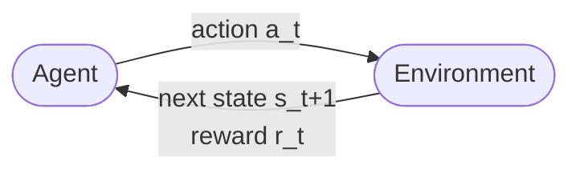
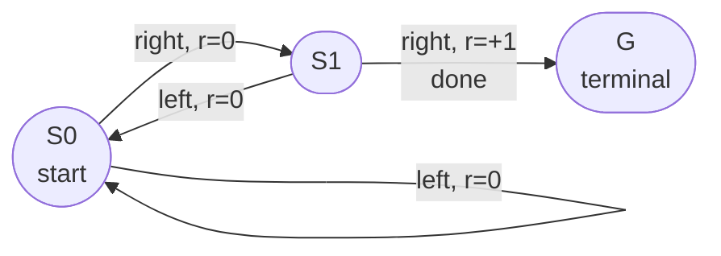

<!--
To view as slides, install marp-cli and run:
  npx @marp-team/marp-cli docs/week2-dqn-under-the-hood.md --preview
  npx @marp-team/marp-cli docs/week2-dqn-under-the-hood.md --pdf
On GitHub this file also renders as a normal document with math and code.
-->

# DQN Under the Hood

## What actually happens when `make train` runs

**Week 2 — Value-Based Methods**
RL 101 Study Group

A slide-by-slide walk-through of the algorithms, formulas, and CleanRL code
that turned a random CartPole agent (dies in ~20 steps) into one that balances
the pole for the full 500 steps.

---

## Table of contents

1. [Part 1 — Week 1 Recap](#part-1--week-1-recap)
    - [The RL loop](#the-rl-loop)
    - [The MDP formalism](#the-mdp-formalism)
    - [Policy and return](#policy-and-return)
    - [Value functions](#value-functions)
    - [The Bellman equation](#the-bellman-equation)
2. [Part 2 — Tabular Q-Learning](#part-2--tabular-q-learning)
    - [Temporal-Difference intuition](#temporal-difference-intuition)
    - [Why this works](#why-this-works)
    - [Worked example — tiny gridworld](#worked-example--tiny-gridworld)
    - [Gridworld — updates step by step](#gridworld--updates-step-by-step)
3. [Part 3 — From Q-table to Deep Q-Network](#part-3--from-q-table-to-deep-q-network)
    - [Why tabular Q-learning dies on CartPole](#why-tabular-q-learning-dies-on-cartpole)
    - [The naive approach (and why it fails)](#the-naive-approach-and-why-it-fails)
    - [DQN Trick #1 — Replay Buffer](#dqn-trick-1--replay-buffer)
    - [DQN Trick #2 — Target Network](#dqn-trick-2--target-network)
    - [Two flavours of target update](#two-flavours-of-target-update)
    - [ε-greedy exploration](#ε-greedy-exploration)
    - [The full DQN algorithm](#the-full-dqn-algorithm)
4. [Part 4 — CleanRL's dqn.py, line by line](#part-4--cleanrls-dqnpy-line-by-line)
    - [File structure](#file-structure-cleanrlcleanrldqnpy-250-lines)
    - [QNetwork — the function approximator](#qnetwork--the-function-approximator)
    - [Setup block — two networks, one optimizer](#setup-block--two-networks-one-optimizer)
    - [The main loop — acting](#the-main-loop--acting)
    - [The main loop — storing experience](#the-main-loop--storing-experience)
    - [The main loop — the TD target](#the-main-loop--the-td-target)
    - [The main loop — the gradient step and target sync](#the-main-loop--the-gradient-step-and-target-sync)
5. [Part 5 — Our exact run](#part-5--our-exact-run)
    - [Our hyperparameters (CartPole-v1)](#our-hyperparameters-cartpole-v1)
    - [What the phases of training look like](#what-the-phases-of-training-look-like)
    - [TensorBoard — the four metrics that matter](#tensorboard--the-four-metrics-that-matter)
    - [Why CPU is faster than GPU here](#why-cpu-is-faster-than-gpu-here)
6. [Part 6 — What DQN doesn't solve](#part-6--what-dqn-doesnt-solve)
    - [Known failure modes of vanilla DQN](#known-failure-modes-of-vanilla-dqn)
    - [The roadmap](#the-roadmap-from-the-course-outline)
    - [Why move beyond Q-learning?](#why-move-beyond-q-learning)
    - [What to take away from Week 2](#what-to-take-away-from-week-2)
7. [Part 7 — The whole algorithm at a glance](#part-7--the-whole-algorithm-at-a-glance)
8. [Part 8 — Pen and Paper Walkthrough](#part-8--pen-and-paper-walkthrough)
    - [The toy environment](#the-toy-environment)
    - [Episode 1](#episode-1)
    - [Episode 2](#episode-2)
    - [Episode 3](#episode-3)
    - [What we just saw](#what-we-just-saw)
    - [Where DQN comes in](#where-dqn-comes-in)
9. [References & further reading](#references--further-reading)

---

## Part 1 — Week 1 Recap

### What we already know

---

## The RL loop



At every timestep $t$:
1. Agent observes state $s_t$
2. Agent picks action $a_t$
3. Environment returns next state $s_{t+1}$ and reward $r_t$
4. Repeat

The agent's data is an infinite stream of tuples $(s_t, a_t, r_t, s_{t+1})$ —
these are called **transitions** and they are the only thing the agent gets to learn from.

---

## The MDP formalism

> A Markov decision process (MDP) is a mathematical model for sequential
> decision making when outcomes are uncertain. It is a type of stochastic
> decision process, and is often solved using the methods of stochastic
> dynamic programming.

Formally, a **Markov Decision Process** is a 5-tuple $(\mathcal{S}, \mathcal{A}, P, R, \gamma)$:

| Symbol | Name | CartPole example |
|---|---|---|
| $\mathcal{S}$ | state space | $\mathbb{R}^4$: cart pos, cart vel, pole angle, pole ang. vel |
| $\mathcal{A}$ | action space | $\{0, 1\}$: push left, push right |
| $P(s' \mid s, a)$ | transition dynamics | physics: how the cart moves |
| $R(s, a)$ | reward function | +1 per step the pole is upright |
| $\gamma \in [0, 1)$ | discount factor | 0.99 in our run |

**Markov property:** $P(s_{t+1} \mid s_t, a_t, s_{t-1}, a_{t-1}, \dots) = P(s_{t+1} \mid s_t, a_t)$.
The current state is a sufficient statistic — the agent doesn't need the past.

---

## Policy and return

**Policy** $\pi(a \mid s)$: the agent's behaviour. A distribution over actions given a state.

- Deterministic: $a = \pi(s)$
- Stochastic: $a \sim \pi(\cdot \mid s)$

**Return** (discounted cumulative reward from time $t$):

$$
G_t = \sum_{k=0}^{\infty} \gamma^k r_{t+k} = r_t + \gamma r_{t+1} + \gamma^2 r_{t+2} + \dots
$$

The agent's goal: find a policy $\pi$ that **maximises expected return** $\mathbb{E}_{\pi}[G_0]$.
The discount $\gamma$ makes far-future rewards matter less and keeps the sum finite
even for infinite horizons.

---

## Value functions

Two ways to measure "how good is a situation":

**State-value** — how good is state $s$ under policy $\pi$?

$$
V^{\pi}(s) = \mathbb{E}_{\pi}\left[ G_t  \mid  s_t = s \right]
$$

**Action-value** — how good is taking action $a$ in state $s$ and then following $\pi$?

$$
Q^{\pi}(s, a) = \mathbb{E}_{\pi}\left[ G_t  \mid  s_t = s,  a_t = a \right]
$$

**Why $Q$ matters more for us:** once you have $Q^{\ast}$ (the optimal action-value), you
can act greedily without knowing the environment dynamics:

$$
\pi^{\ast}(s) = \arg\max_{a} Q^{\ast}(s, a)
$$

No model of $P$ needed. This is the entire reason value-based RL works.

---

## The Bellman equation

Returns are recursive: $G_t = r_t + \gamma G_{t+1}$. Pushing this through the
expectation gives Bellman's equation for a fixed policy $\pi$:

$$
Q^{\pi}(s, a) = \mathbb{E}\left[ r + \gamma   Q^{\pi}(s', a') \right]
$$

And for the **optimal** policy (the Bellman *optimality* equation):

$$
\boxed{ Q^{\ast}(s, a) = \mathbb{E}\left[ r + \gamma \max_{a'} Q^{\ast}(s', a') \right] }
$$

This is the object DQN is trying to approximate. Everything that follows is
machinery for finding $Q^{\ast}$ without having to enumerate every $(s, a)$ pair.

---

## Part 2 — Tabular Q-Learning

### The simplest algorithm that actually works

---

## Temporal-Difference intuition

Suppose we already have some estimate $Q(s, a)$. We take action $a$, observe
$(r, s')$, and now we have a **better** guess for what $Q(s, a)$ should be:

$$
y  =  r + \gamma \max_{a'} Q(s', a') \qquad\text{(the TD target)}
$$

If our current $Q(s, a)$ differs from $y$, we should nudge it toward $y$. That's
the whole idea of TD learning.

**Q-learning update** (Watkins, 1989):

$$
Q(s, a)  \leftarrow  Q(s, a) + \alpha [ \underbrace{r + \gamma \max_{a'} Q(s', a')}_{\text{TD target}}  -  \underbrace{Q(s, a)}_{\text{current estimate}} ]
$$

$\alpha$ is the learning rate. The quantity in brackets is the **TD error**.

---

## Why this works

Two important properties:

**1. Off-policy.** Notice we use $\max_{a'}$ in the target, not the action the
behaviour policy actually took next. We learn about the greedy policy while
exploring with a different (e.g. $\epsilon$-greedy) one.

**2. Convergence guarantee.** In the tabular case — with enough exploration and
a decaying $\alpha$ — Q-learning is proven to converge to $Q^{\ast}$. The Bellman
operator is a $\gamma$-contraction in the sup-norm, and the stochastic
fixed-point iteration converges.

Once we move to function approximators (neural nets), we lose these guarantees.
DQN's whole design is about getting back *enough* stability to train in practice.

---

## Worked example — tiny gridworld

```
    +---+---+---+
    | S | . | G |        S = start
    +---+---+---+        G = goal (reward +1, terminal)
    | . | X | . |        X = wall
    +---+---+---+        everything else: reward 0
    | . | . | . |
    +---+---+---+
```

- 9 states (4 actions each = 36 Q-values)
- $\gamma = 0.9$, $\alpha = 0.5$, $\epsilon = 0.1$
- Start with $Q \equiv 0$

**First successful episode** (by luck): $S \to \text{right} \to \text{right}$ (goal).
Transitions: $(S, \text{right}, 0, s_1)$ and $(s_1, \text{right}, 1, G)$.

---

## Gridworld — updates step by step

Start with $Q \equiv 0$. Apply the Q-learning rule to each transition:

**Update on the transition $(s_1, \text{right}, 1, G)$:**

$$
Q(s_1, \text{right}) \leftarrow 0 + 0.5 \cdot \left( 1 + 0.9 \cdot 0 - 0 \right) = 0.5
$$

**Update on the transition $(S, \text{right}, 0, s_1)$:**

$$
Q(S, \text{right}) \leftarrow 0 + 0.5 \cdot \left( 0 + 0.9 \cdot \max_a Q(s_1, a) - 0 \right)
$$

$$
= 0.5 \cdot \left( 0 + 0.9 \cdot 0.5 - 0 \right) = 0.225
$$

The reward signal has **propagated backwards one step**. After enough episodes,
this backward propagation fills in every $(s, a)$ cell with the true $Q^{\ast}$.
This is the core mechanism: *reinforcement* literally means pulling information
backward through time along the trajectory.

---

## Part 3 — From Q-table to Deep Q-Network

### Why neural networks are necessary

---

## Why tabular Q-learning dies on CartPole

CartPole's state space is $\mathbb{R}^4$. Even if we bucket each dimension into
100 bins, the table has:

$$
100^4 = 10^8 \text{ cells}  \times  2\text{ actions} = 2 \times 10^8 \text{ Q-values}
$$

For Atari (84x84 greyscale frames) the table would have $256^{84 \cdot 84} \approx 10^{17000}$
cells. This is hopeless.

**The fix:** instead of storing one number per $(s, a)$, we learn a *parametric
function* that generalises across similar states:

$$
Q_{\theta}(s, a)  \approx  Q^{\ast}(s, a), \qquad \theta \in \mathbb{R}^n
$$

$\theta$ is a neural network's weights. $n \ll$ the number of possible states.
Similar states get similar Q-values "for free" — the network interpolates.

---

## The naive approach (and why it fails)

If you just plug a neural net into the Q-learning update:

$$
\mathcal{L}(\theta)  =  ( r + \gamma \max_{a'} Q_{\theta}(s', a')  -  Q_{\theta}(s, a) )^2
$$

...and train online, **three things go catastrophically wrong:**

1. **Non-stationary targets.** The target $r + \gamma \max Q_{\theta}(s', a')$
   uses the *same* weights $\theta$ we're training. As $\theta$ moves, the target
   moves. You're chasing your own tail.

2. **Correlated data.** Consecutive transitions $(s_t, a_t, r_t, s_{t+1})$ are
   strongly correlated — the $s_{t+1}$ is just $s_t$ nudged. SGD assumes i.i.d.
   mini-batches; we're feeding it the opposite.

3. **Catastrophic forgetting.** If the agent gets very good at one region of
   the state space, it stops visiting the others, and the network forgets what
   it learned earlier.

---

## DQN Trick #1 — Replay Buffer

Store every transition $(s_t, a_t, r_t, s_{t+1}, d_t)$ in a big FIFO buffer
$\mathcal{D}$ (size $10^4$ to $10^6$). Sample **random mini-batches** from
$\mathcal{D}$ for each gradient step.

Effect:
- Breaks temporal correlation (samples come from different timesteps)
- Same transition can be reused many times — better sample efficiency
- Acts like a running dataset — gradient steps look more like supervised learning

**Experience replay** was actually proposed by Lin (1992) for robot learning. DQN
just made it famous by combining it with deep nets.

**In CleanRL:** `rb = ReplayBuffer(buffer_size=10000, ...)` and `rb.sample(batch_size=128)`.

---

## DQN Trick #2 — Target Network

Keep *two* copies of the Q-network:
- **Online network** $Q_{\theta}$ — updated every step by SGD
- **Target network** $Q_{\theta^{-}}$ — a frozen snapshot used to compute the TD target

Every $C$ steps (e.g. 500), copy $\theta^{-} \leftarrow \theta$. Between copies, the
target is held **stationary**.

The loss becomes:

$$
\mathcal{L}(\theta)  =  \mathbb{E}_{(s,a,r,s') \sim \mathcal{D}}\left[ ( r + \gamma \max_{a'} Q_{\theta^{-}}(s', a')  -  Q_{\theta}(s, a) )^2 \right]
$$

Note: $\theta^{-}$ in the target, $\theta$ in the prediction. This decouples the
target from the parameters being optimised — stable targets, stable training.

---

## Two flavours of target update

**Hard update (Mnih et al., 2015):**

$$
\theta^{-} \leftarrow \theta \quad \text{every } C \text{ steps}
$$

**Soft update / Polyak averaging (Lillicrap et al., 2015):**

$$
\theta^{-} \leftarrow \tau \theta + (1 - \tau) \theta^{-}, \qquad \tau \ll 1
$$

**CleanRL supports both** through one knob. Our run uses the default:

```python
tau: float = 1.0
target_network_frequency: int = 500
```

$\tau = 1.0$ with frequency 500 means: every 500 steps do a complete hard copy.
If you set $\tau = 0.005$ you'd update every step with a soft Polyak average — that's
what algorithms like DDPG and SAC do.

---

## ε-greedy exploration

A simple rule for balancing **exploration** (try new actions) vs
**exploitation** (take the greedy action):

$$
a_t = \begin{cases}
\text{random action in } \mathcal{A} & \text{with probability } \epsilon \\
\arg\max_{a} Q_{\theta}(s_t, a) & \text{with probability } 1 - \epsilon
\end{cases}
$$

We **decay** $\epsilon$ over time so the agent explores early and exploits later:

$$
\epsilon(t) = \max\left(\epsilon_{\text{end}},  \epsilon_{\text{start}} + \frac{\epsilon_{\text{end}} - \epsilon_{\text{start}}}{\text{duration}} \cdot t\right)
$$

Our run: $\epsilon$ goes from **1.0 at $t=0$** to **0.05 at $t = 50{,}000$**
(10% of 500K), then stays at 0.05 forever. That's `start-e=1.0`, `end-e=0.05`,
`exploration-fraction=0.1`.

---

## The full DQN algorithm

```
Initialise online network Q_θ with random weights
Initialise target network Q_θ⁻ ← Q_θ
Initialise replay buffer D (capacity 10000)

for global_step = 1 .. total_timesteps:
    # ACT
    compute ε = linear_schedule(...)
    with probability ε: a ← random action
    else:               a ← argmax_a Q_θ(s, a)
    (s', r, done) ← env.step(a)
    D.add((s, a, r, s', done))
    s ← s'

    # LEARN (only after learning_starts)
    if step > learning_starts and step % train_frequency == 0:
        sample minibatch (s, a, r, s', d) ~ D
        y = r + γ · max_a' Q_θ⁻(s', a') · (1 − d)
        L = MSE( y ,  Q_θ(s, a) )
        θ ← θ − η ∇_θ L

    # SYNC target network
    if step % target_network_frequency == 0:
        θ⁻ ← θ
```

---

## Part 4 — CleanRL's dqn.py, line by line

### The code we actually ran

---

## File structure (`cleanrl/cleanrl/dqn.py`, ~250 lines)

```
Lines 1–17    imports (gymnasium, torch, tyro, tensorboard, ReplayBuffer)
Lines 19–72   @dataclass Args — every hyperparameter, documented inline
Lines 75–87   make_env — wraps a gym env with video + episode-stats
Lines 91–103  class QNetwork — the 3-layer MLP
Lines 106–108 linear_schedule — ε decay helper
Lines 111–149 setup — parse args, seed, create envs + networks + optimizer
Lines 152–158 replay buffer
Lines 161–219 the main training loop
Lines 221–245 post-training: save model, evaluate, (optional) upload to HF
Lines 247–248 cleanup
```

The whole algorithm is ~60 lines of actual logic. Everything else is
plumbing. This is CleanRL's pitch: single-file, no inheritance soup.

---

## QNetwork — the function approximator

```python
class QNetwork(nn.Module):
    def __init__(self, env):
        super().__init__()
        self.network = nn.Sequential(
            nn.Linear(np.array(env.single_observation_space.shape).prod(), 120),
            nn.ReLU(),
            nn.Linear(120, 84),
            nn.ReLU(),
            nn.Linear(84, env.single_action_space.n),
        )

    def forward(self, x):
        return self.network(x)
```

A 3-layer MLP: **obs_dim → 120 → 84 → num_actions**.

For CartPole: $4 \to 120 \to 84 \to 2$. That's $4 \cdot 120 + 120 \cdot 84 + 84 \cdot 2 + \text{biases} \approx 10{,}900$ parameters.

Forward pass returns a vector of **Q-values, one per action**. To pick an action,
we just take $\arg\max$. To learn, we pick out one entry per state in the batch.

---

## Setup block — two networks, one optimizer

```python
device = torch.device("cuda" if torch.cuda.is_available() and args.cuda else "cpu")

envs = gym.vector.SyncVectorEnv(
    [make_env(args.env_id, args.seed + i, i, args.capture_video, run_name)
     for i in range(args.num_envs)]
)

q_network = QNetwork(envs).to(device)
optimizer = optim.Adam(q_network.parameters(), lr=args.learning_rate)
target_network = QNetwork(envs).to(device)
target_network.load_state_dict(q_network.state_dict())   # <-- same init
```

Both networks start with **identical weights**. Only `q_network` gets its
parameters updated by the optimizer. `target_network` is updated by copy
(every 500 steps) — see the bottom of the loop.

`SyncVectorEnv` with `num_envs=1` looks like overkill, but it standardises the
API: observations have shape `(num_envs, obs_dim)`, not `(obs_dim,)`.

---

## The main loop — acting

```python
for global_step in range(args.total_timesteps):
    # linearly decay ε from 1.0 to 0.05 over the first 10% of training
    epsilon = linear_schedule(args.start_e, args.end_e,
                              args.exploration_fraction * args.total_timesteps,
                              global_step)

    if random.random() < epsilon:
        actions = np.array([envs.single_action_space.sample()
                            for _ in range(envs.num_envs)])
    else:
        q_values = q_network(torch.Tensor(obs).to(device))
        actions = torch.argmax(q_values, dim=1).cpu().numpy()

    next_obs, rewards, terminations, truncations, infos = envs.step(actions)
```

This is literally the ε-greedy rule from slide "εε-greedy exploration". Note
that action selection uses the **online** network `q_network`, not the target.
`envs.step(actions)` returns 5 things — the standard gymnasium API.

---

## The main loop — storing experience

```python
# record episode stats for TensorBoard
if "final_info" in infos:
    for info in infos["final_info"]:
        if info and "episode" in info:
            writer.add_scalar("charts/episodic_return",
                              info["episode"]["r"], global_step)

# if the env was truncated, use the real final observation in the buffer
real_next_obs = next_obs.copy()
for idx, trunc in enumerate(truncations):
    if trunc:
        real_next_obs[idx] = infos["final_observation"][idx]

rb.add(obs, real_next_obs, actions, rewards, terminations, infos)
obs = next_obs
```

The truncation handling is subtle but important: when an episode is *truncated*
(time limit reached, not a real terminal), the "next observation" in `next_obs`
is actually the *reset* of the next episode, not the state we landed in. We
have to substitute the real final observation back in, or the buffer learns a
wrong transition.

This is also why `handle_timeout_termination=False` is passed to the buffer —
we're managing it ourselves.

---

## The main loop — the TD target

```python
if global_step > args.learning_starts:
    if global_step % args.train_frequency == 0:
        data = rb.sample(args.batch_size)

        with torch.no_grad():
            target_max, _ = target_network(data.next_observations).max(dim=1)
            td_target = data.rewards.flatten() + \
                        args.gamma * target_max * (1 - data.dones.flatten())

        old_val = q_network(data.observations).gather(1, data.actions).squeeze()
        loss = F.mse_loss(td_target, old_val)
```

**Line by line:**

- `data = rb.sample(128)` — 128 random transitions, uncorrelated
- `target_network(...).max(dim=1)` — $\max_{a'} Q_{\theta^{-}}(s', a')$, using the **target** net
- `td_target = r + γ · max · (1 − done)` — the TD target. The `(1 - done)` zeros out the future value for terminal states, so terminal transitions reduce to $y = r$. This is the Bellman equation with a boundary condition.
- `with torch.no_grad()` — we don't backprop through the target. Critical — this is how we freeze $\theta^{-}$.
- `q_network(...).gather(1, data.actions)` — this is how you pick $Q_{\theta}(s_i, a_i)$ for each sample $i$ in the batch. `.gather` indexes the Q-value vector by the action we actually took.
- `F.mse_loss(td_target, old_val)` — $\mathcal{L}(\theta) = \tfrac{1}{N}\sum_i (y_i - Q_{\theta}(s_i, a_i))^2$

---

## The main loop — the gradient step and target sync

```python
        # optimize the model
        optimizer.zero_grad()
        loss.backward()
        optimizer.step()

    # update target network
    if global_step % args.target_network_frequency == 0:
        for target_param, q_param in zip(target_network.parameters(),
                                         q_network.parameters()):
            target_param.data.copy_(
                args.tau * q_param.data + (1.0 - args.tau) * target_param.data
            )
```

First block: standard PyTorch three-liner for a gradient step on `loss`.
`loss.backward()` computes $\nabla_{\theta} \mathcal{L}$ — this is why we
couldn't backprop through the target (it would try to compute gradients w.r.t.
$\theta^{-}$ which we don't want to update).

Second block: target network sync. With the default $\tau = 1.0$ this is a
complete hard copy every 500 steps. Setting $\tau \lt 1$ gives Polyak averaging.

---

## Part 5 — Our exact run

### What happened on your machine

---

## Our hyperparameters (CartPole-v1)

From `scripts/train_cartpole.py`:

| Flag | Value | Meaning |
|---|---:|---|
| `total-timesteps` | 500,000 | length of training |
| `learning-rate` | 2.5e-4 | Adam $\eta$ |
| `buffer-size` | 10,000 | capacity of $\mathcal{D}$ |
| `batch-size` | 128 | samples per gradient step |
| `gamma` | 0.99 | discount $\gamma$ |
| `start-e`, `end-e` | 1.0 → 0.05 | ε decay endpoints |
| `exploration-fraction` | 0.1 | ε hits end-e at 10% of training (step 50K) |
| `learning-starts` | 10,000 (default) | first 10K steps are pure exploration, no updates |
| `train-frequency` | 4 | one SGD step per 4 env steps |
| `target-network-frequency` | 500 | hard-copy target every 500 steps |
| `tau` | 1.0 (default) | hard copy (not Polyak) |

---

## What the phases of training look like

```
step 0 .. 10k     ε = 1.0 → 0.82       random actions fill the buffer
                                       NO gradient steps yet (learning_starts)

step 10k .. 50k   ε = 0.82 → 0.05      first gradient steps, ε decay still happening
                                       episode_return climbs from ~20 to ~100

step 50k .. 100k  ε = 0.05             exploitation; return climbs toward 500

step 100k .. 500k ε = 0.05             agent should consistently hit 500
                                       (the max CartPole-v1 score)
```

Rough heuristic for "is it working":
- Episodic return climbs steadily → good
- Return plateaus early at ~20 (random level) → learning_rate or ε wrong
- Return oscillates wildly between 500 and 20 → target network too slow, or γ too high
- Return climbs then collapses → catastrophic forgetting, a known DQN failure

---

## TensorBoard — the four metrics that matter

Run `make tensorboard` and watch:

**`charts/episodic_return`** — reward per episode.
Should climb from ~20 (random) toward 500 (CartPole max). This is the headline.

**`losses/q_values`** — average predicted $Q_{\theta}(s, a)$ for the sampled
actions. In a well-trained CartPole agent this should rise and plateau around
the true optimal $V^{\ast}(s) \approx 1 / (1 - \gamma) = 100$. (The max cumulative
discounted reward from a balanced state.)

**`losses/td_loss`** — MSE of the TD error. Should decrease on average. It
won't go to zero — there's always some Bellman residual because the environment
is stochastic and the function approximator is imperfect.

**`charts/epsilon`** (and `charts/SPS`) — ε should match the linear schedule;
SPS tells you how fast your loop is running (higher is better).

---

## Why CPU is faster than GPU here

The QNetwork has **~10,900 parameters**. A forward + backward pass on a batch
of 128 samples is:
- Compute: ~3 million float ops. GPU does this in **~1 μs**.
- Host → device transfer of the batch + returning the loss: **~50 μs** per round trip.

On GPU you spend **50× more time moving data than computing**. On CPU there's
no transfer — the tensors live in the same memory as the Python process.

**Rule of thumb:** GPU starts winning when the model is big enough that compute
time per step exceeds transfer overhead. For CartPole, that threshold is
somewhere around a 64x64 conv net. For Atari DQN, GPU is ~10× faster. For
CartPole, CPU is ~10× faster.

This is why CleanRL falls back to CPU when `args.cuda and torch.cuda.is_available()`
is False on your Mac, and why training was fast.

---

## Part 6 — What DQN *doesn't* solve

### Setting up Week 3

---

## Known failure modes of vanilla DQN

**Overestimation bias.** The $\max_{a'} Q(s', a')$ is a *biased* estimator of
$\max_{a'} \mathbb{E}[Q(s', a')]$ — the max of noisy estimates is greater than
the max of means. Fix: **Double DQN** (van Hasselt et al., 2016) uses the
online net to pick the action and the target net to evaluate it.

**Uniform replay ignores importance.** Some transitions carry more information
than others. Fix: **Prioritised Experience Replay** (Schaul et al., 2016)
samples transitions proportional to their TD error.

**Single scalar Q-value.** Fix: **Dueling DQN** (Wang et al., 2016) factorises
$Q(s, a) = V(s) + A(s, a) - \text{mean}_{a'} A(s, a')$ so the network can
learn state values independent of action values.

**Discrete actions only.** CartPole has 2 actions. How do you do $\arg\max$
over a continuous steering angle? You can't — that's a Week 3+ problem.

---

## The roadmap (from the course outline)

| Week | Family | Algorithm | What's new |
|---|---|---|---|
| 2 (now) | Value-based | **Q-learning, DQN** | learn $Q$, then act greedily |
| 3 | Policy-based | **REINFORCE** | learn $\pi$ directly, no $Q$ |
| 4 | Actor-Critic | **A2C, PPO** | learn both $Q$ and $\pi$, use each to train the other |
| 5 | RLHF | **PPO with reward model** | the reward function itself is learned from human prefs |
| 6 | World Models | **Dreamer, MuZero** | learn a model of the environment, then plan in imagination |

CleanRL has single-file implementations of every one of these. Once you can
read `dqn.py` you can read `ppo.py` (it's ~300 lines). This is the whole point
of going through DQN line by line.

---

## Why move beyond Q-learning?

Three concrete pain points that Week 3 addresses:

**1. Continuous actions.** Q-learning picks actions by $\arg\max_a Q(s, a)$.
For $|\mathcal{A}| = 2$ that's easy. For $a \in \mathbb{R}^6$ (a robot arm) it's a
second optimisation problem at every step. **Policy methods** just
output the action directly.

**2. Stochastic optimal policies.** Rock-paper-scissors' optimal policy is
uniformly random. Q-learning can only represent greedy (deterministic) policies.
**Stochastic policies** $\pi(a \mid s)$ can.

**3. Easier credit assignment in long-horizon tasks.** Policy gradient methods
can use full-episode returns directly (Monte Carlo), avoiding the
bootstrap-on-bootstrap instability of TD in long horizons.

---

## What to take away from Week 2

1. **The RL problem is an MDP.** Once you can spell $(\mathcal{S}, \mathcal{A}, P, R, \gamma)$ you can describe any RL task.
2. **The Bellman equation is the central equation of value-based RL.** Every value-based algorithm is some way of iterating toward its fixed point.
3. **Tabular Q-learning works but doesn't scale.** The $n^d$ curse of dimensionality is real.
4. **DQN = Q-learning + neural net + replay buffer + target network.** Those last two tricks are what make it stable enough to train.
5. **The loss is a stale-target MSE** — $\mathbb{E}[(r + \gamma \max_{a'} Q_{\theta^{-}}(s', a') - Q_{\theta}(s, a))^2]$.
6. **CleanRL's `dqn.py` is ~60 lines of real logic.** You can read it end-to-end.
7. **Hyperparameters matter but the defaults in CleanRL are sane** for the classic environments. Change them one at a time and watch TensorBoard.

---

## Part 7 — The whole algorithm at a glance

Every box in this flowchart maps to code in `cleanrl/cleanrl/dqn.py` and every
previous section of this deck zooms into one of them. If you only take one
picture with you from Week 2, take this one.

```mermaid
flowchart LR
    Start(["make train"])
    Start --> Init["Initialise online net Qθ<br/>target net Qθ⁻ ← Qθ<br/>replay buffer D capacity 10k"]
    Init --> Observe["Observe state s"]
    Observe --> Epsilon["Compute ε from<br/>linear schedule"]
    Epsilon --> Choose{"Explore<br/>or exploit?"}
    Choose -->|"prob ε"| RandAct["a = random action"]
    Choose -->|"prob 1-ε"| GreedyAct["a = argmax Qθ s,a"]
    RandAct --> Env["env.step a<br/>get r, s', done"]
    GreedyAct --> Env
    Env --> AddBuf[("Store transition<br/>in buffer D")]
    AddBuf --> Warmup{"step &gt; 10k?"}
    Warmup -->|"no"| Next["global_step += 1"]
    Warmup -->|"yes"| TrainCheck{"step mod 4 == 0?"}
    TrainCheck -->|"no"| SyncCheck
    TrainCheck -->|"yes"| Sample["Sample 128 transitions"]
    Sample --> ComputeTarget["TD target<br/>y = r + γ · max Qθ⁻ · 1-done"]
    Sample --> ComputeQ["Prediction<br/>q = Qθ s,a"]
    ComputeTarget --> Loss["MSE loss<br/>L = mean y-q squared"]
    ComputeQ --> Loss
    Loss --> AdamStep["Backprop + Adam<br/>θ ← θ - η ∇L"]
    AdamStep --> SyncCheck{"step mod 500 == 0?"}
    SyncCheck -->|"yes"| HardCopy["Hard copy<br/>θ⁻ ← θ"]
    SyncCheck -->|"no"| Next
    HardCopy --> Next
    Next --> Observe

    style Init fill:#e7f1ff,stroke:#0d6efd
    style AddBuf fill:#fff3cd,stroke:#d39e00
    style ComputeTarget fill:#f8d7da,stroke:#dc3545
    style ComputeQ fill:#d1e7dd,stroke:#198754
    style HardCopy fill:#e2e3e5,stroke:#6c757d
```



**Three things to notice:**

1. **Two Q-networks.** The *online* net `Qθ` is what we train; the *target* net `Qθ⁻` is a frozen copy used to compute stable TD targets. Every 500 steps we hard-copy online → target.
2. **The replay buffer decouples experience collection from learning.** We add every transition, then sample random minibatches — this breaks temporal correlation and lets us re-use experience.
3. **Learning is gated twice.** Nothing learns until `step > 10,000` (buffer warmup), and even then only one gradient step every 4 env steps. So training is ~10x cheaper than "update every step."

---

## Part 8 — Pen and Paper Walkthrough

### Everything above, on a tiny 3-state corridor

To consolidate everything so far — MDP formalism, Q-learning update rule,
Bellman equation, TD error, convergence — let's run Q-learning **by hand** on
an environment so small it fits on a napkin.

---

## The toy environment

A 3-state corridor. The agent starts at `S0` and wants to reach the goal `G`.
At `G` the episode ends with reward +1. Elsewhere, reward 0.



**MDP specification:**

- **States** $\mathcal{S} = \{S_0,\ S_1,\ G\}$, with $G$ terminal
- **Actions** $\mathcal{A} = \{\text{left},\ \text{right}\}$
- **Transitions** (deterministic):
  - $S_0 + \text{right} \to S_1$
  - $S_0 + \text{left}  \to S_0$ (bumps a wall, stays)
  - $S_1 + \text{right} \to G$ (terminates, reward +1)
  - $S_1 + \text{left}  \to S_0$
- **Rewards:** +1 only on the transition into $G$, otherwise 0
- **Discount** $\gamma = 0.5$ (chosen to keep fractions clean)
- **Learning rate** $\alpha = 0.5$

**Sanity check: what's the true $Q^{\ast}$ we should converge to?**

From $S_1$, "right" terminates the episode with immediate reward 1 and no
future rewards, so $Q^{\ast}(S_1, \text{right}) = 1$.

From $S_0$, "right" gives reward 0 and lands in $S_1$, from which the best
next action is "right" (value 1), so
$Q^{\ast}(S_0, \text{right}) = 0 + \gamma \cdot Q^{\ast}(S_1, \text{right}) = 0.5 \cdot 1 = 0.5$.

The "left" actions are strictly worse. The optimal Q-table is:

| State | left | right    |
|-------|-----:|---------:|
| $S_0$ |  0   | **0.5**  |
| $S_1$ |  0   | **1.0**  |

We'll start with $Q \equiv 0$ everywhere and run 3 episodes where the agent
always happens to go "right" (pretend the initial $\varepsilon$-greedy rolls
landed on the good action — it keeps the arithmetic short).

The update rule we'll apply every step:

$$
Q(s,a) \leftarrow Q(s,a) + \alpha \cdot \left( r + \gamma \cdot \max_{a'} Q(s', a') - Q(s,a) \right)
$$

---

## Episode 1

**Initial Q-table** ($Q \equiv 0$):

| State | left | right |
|-------|-----:|------:|
| $S_0$ |  0   |   0   |
| $S_1$ |  0   |   0   |

Trajectory: $S_0 \xrightarrow{\text{right}, r=0} S_1 \xrightarrow{\text{right}, r=1, \text{done}} G$.

**Update 1 — transition $(S_0, \text{right}, 0, S_1)$:**

$$
Q(S_0, \text{right}) \leftarrow 0 + 0.5 \cdot \left( 0 + 0.5 \cdot \max(0, 0) - 0 \right) = 0
$$

No update. There's no reward yet, and the future value is still zero, so the
TD error is zero. This is expected: the first time we see a new state, we
have nothing to propagate.

**Update 2 — transition $(S_1, \text{right}, 1, G)$:**

$G$ is terminal, so we multiply the future term by $(1 - \text{done}) = 0$:

$$
Q(S_1, \text{right}) \leftarrow 0 + 0.5 \cdot \left( 1 + 0.5 \cdot 0 \cdot 0 - 0 \right) = 0 + 0.5 \cdot 1 = 0.5
$$

**Q-table after Episode 1:**

| State | left | right     |
|-------|-----:|----------:|
| $S_0$ |  0   |   0       |
| $S_1$ |  0   | **0.5**   |

The reward has reached $S_1$ but hasn't propagated back to $S_0$ yet.

---

## Episode 2

Same trajectory $S_0 \to S_1 \to G$.

**Update 1 — transition $(S_0, \text{right}, 0, S_1)$:**

Now $Q(S_1, \text{right}) = 0.5$, so the max future value is 0.5:

$$
Q(S_0, \text{right}) \leftarrow 0 + 0.5 \cdot \left( 0 + 0.5 \cdot 0.5 - 0 \right) = 0 + 0.5 \cdot 0.25 = 0.125
$$

This is the reward propagating backward one step.

**Update 2 — transition $(S_1, \text{right}, 1, G)$:**

$$
Q(S_1, \text{right}) \leftarrow 0.5 + 0.5 \cdot \left( 1 - 0.5 \right) = 0.5 + 0.25 = 0.75
$$

**Q-table after Episode 2:**

| State | left | right        |
|-------|-----:|-------------:|
| $S_0$ |  0   | **0.125**    |
| $S_1$ |  0   | **0.75**     |

---

## Episode 3

**Update 1 — transition $(S_0, \text{right}, 0, S_1)$:**

$$
Q(S_0, \text{right}) \leftarrow 0.125 + 0.5 \cdot \left( 0 + 0.5 \cdot 0.75 - 0.125 \right)
$$

$$
= 0.125 + 0.5 \cdot (0.375 - 0.125) = 0.125 + 0.5 \cdot 0.25 = 0.25
$$

**Update 2 — transition $(S_1, \text{right}, 1, G)$:**

$$
Q(S_1, \text{right}) \leftarrow 0.75 + 0.5 \cdot \left( 1 - 0.75 \right) = 0.75 + 0.125 = 0.875
$$

**Q-table after Episode 3:**

| State | left | right       |
|-------|-----:|------------:|
| $S_0$ |  0   | **0.25**    |
| $S_1$ |  0   | **0.875**   |

---

## What we just saw

Across three episodes, the "right" values evolved:

| Episode | $Q(S_0, \text{right})$ | $Q(S_1, \text{right})$ |
|--------:|----------------------:|----------------------:|
|    0 (init)  | 0                 | 0                 |
|    1    | 0                     | 0.5                   |
|    2    | 0.125                 | 0.75                  |
|    3    | 0.25                  | 0.875                 |
|  $\infty$ (true $Q^{\ast}$) | **0.5** | **1.0** |

Both are converging to their optimal values. Three concepts made visible:

**1. Reward propagates backwards.** After Episode 1 only $S_1$ knew about the
goal. After Episode 2 the signal had reached $S_0$. Information flows
`goal → previous state → state-before-that → ...` through the chain of
Q-learning updates. This is the same reason DQN takes so long on environments
with long horizons: every update only moves the signal back one step.

**2. The update is a contraction.** Each step does
$Q \leftarrow Q + \alpha \cdot (y - Q)$, moving $Q$ a fraction $\alpha$
of the way toward the target $y$. With $\alpha \lt 1$ we never overshoot,
and with $\gamma \lt 1$ the targets stay bounded. These two facts are
what give us the convergence guarantee in the tabular case.

**3. The Bellman equation is the fixed point.** At convergence the TD error
$y - Q$ is zero, which means
$Q(s, a) = r + \gamma \cdot \max_{a'} Q(s', a')$ — literally the Bellman
optimality equation. Q-learning is just stochastic fixed-point iteration on
the Bellman operator.

---

## Where DQN comes in

The calculation we just did needs one table cell per $(s, a)$ pair. For
CartPole's 4-dimensional continuous state space that's infeasible — the
curse of dimensionality from Part 3.

DQN replaces the table with a neural network $Q_\theta(s, a)$ that
*generalises* across similar states. The update rule is the same in spirit:

| | Tabular | DQN |
|---|---|---|
| Prediction | $Q(s, a)$ lookup in a table | $Q_\theta(s, a)$ forward pass |
| Target | $y = r + \gamma \cdot \max_{a'} Q(s', a')$ | $y = r + \gamma \cdot \max_{a'} Q_{\theta^{-}}(s', a')$ |
| Update | $Q \leftarrow Q + \alpha (y - Q)$ | $\theta \leftarrow \theta - \eta \nabla_\theta (y - Q_\theta)^2$ |
| Stability trick | none needed | replay buffer + target network |

The target network $Q_{\theta^{-}}$ plays exactly the role of "the Q-values
I looked at before the update" in the tabular rule — it holds still while
we're computing the gradient, so we aren't chasing a moving target. Replay
buffer sampling makes the updates look like i.i.d. mini-batches, so the
SGD assumptions approximately hold.

Everything else is the same algorithm you just did on paper. Every time
`cleanrl/cleanrl/dqn.py` runs one gradient step, it is doing a vectorised
neural-network version of the two updates we did for Episode 1.

---

## References & further reading

**Papers (read in this order):**
- Mnih et al., *Playing Atari with Deep Reinforcement Learning* (NeurIPS DL workshop, 2013) — the original DQN
- Mnih et al., *Human-level control through deep reinforcement learning* (Nature, 2015) — the production-grade version with the target network
- van Hasselt et al., *Deep Reinforcement Learning with Double Q-learning* (AAAI, 2016)
- Wang et al., *Dueling Network Architectures for Deep Reinforcement Learning* (ICML, 2016)
- Schaul et al., *Prioritized Experience Replay* (ICLR, 2016)
- Hessel et al., *Rainbow: Combining Improvements in Deep RL* (AAAI, 2018) — everything above, combined

**Textbooks:**
- Sutton & Barto, *Reinforcement Learning: An Introduction* (2nd ed., 2018) — chapters 3 (MDPs), 6 (TD), 16.5 (DQN). Free PDF on author's site.
- Szepesvári, *Algorithms for Reinforcement Learning* (2010) — shorter, more formal.

**Code:**
- CleanRL's `dqn.py` — [github.com/vwxyzjn/cleanrl](https://github.com/vwxyzjn/cleanrl)
- This repo's `scripts/train_cartpole.py` — the wrapper we ran

**Next week:** REINFORCE / policy gradient theorem. See you there.
