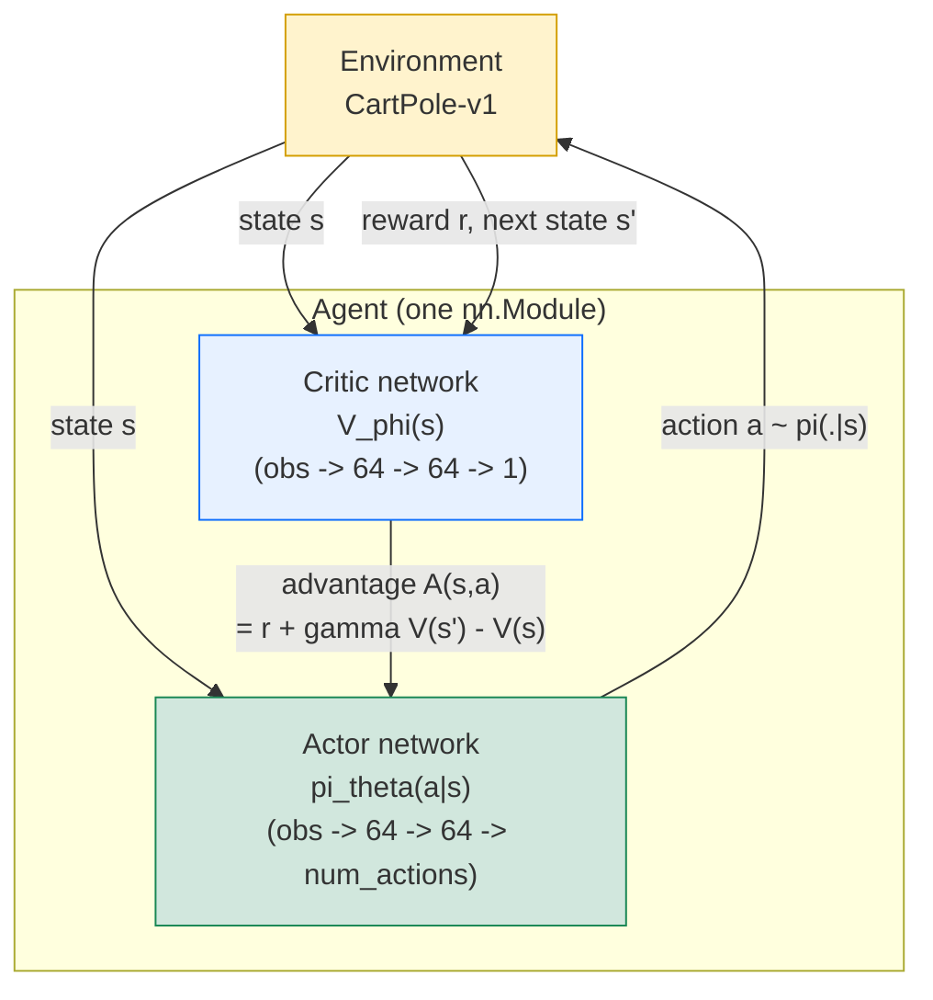

<!--
To view as slides, install marp-cli and run:
  npx @marp-team/marp-cli docs/week3-ppo-under-the-hood.md --preview
  npx @marp-team/marp-cli docs/week3-ppo-under-the-hood.md --pdf
On GitHub this file also renders as a normal document with math and code.
-->

# PPO Under the Hood

## What actually happens when `make train-ppo` runs

**Week 3 — Actor-Critic Methods**
RL 101 Study Group

A slide-by-slide walk-through of Actor-Critic, GAE, and Proximal Policy
Optimization: the algorithms, formulas, and CleanRL code that let us learn
a policy and a value function *together* — and keep them from destroying
each other.

---

## Table of contents

1. [Part 1 — Recap: Where We Left Off](#part-1--recap-where-we-left-off)
    - [Two families of RL](#two-families-of-rl)
    - [The REINFORCE gradient](#the-reinforce-gradient)
    - [The variance problem](#the-variance-problem)
2. [Part 2 — Actor-Critic: The Best of Both Worlds](#part-2--actor-critic-the-best-of-both-worlds)
    - [Two networks, one agent](#two-networks-one-agent)
    - [The advantage function](#the-advantage-function)
    - [The policy gradient with advantage](#the-policy-gradient-with-advantage)
    - [How the critic learns](#how-the-critic-learns)
    - [Actor-critic interaction diagram](#actor-critic-interaction-diagram)
3. [Part 3 — Generalized Advantage Estimation (GAE)](#part-3--generalized-advantage-estimation-gae)
    - [The bias-variance tradeoff in advantage estimation](#the-bias-variance-tradeoff-in-advantage-estimation)
    - [GAE: a smooth interpolation](#gae-a-smooth-interpolation)
    - [The backward computation in code](#the-backward-computation-in-code)
4. [Part 4 — PPO: Proximal Policy Optimization](#part-4--ppo-proximal-policy-optimization)
    - [The trust region problem](#the-trust-region-problem)
    - [Importance sampling and the ratio](#importance-sampling-and-the-ratio)
    - [The surrogate objective](#the-surrogate-objective)
    - [The clipped objective](#the-clipped-objective)
    - [Why clipping works — the four cases](#why-clipping-works--the-four-cases)
    - [The combined loss](#the-combined-loss)
5. [Part 5 — CleanRL's ppo.py, line by line](#part-5--cleanrls-ppopy-line-by-line)
    - [File structure](#file-structure-cleanrlcleanrlppopy-312-lines)
    - [Agent class: actor + critic](#agent-class-actor--critic)
    - [Rollout storage — not a replay buffer](#rollout-storage--not-a-replay-buffer)
    - [Rollout collection: 4 envs x 128 steps](#rollout-collection-4-envs-x-128-steps)
    - [GAE computation (the backward loop)](#gae-computation-the-backward-loop)
    - [The update loop: 4 epochs x 4 minibatches](#the-update-loop-4-epochs-x-4-minibatches)
    - [The clipped policy loss](#the-clipped-policy-loss)
    - [Value loss, entropy, combined loss, and gradient clipping](#value-loss-entropy-combined-loss-and-gradient-clipping)
6. [Part 6 — DQN vs PPO Side-by-Side](#part-6--dqn-vs-ppo-side-by-side)
    - [Structural comparison](#structural-comparison)
    - [When to use which](#when-to-use-which)
7. [Part 7 — Our Exact Run](#part-7--our-exact-run)
    - [Our hyperparameters (CartPole-v1)](#our-hyperparameters-cartpole-v1)
    - [Training phases and what to watch](#training-phases-and-what-to-watch)
    - [TensorBoard — the seven metrics that matter](#tensorboard--the-seven-metrics-that-matter)
8. [Part 8 — Pen and Paper Walkthrough](#part-8--pen-and-paper-walkthrough)
    - [Setup: a single state, two actions](#setup-a-single-state-two-actions)
    - [Step 1: sample and observe](#step-1-sample-and-observe)
    - [Step 2: compute ratio, clipped ratio, and the loss](#step-2-compute-ratio-clipped-ratio-and-the-loss)
    - [Step 3: the update direction](#step-3-the-update-direction)
9. [Part 9 — The Whole Algorithm at a Glance](#part-9--the-whole-algorithm-at-a-glance)
10. [References and further reading](#references-and-further-reading)

---

## Part 1 — Recap: Where We Left Off

### From value-based to policy-based, and the gap between them

---

## Two families of RL

Last two weeks we saw both approaches to the RL problem:

| | Value-based (DQN) | Policy-based (REINFORCE) |
|---|---|---|
| What it learns | $Q_\theta(s, a)$ — how good is each action | $\pi_\theta(a \mid s)$ — a distribution over actions |
| How it acts | $\arg\max_a Q(s, a)$ (deterministic) | Sample from $\pi_\theta$ (stochastic) |
| Action space | Discrete only (need argmax) | Discrete or continuous |
| Exploration | Bolted on ($\varepsilon$-greedy) | Built in (stochastic policy) |
| Sample efficiency | Higher (replay buffer, off-policy) | Lower (on-policy, use data once) |

**DQN** learns a value function and derives a policy from it.
**REINFORCE** learns a policy directly, with no value function at all.

Week 3 question: **can we combine both?**

---

## The REINFORCE gradient

The **policy gradient theorem** (Sutton et al., 2000) says we can optimise a
stochastic policy $\pi_\theta$ by gradient ascent on the expected return:

$$
\nabla_\theta J(\theta) = \mathbb{E}_{\pi_\theta}\left[\nabla_\theta \log \pi_\theta(a \mid s) \cdot G_t \right]
$$

The $\log \pi_\theta(a \mid s)$ term gives the direction to make action $a$
more or less likely; the return $G_t$ scales it. Good actions become more
probable; bad actions become less probable.

In practice, we estimate this with a single trajectory:

$$
\nabla_\theta J(\theta) \approx \sum_{t=0}^{T} \nabla_\theta \log \pi_\theta(a_t \mid s_t) \cdot G_t
$$

This is REINFORCE (Williams, 1992). Simple, elegant, and mathematically correct.
But it has a serious practical problem.

---

## The variance problem

$G_t = r_t + \gamma r_{t+1} + \gamma^2 r_{t+2} + \dots$ is the **full Monte Carlo
return** from time $t$ to the end of the episode.

The problem: $G_t$ depends on *every* future action and reward. Two episodes
from the same state can have wildly different returns, just from randomness in
actions and transitions. This makes the gradient estimate **extremely noisy**.

**Concrete example (CartPole):**
- Episode A: the pole wobbles early, $G_t = 42$
- Episode B: the pole stays up, $G_t = 487$

Both episodes took the same action in the same state, but the gradient gets
scaled by numbers that differ by 10x. The optimizer sees contradictory signals
and learning oscillates or diverges.

**The fix we need:** replace $G_t$ with something that has the same expectation
but much lower variance. This is exactly what the **actor-critic** idea gives us.

---

## Part 2 — Actor-Critic: The Best of Both Worlds

### Learn a policy *and* a value function, and use each to help the other

---

## Two networks, one agent

The actor-critic architecture has two components:

**Actor** $\pi_\theta(a \mid s)$ — a neural network that outputs a probability
distribution over actions. This is the policy. It decides *what to do*.

**Critic** $V_\phi(s)$ — a neural network that outputs a single scalar: the
estimated value of state $s$. It answers *how good is this state*.

Note: the critic learns $V(s)$, not $Q(s, a)$. This is different from DQN.
We only need to know how good the *state* is, because the actor handles action
selection. This also means the critic's output dimension is always 1, regardless
of the number of actions.

In CleanRL's `ppo.py` (lines 100--126), these are two separate `nn.Sequential`
networks inside one `Agent` class. They share no weights.

---

## The advantage function

The **advantage** measures how much better an action is compared to the
average action in that state:

$$
A(s, a) = Q(s, a) - V(s)
$$

Think of it this way:
- $V(s)$ is the **baseline** — the expected return from state $s$ under the current policy
- $Q(s, a)$ is the expected return from taking a *specific* action $a$ and then following the policy
- $A(s, a)$ is the **relative** quality: positive means "better than average," negative means "worse"

**Why this matters:** replacing $G_t$ with $A(s, a)$ in the policy gradient
doesn't change the expected gradient (the baseline subtracts out), but it
**dramatically reduces variance**. Actions are judged relative to a state's
expected value, not on absolute return.

---

## The policy gradient with advantage

The actor-critic policy gradient replaces the raw return $G_t$ with the
advantage $A(s, a)$:

$$
\nabla_\theta J(\theta) = \mathbb{E}_{\pi_\theta}\left[\nabla_\theta \log \pi_\theta(a \mid s) \cdot A(s, a) \right]
$$

Compare to REINFORCE:

| | REINFORCE | Actor-Critic |
|---|---|---|
| Signal | $G_t$ (full Monte Carlo return) | $A(s, a)$ (advantage) |
| Variance | High (depends on entire future) | Low (relative to learned baseline) |
| Bias | None (unbiased estimator) | Small (depends on critic accuracy) |
| Needs | One network ($\pi_\theta$) | Two networks ($\pi_\theta$, $V_\phi$) |

The advantage is centred around zero: good actions get positive signal, bad
actions get negative signal. No more scaling by absolute returns that can be
anywhere from 0 to 500.

---

## How the critic learns

The critic $V_\phi(s)$ is trained just like a DQN-style value function, but
predicting **state values** instead of action values.

The TD target for the critic:

$$
y_t = r_t + \gamma \cdot V_\phi(s_{t+1}) \cdot (1 - d_t)
$$

where $d_t$ indicates whether the episode terminated. The critic loss is MSE:

$$
\mathcal{L}_{\text{critic}} = \mathbb{E}\left[\left(V_\phi(s_t) - y_t\right)^2\right]
$$

This is the same TD learning we saw in DQN (Week 2), just applied to $V$
instead of $Q$. The one-step TD advantage is then:

$$
\hat{A}_t = r_t + \gamma V_\phi(s_{t+1}) - V_\phi(s_t)
$$

which is exactly the **TD error** $\delta_t$. Good critic estimates
lead to good advantage estimates, which lead to better policy updates.

---

## Actor-critic interaction diagram



The actor picks actions; the critic evaluates them. The critic's advantage
signal tells the actor which actions were better or worse than expected. The
critic itself learns from the TD error — same as value-based methods. The
two networks bootstrap off each other.

---

## Part 3 — Generalized Advantage Estimation (GAE)

### Getting the bias-variance tradeoff right

---

## The bias-variance tradeoff in advantage estimation

We need an estimate of the advantage $A(s_t, a_t)$. There are two extremes:

**One-step TD advantage (low variance, high bias):**

$$
\hat{A}_t^{(1)} = \delta_t = r_t + \gamma V(s_{t+1}) - V(s_t)
$$

Depends on a single reward and one value estimate. Low variance, but biased
because $V$ is an imperfect approximation.

**Monte Carlo advantage (no bias, high variance):**

$$
\hat{A}_t^{(\mathrm{MC})} = G_t - V(s_t) = \sum_{k=0}^{T-t} \gamma^k r_{t+k} - V(s_t)
$$

Uses the full actual return. Unbiased, but has all the variance problems of
REINFORCE. We're back where we started.

Can we interpolate between these two extremes? Yes. That's GAE.

---

## GAE: a smooth interpolation

**Generalized Advantage Estimation** (Schulman et al., 2016) defines:

$$
\hat{A}_t^{\text{GAE}} = \sum_{l=0}^{T-t} (\gamma \lambda)^l \delta_{t+l}
$$

where $\delta_t = r_t + \gamma V(s_{t+1}) - V(s_t)$ is the one-step TD error.

The parameter $\lambda \in [0, 1]$ controls the tradeoff:

| $\lambda$ | Effective estimator | Variance | Bias |
|---|---|---|---|
| 0 | One-step TD: $\hat{A}_t = \delta_t$ | Lowest | Highest |
| 1 | Monte Carlo: $\hat{A}_t \approx G_t - V(s_t)$ | Highest | Lowest |
| 0.95 (default) | Weighted blend, leaning low-variance | Low-ish | Low-ish |

**Think of $\lambda$ as an exponential decay on future TD errors.** With
$\lambda = 0.95$, the contribution of $\delta_{t+k}$ is scaled by
$0.95^k$ — errors 10 steps out are multiplied by $0.95^{10} \approx 0.6$,
errors 20 steps out by $0.95^{20} \approx 0.36$.

The default $\gamma = 0.99$, $\lambda = 0.95$ in CleanRL works well across
many tasks. It leans toward low variance while keeping enough horizon that
credit can propagate.

---

## The backward computation in code

GAE is computed **backwards** through the rollout buffer. The recursion
unfolds from the last timestep to the first:

$$
\hat{A}_t = \delta_t + \gamma \lambda \cdot (1 - d_{t+1}) \cdot \hat{A}_{t+1}
$$

This is lines 222--231 of `cleanrl/cleanrl/ppo.py`:

```python
# bootstrap value if not done                          # line 218
with torch.no_grad():
    next_value = agent.get_value(next_obs).reshape(1, -1)   # line 219
    advantages = torch.zeros_like(rewards).to(device)       # line 220
    lastgaelam = 0                                          # line 221
    for t in reversed(range(args.num_steps)):               # line 222
        if t == args.num_steps - 1:                         # line 223
            nextnonterminal = 1.0 - next_done               # line 224
            nextvalues = next_value                         # line 225
        else:
            nextnonterminal = 1.0 - dones[t + 1]            # line 227
            nextvalues = values[t + 1]                      # line 228
        delta = rewards[t] + args.gamma * nextvalues \
                * nextnonterminal - values[t]               # line 229
        advantages[t] = lastgaelam = delta \
                + args.gamma * args.gae_lambda \
                * nextnonterminal * lastgaelam              # line 230
    returns = advantages + values                           # line 231
```

The variable `lastgaelam` accumulates $\hat{A}_{t+1}$ from the previous
iteration. The `nextnonterminal` factor zeros out the advantage across
episode boundaries — if the episode ended at $t+1$, there is no future
advantage to propagate.

---

## Part 4 — PPO: Proximal Policy Optimization

### The clipping trick that makes policy gradient practical

---

## The trust region problem

Vanilla policy gradient computes one gradient and takes one step. But the step
size matters enormously:

**Too small:** learning is painfully slow. We collected 512 transitions and
barely moved the policy.

**Too large:** the policy changes so much that the advantage estimates
(computed under the *old* policy) are no longer valid. Performance can
collapse catastrophically, and unlike supervised learning, you can't easily
recover — bad policy generates bad data generates worse policy.

This is the fundamental problem PPO solves: **how do you take the biggest
useful step without overshooting?**

TRPO (Schulman et al., 2015) solved this with constrained optimization and
conjugate gradients — mathematically elegant but complex to implement.
PPO (Schulman et al., 2017) replaces all of that with a simple clipping trick.

---

## Importance sampling and the ratio

PPO reuses data from the *old* policy $\pi_{\text{old}}$ to compute gradients
for the *new* policy $\pi_\theta$. This requires **importance sampling**.

The probability ratio:

$$
r_t(\theta) = \frac{\pi_\theta(a_t \mid s_t)}{\pi_{\text{old}}(a_t \mid s_t)}
$$

In log-space (numerically stable):

$$
r_t(\theta) = \exp\left(\log \pi_\theta(a_t \mid s_t) - \log \pi_{\text{old}}(a_t \mid s_t)\right)
$$

This is lines 251--252 of `ppo.py`:

```python
logratio = newlogprob - b_logprobs[mb_inds]    # line 251
ratio = logratio.exp()                          # line 252
```

**Interpretation of the ratio:**
- $r(\theta) = 1$: new and old policies agree on this action's probability
- $r(\theta) > 1$: new policy is *more* likely to take this action than old
- $r(\theta) \lt 1$: new policy is *less* likely to take this action than old

---

## The surrogate objective

The standard policy gradient objective, rewritten with importance sampling:

$$
L^{\text{CPI}}(\theta) = \mathbb{E}\left[r_t(\theta) \cdot \hat{A}_t\right]
$$

This is called the **conservative policy iteration** (CPI) surrogate.
When $\theta = \theta_{\text{old}}$, the ratio is 1 and this equals the
standard policy gradient.

The problem: maximising $L^{\text{CPI}}$ without constraint can lead to
$r_t(\theta)$ becoming very large — the policy changes too much in one update.

Example: suppose $\hat{A}_t = +5$ for some action.

Unconstrained optimization would keep increasing $\pi_\theta(a \mid s)$ to
make $r(\theta)$ as large as possible. After a few gradient steps,
$r(\theta)$ could be 10 or 100, meaning the policy has completely changed.
But the advantage was computed under the *old* policy — it's no longer valid
for this radically different policy.

---

## The clipped objective

PPO clips the ratio to prevent it from straying too far from 1:

$$
L^{\text{CLIP}}(\theta) = \mathbb{E}\left[\min\left(r_t(\theta) \cdot \hat{A}_t, \  \text{clip}(r_t(\theta),\  1 - \varepsilon,\  1 + \varepsilon) \cdot \hat{A}_t\right)\right]
$$

where $\varepsilon = 0.2$ (the default `clip_coef`).

The `clip` function restricts the ratio to the interval $[0.8, 1.2]$:

$$
\text{clip}(r, 1 - \varepsilon, 1 + \varepsilon) = \max(1 - \varepsilon, \min(r, 1 + \varepsilon))
$$

The `min` over the clipped and unclipped terms means: if the ratio moves
outside $[0.8, 1.2]$ in a direction that *increases* the objective, the
gradient is zero. The policy can't keep moving in that direction.

This is the entire PPO innovation. No second-order optimization, no KL
penalty tuning, no conjugate gradients. Just a `clamp` and a `min`.

---

## Why clipping works -- the four cases

The `min` selects different branches depending on the sign of the advantage
and the value of the ratio:

| Advantage | Ratio | Unclipped $r \cdot A$ | Clipped $\text{clip}(r) \cdot A$ | $\min$ selects | Effect |
|---|---|---|---|---|---|
| $A > 0$ (good action) | $r \lt 1.2$ | $r \cdot A$ | $r \cdot A$ | Either (same) | Normal gradient, push $r$ toward higher |
| $A > 0$ (good action) | $r \geq 1.2$ | $r \cdot A$ (big) | $1.2 \cdot A$ (capped) | **Clipped** | Gradient stops; already moved enough |
| $A \lt 0$ (bad action) | $r > 0.8$ | $r \cdot A$ | $r \cdot A$ | Either (same) | Normal gradient, push $r$ toward lower |
| $A \lt 0$ (bad action) | $r \leq 0.8$ | $r \cdot A$ (big positive) | $0.8 \cdot A$ (capped) | **Clipped** | Gradient stops; already moved enough |

In both clipped cases, the policy has already moved enough in the right
direction. Clipping prevents further movement, keeping the new policy close
to the old one. The unclipped side is always free to move — clipping only
fires when the ratio hits the boundary.

---

## The combined loss

PPO trains both actor and critic with a single combined loss:

$$
L = L^{\text{CLIP}} - c_1 \cdot H[\pi_\theta] + c_2 \cdot L^{\text{value}}
$$

Three components:

**Policy loss** $L^{\text{CLIP}}$: the clipped surrogate. Maximised (in the
code, it's negated so we minimise).

**Entropy bonus** $H[\pi_\theta]$: the entropy of the policy distribution.
Higher entropy means the policy is more random and exploratory. The negative
sign means we *maximize* entropy — encouraging exploration. Coefficient
$c_1 = 0.01$ (`ent_coef`).

**Value loss** $L^{\text{value}} = \frac{1}{2}\mathbb{E}\left[(V_\phi(s) - R_t)^2\right]$:
MSE between predicted values and actual returns. Coefficient
$c_2 = 0.5$ (`vf_coef`).

In code (line 285):

```python
loss = pg_loss - args.ent_coef * entropy_loss + v_loss * args.vf_coef
```

One `loss.backward()` call computes gradients for both actor and critic
networks simultaneously.

---

## Part 5 — CleanRL's ppo.py, line by line

### The code we'll run with `make train-ppo`

---

## File structure (`cleanrl/cleanrl/ppo.py`, 312 lines)

```
Lines 1--14    imports (gymnasium, torch, tyro, Categorical, tensorboard)
Lines 17--78   @dataclass Args — every hyperparameter, documented inline
Lines 81--91   make_env — wraps a gym env with video + episode-stats
Lines 94--97   layer_init — orthogonal weight init + constant bias
Lines 100--126 class Agent — actor + critic networks, get_action_and_value
Lines 129--168 setup — parse args, seed, create envs + agent + optimizer
Lines 170--176 rollout storage — obs, actions, logprobs, rewards, dones, values
Lines 178--183 initial state
Lines 185--231 main loop — rollout collection + GAE computation
Lines 233--293 main loop — the update phase (4 epochs x 4 minibatches)
Lines 295--309 logging — learning_rate, losses, KL, clipfrac, explained_var
Lines 311--312 cleanup
```

The whole algorithm is about 100 lines of logic (185--293). Everything else
is argument parsing, environment setup, and TensorBoard logging. Like
`dqn.py`, this is a single file with no class hierarchy.

---

## Agent class: actor + critic

```python
class Agent(nn.Module):                                     # line 100
    def __init__(self, envs):
        super().__init__()
        self.critic = nn.Sequential(                        # line 103
            layer_init(nn.Linear(obs_dim, 64)),
            nn.Tanh(),
            layer_init(nn.Linear(64, 64)),
            nn.Tanh(),
            layer_init(nn.Linear(64, 1), std=1.0),          # line 108
        )
        self.actor = nn.Sequential(                         # line 110
            layer_init(nn.Linear(obs_dim, 64)),
            nn.Tanh(),
            layer_init(nn.Linear(64, 64)),
            nn.Tanh(),
            layer_init(nn.Linear(64, num_actions), std=0.01), # line 115
        )
```

**Key design choices:**

- **Separate networks.** Actor and critic do not share hidden layers. This avoids
  conflicting gradients — the actor wants features for action selection, the
  critic wants features for value prediction.
- **Tanh activations** (not ReLU). Empirically more stable for policy gradient
  methods. Bounded outputs help prevent exploding activations.
- **Orthogonal initialization.** `layer_init` uses `nn.init.orthogonal_` (line 95).
  The actor's last layer uses `std=0.01` so initial action logits are near zero
  (uniform policy). The critic's last layer uses `std=1.0` for normal scale.

For CartPole: $4 \to 64 \to 64 \to 2$ (actor), $4 \to 64 \to 64 \to 1$ (critic).
Total: roughly $4 \cdot 64 + 64 \cdot 64 + 64 \cdot 2 + 4 \cdot 64 + 64 \cdot 64 + 64 \cdot 1 + \text{biases} \approx 9{,}000$ parameters.

---

## The `get_action_and_value` method

```python
def get_action_and_value(self, x, action=None):         # line 121
    logits = self.actor(x)                              # line 122
    probs = Categorical(logits=logits)                  # line 123
    if action is None:                                  # line 124
        action = probs.sample()                         # line 125
    return action, probs.log_prob(action), \
           probs.entropy(), self.critic(x)              # line 126
```

This single method handles both phases:

**During rollout** (`action=None`): sample a new action from the policy.
Returns the sampled action, its log-probability, entropy, and state value.

**During update** (`action=b_actions[mb_inds]`): re-evaluate a *previously
taken* action under the *current* policy. This gives us the `newlogprob`
we need to compute the importance sampling ratio.

The `Categorical` distribution takes raw logits (unnormalized) and handles
the softmax internally. `log_prob` returns $\log \pi_\theta(a \mid s)$,
and `entropy` returns $H = -\sum_a \pi(a) \log \pi(a)$.

---

## Rollout storage -- not a replay buffer

```python
obs = torch.zeros((num_steps, num_envs) + obs_shape).to(device)     # line 171
actions = torch.zeros((num_steps, num_envs) + act_shape).to(device) # line 172
logprobs = torch.zeros((num_steps, num_envs)).to(device)            # line 173
rewards = torch.zeros((num_steps, num_envs)).to(device)             # line 174
dones = torch.zeros((num_steps, num_envs)).to(device)               # line 175
values = torch.zeros((num_steps, num_envs)).to(device)              # line 176
```

This is **not** a replay buffer. Critical differences from DQN:

| | DQN replay buffer | PPO rollout buffer |
|---|---|---|
| Size | 10,000 transitions | 512 (128 steps x 4 envs) |
| Lifetime | Persistent, FIFO | Overwritten every iteration |
| Sampling | Random minibatches | Shuffled, but used entirely |
| Reuse | Each transition used many times | Each transition used for 4 epochs, then discarded |
| Policy | Off-policy (any past policy) | On-policy (current policy only) |

PPO is **on-policy**: it collects data with the current policy, uses it for
a few update epochs, then throws it away. This is less sample-efficient than
DQN but avoids the distributional mismatch that makes off-policy methods unstable.

---

## Rollout collection: 4 envs x 128 steps

```python
for step in range(0, args.num_steps):                   # line 192
    global_step += args.num_envs                        # line 193
    obs[step] = next_obs                                # line 194
    dones[step] = next_done                             # line 195

    with torch.no_grad():                               # line 198
        action, logprob, _, value = \
            agent.get_action_and_value(next_obs)        # line 199
        values[step] = value.flatten()                  # line 200
    actions[step] = action                              # line 201
    logprobs[step] = logprob                            # line 202

    next_obs, reward, terminations, truncations, infos \
        = envs.step(action.cpu().numpy())               # line 205
```

Each iteration collects $128 \times 4 = 512$ transitions. With
`total_timesteps` = 500,000 and `batch_size` = 512:

```math
\text{num\_iterations} = \frac{500{,}000}{512} \approx 976
```

So we do 976 rounds of "collect 512 transitions, then update."

Notice we store `logprobs[step] = logprob` — the log-probability of the
action under the *old* policy (the policy at collection time). During the
update phase, we'll compare this against the *current* policy's log-probability
to compute the importance sampling ratio.

---

## GAE computation (the backward loop)

```python
with torch.no_grad():                                   # line 218
    next_value = agent.get_value(next_obs).reshape(1, -1)
    advantages = torch.zeros_like(rewards).to(device)
    lastgaelam = 0
    for t in reversed(range(args.num_steps)):           # line 222
        if t == args.num_steps - 1:
            nextnonterminal = 1.0 - next_done
            nextvalues = next_value
        else:
            nextnonterminal = 1.0 - dones[t + 1]
            nextvalues = values[t + 1]
        delta = rewards[t] + args.gamma * nextvalues \
                * nextnonterminal - values[t]           # line 229
        advantages[t] = lastgaelam = delta \
                + args.gamma * args.gae_lambda \
                * nextnonterminal * lastgaelam          # line 230
    returns = advantages + values                       # line 231
```

Walking through the math for a single environment:

**Step 1 ($t = 127$):** `lastgaelam = 0`, so the advantage is just the one-step TD error:

$$\hat{A}_{127} = \delta_{127}$$

**Step 2 ($t = 126$):**

$$\hat{A}_{126} = \delta_{126} + \gamma \lambda \cdot \hat{A}_{127}$$

**Step 3 ($t = 125$):**

$$\hat{A}_{125} = \delta_{125} + \gamma \lambda \cdot \hat{A}_{126}$$

And so on, backwards to $t = 0$.

The `nextnonterminal` factor is crucial: if the episode terminated between
$t$ and $t+1$, we zero out the propagation. Advantages don't leak across
episode boundaries.

After GAE, `returns = advantages + values` gives us the target for the
critic: $R_t = \hat{A}_t + V(s_t)$.

---

## The update loop: 4 epochs x 4 minibatches

```python
b_obs = obs.reshape((-1,) + obs_shape)                 # line 234
b_logprobs = logprobs.reshape(-1)                       # line 235
b_actions = actions.reshape((-1,) + act_shape)          # line 236
b_advantages = advantages.reshape(-1)                   # line 237
b_returns = returns.reshape(-1)                         # line 238
b_values = values.reshape(-1)                           # line 239

b_inds = np.arange(args.batch_size)                     # line 242
clipfracs = []
for epoch in range(args.update_epochs):                 # line 244
    np.random.shuffle(b_inds)                           # line 245
    for start in range(0, args.batch_size,
                       args.minibatch_size):             # line 246
        end = start + args.minibatch_size               # line 247
        mb_inds = b_inds[start:end]                     # line 248
```

First, flatten the $(128, 4)$ buffers into a single batch of 512. Then:

- **4 epochs** (`update_epochs = 4`): each epoch sees all 512 transitions
- **4 minibatches** (`num_minibatches = 4`): each minibatch has $512 / 4 = 128$ transitions
- **Total gradient steps per iteration:** $4 \times 4 = 16$

The indices are re-shuffled each epoch, so each minibatch sees a different
random subset. This is important: without shuffling, the four minibatches
would always contain the same transitions and the network could overfit to
the ordering.

---

## The clipped policy loss

```python
_, newlogprob, entropy, newvalue = \
    agent.get_action_and_value(b_obs[mb_inds],
                               b_actions.long()[mb_inds])   # line 250
logratio = newlogprob - b_logprobs[mb_inds]                 # line 251
ratio = logratio.exp()                                      # line 252

mb_advantages = b_advantages[mb_inds]                       # line 260
if args.norm_adv:                                           # line 261
    mb_advantages = (mb_advantages - mb_advantages.mean()) \
                    / (mb_advantages.std() + 1e-8)          # line 262

# Policy loss                                               # line 264
pg_loss1 = -mb_advantages * ratio                           # line 265
pg_loss2 = -mb_advantages * torch.clamp(ratio,
            1 - args.clip_coef, 1 + args.clip_coef)         # line 266
pg_loss = torch.max(pg_loss1, pg_loss2).mean()              # line 267
```

Note the signs: the paper maximizes $L^{\text{CLIP}}$, but PyTorch minimizes.
So the code negates the advantages and uses `max` instead of `min`:

```math
\texttt{pg\_loss} = \max\left(-\hat{A} \cdot r,\ -\hat{A} \cdot \text{clip}(r)\right)
```

Minimizing this is equivalent to maximizing the original clipped objective.

**Advantage normalization** (line 261--262) standardizes the minibatch
advantages to zero mean and unit variance. This makes the loss scale
independent of the environment's reward magnitude.

---

## Value loss, entropy, combined loss, and gradient clipping

```python
# Value loss                                                # line 269
newvalue = newvalue.view(-1)                                # line 270
if args.clip_vloss:                                         # line 271
    v_loss_unclipped = (newvalue - b_returns[mb_inds]) ** 2
    v_clipped = b_values[mb_inds] + torch.clamp(
        newvalue - b_values[mb_inds],
        -args.clip_coef, args.clip_coef)                    # line 276
    v_loss_clipped = (v_clipped - b_returns[mb_inds]) ** 2
    v_loss_max = torch.max(v_loss_unclipped, v_loss_clipped)
    v_loss = 0.5 * v_loss_max.mean()                        # line 280
else:
    v_loss = 0.5 * ((newvalue - b_returns[mb_inds]) ** 2).mean()

entropy_loss = entropy.mean()                               # line 284
loss = pg_loss - args.ent_coef * entropy_loss \
       + v_loss * args.vf_coef                              # line 285

optimizer.zero_grad()                                       # line 287
loss.backward()                                             # line 288
nn.utils.clip_grad_norm_(agent.parameters(),
                         args.max_grad_norm)                # line 289
optimizer.step()                                            # line 290
```

**Value clipping** (lines 271--280) mirrors the policy clip: the critic's
prediction is clamped to stay within $\pm 0.2$ of the old value. This
prevents the critic from changing too fast. Note: the [37 Implementation
Details](https://iclr-blog-track.github.io/2022/03/25/ppo-implementation-details/)
paper found that value clipping does not consistently help and may slightly
hurt performance — it's kept here for compatibility with the original PPO
implementation.

**Gradient clipping** (line 289) caps the global gradient norm at 0.5.
Combined with the learning rate, this bounds the maximum parameter change
per step.

**Early stopping via KL** (lines 292--293):

```python
if args.target_kl is not None and approx_kl > args.target_kl:
    break
```

If the approximate KL divergence between old and new policy exceeds a
threshold, stop updating early. In the default config `target_kl = None`,
so this is disabled — we always run all 4 epochs.

---

## Part 6 — DQN vs PPO Side-by-Side

### Contrasting the two algorithms we've implemented

---

## Structural comparison

| Aspect | DQN (Week 2) | PPO (Week 3) |
|---|---|---|
| **What it learns** | $Q_\theta(s, a)$ (action values) | $\pi_\theta(a \mid s)$ + $V_\phi(s)$ (policy + state values) |
| **Networks** | 1 online + 1 target (same arch) | 1 actor + 1 critic (different output dims) |
| **Action selection** | $\arg\max_a Q(s, a)$ + $\varepsilon$-greedy | Sample from $\pi_\theta(\cdot \mid s)$ |
| **Action space** | Discrete only | Discrete or continuous |
| **Data collection** | Off-policy (replay buffer, 10K transitions) | On-policy (rollout buffer, 512 transitions) |
| **Data reuse** | High (each transition sampled many times) | Low (4 epochs, then discard) |
| **Target stability** | Target network (hard copy every 500 steps) | Clipped ratio (stay within $\pm 0.2$) |
| **Loss** | MSE of TD error | Clipped surrogate + value MSE + entropy |
| **Advantage** | Implicit ($y - Q$) | Explicit (GAE) |
| **Exploration** | $\varepsilon$-greedy (external) | Entropy bonus (internal, principled) |
| **Gradient steps per iteration** | 1 every 4 env steps | 16 per 512 env steps |

---

## When to use which

**Use DQN when:**
- Action space is small and discrete
- Sample efficiency matters (e.g., expensive simulations)
- You want a simpler algorithm with fewer moving parts
- Environment interaction is cheap but training time is limited

**Use PPO when:**
- Actions are continuous (robot control, continuous games)
- You need a stochastic policy (e.g., mixed strategies)
- You have many parallel environments to compensate for lower sample efficiency
- You want a general-purpose algorithm that works across a wide range of tasks
- You're doing RLHF (PPO is the standard algorithm for fine-tuning LLMs)

**In practice:** PPO is the default choice in industry. It's more general,
more stable, and works with both discrete and continuous actions. DQN is still
valuable for simple discrete problems and as a stepping stone to understanding
value-based methods like SAC and TD3.

---

## Part 7 — Our Exact Run

### What `make train-ppo` does and what to watch

---

## Our hyperparameters (CartPole-v1)

From `scripts/train_cartpole_ppo.py`:

| Parameter | Value | Meaning |
|---|---|---|
| `env_id` | `CartPole-v1` | 4-dim obs, 2 discrete actions, max 500 steps |
| `total_timesteps` | 500,000 | Total env interactions |
| `learning_rate` | $2.5 \times 10^{-4}$ | Adam LR (annealed linearly to 0) |
| `num_envs` | 4 | Parallel environments |
| `num_steps` | 128 | Steps per env per rollout |
| `gamma` | 0.99 | Discount factor |
| `gae_lambda` | 0.95 | GAE lambda |
| `num_minibatches` | 4 | Minibatches per epoch |
| `update_epochs` | 4 | Epochs per update |
| `clip_coef` | 0.2 | PPO clipping $\varepsilon$ |
| `ent_coef` | 0.01 | Entropy bonus coefficient |
| `vf_coef` | 0.5 | Value loss coefficient |
| `max_grad_norm` | 0.5 | Gradient clipping threshold |
| Adam `eps` | $10^{-5}$ | Not the PyTorch default ($10^{-8}$); see [37 Details](https://iclr-blog-track.github.io/2022/03/25/ppo-implementation-details/) |
| `capture_video` | True | Record eval videos |

**Derived values:**
- `batch_size` = $4 \times 128 = 512$
- `minibatch_size` = $512 / 4 = 128$
- `num_iterations` = $500{,}000 / 512 \approx 976$
- Gradient steps per iteration: $4 \times 4 = 16$
- Total gradient steps: $976 \times 16 = 15{,}616$

---

## Training phases and what to watch

| Phase | Timesteps | What happens |
|---|---|---|
| **Early exploration** | 0 -- 50K | Policy is near-uniform (due to `std=0.01` init). Episodic returns hover around 20--50. The critic is learning basic state values. |
| **Rapid learning** | 50K -- 200K | The critic provides useful baselines. Advantages become meaningful. Returns climb steeply toward 300--400. Entropy drops as the policy becomes more confident. |
| **Convergence** | 200K -- 350K | Returns reach 500 (CartPole max). The policy has nearly converged. Clip fraction stabilises at a low value. Learning rate is annealing down. |
| **Stable plateau** | 350K -- 500K | Returns stay at 500. Policy loss and value loss are small. The agent has solved the task. |

**Failure modes to watch for:**
- Returns plateau at ~200 and never improve: learning rate may be too low or too high
- Returns oscillate wildly: clip coefficient may be too large (allowing big policy changes)
- Entropy drops to zero early: entropy coefficient too small, policy collapsed to deterministic too soon
- `approx_kl` spikes above 0.05 regularly: policy updates are too aggressive

---

## TensorBoard -- the seven metrics that matter

Run `make tensorboard` and watch:

**`charts/episodic_return`** — reward per episode. Should climb from ~20
(random) toward 500 (CartPole max). This is the headline number.

**`losses/policy_loss`** — the clipped surrogate loss. Should be small and
fluctuate around zero. Large sustained values mean the policy is struggling.

**`losses/value_loss`** — MSE of critic predictions. Should decrease over
training as the critic gets better at predicting returns.

**`losses/entropy`** — policy entropy. Should start high (near $\log 2 \approx 0.69$
for 2 actions) and decrease as the policy becomes more deterministic. If it
drops to zero too fast, exploration collapses.

**`losses/approx_kl`** — approximate KL divergence between old and new policy.
Should stay below ~0.02. If it spikes, the policy changed too much in one update.

**`losses/clipfrac`** — fraction of transitions where the ratio was clipped.
Should be moderate (0.05--0.2). Zero means the clip never fires (updates are
tiny). Above 0.3 means the policy is changing too fast.

**`losses/explained_variance`** — how well the critic predicts returns.
$1.0$ = perfect, $0.0$ = no better than mean, negative = worse than mean.
Should increase toward 1.0 over training.

---

## Part 8 — Pen and Paper Walkthrough

### One PPO update step, computed by hand

---

## Setup: a single state, two actions

Consider a simplified scenario: one state $s$, two actions $\{a_0, a_1\}$.

**Old policy** (at collection time):

$$
\pi_{\text{old}}(a_0 \mid s) = 0.6, \quad \pi_{\text{old}}(a_1 \mid s) = 0.4
$$

**Critic's value estimate:** $V(s) = 8.0$

**What happened:** we sampled action $a_1$ (probability 0.4) and observed
reward $r = 12.0$. The next state $s'$ has $V(s') = 7.0$ and the episode
did not terminate.

**One-step advantage** (using TD error as the advantage for simplicity):

$$
\hat{A} = r + \gamma \cdot V(s') - V(s) = 12 + 0.99 \cdot 7.0 - 8.0 = 12 + 6.93 - 8.0 = 10.93
$$

The advantage is positive, meaning action $a_1$ was **better than expected**.
The policy should make $a_1$ more likely.

**Stored log-probability:**

$$
\log \pi_{\text{old}}(a_1 \mid s) = \log(0.4) \approx -0.916
$$

---

## Step 1: sample and observe

Now suppose after one gradient step, the **current policy** has shifted to:

$$
\pi_\theta(a_0 \mid s) = 0.45, \quad \pi_\theta(a_1 \mid s) = 0.55
$$

**New log-probability:**

$$
\log \pi_\theta(a_1 \mid s) = \log(0.55) \approx -0.598
$$

**Log ratio:**

$$
\text{logratio} = \log \pi_\theta(a_1 \mid s) - \log \pi_{\text{old}}(a_1 \mid s) = -0.598 - (-0.916) = 0.318
$$

**Ratio (importance weight):**

$$
r(\theta) = e^{0.318} \approx 1.374
$$

The ratio is $1.374 > 1$, meaning the current policy is 37.4% more likely to
take action $a_1$ than the old policy was. The policy has already moved in the
right direction (since $\hat{A} > 0$).

---

## Step 2: compute ratio, clipped ratio, and the loss

With $\varepsilon = 0.2$, the clip bounds are $[0.8, 1.2]$.

**Clipped ratio:**

$$
\text{clip}(r(\theta), 0.8, 1.2) = \text{clip}(1.374, 0.8, 1.2) = 1.2
$$

The ratio exceeds the upper bound, so it's clamped to 1.2.

**Unclipped objective term** (negated for minimization):

```math
\texttt{pg\_loss1} = -\hat{A} \cdot r(\theta) = -10.93 \cdot 1.374 = -15.02
```

**Clipped objective term:**

```math
\texttt{pg\_loss2} = -\hat{A} \cdot \text{clip}(r(\theta)) = -10.93 \cdot 1.2 = -13.12
```

**PPO loss** (taking the max for minimization):

```math
\texttt{pg\_loss} = \max(-15.02, -13.12) = -13.12
```

The clipped term "wins." The loss is $-13.12$ instead of $-15.02$ — the
gradient will be computed through the **clipped** path, not the unclipped one.

---

## Step 3: the update direction

Because the clipped branch was selected, the gradient with respect to
$\theta$ is **zero through the ratio** — `torch.clamp` has zero gradient
when the input is outside the clamp bounds. This means:

**The policy will NOT be pushed to increase $\pi_\theta(a_1 \mid s)$ further.**

It has already moved from 0.4 to 0.55 — a 37.4% increase — which exceeds the
20% clipping threshold. PPO says: "you've moved enough in this direction, stop."

If the ratio had been, say, $r(\theta) = 1.1$ (within the clip range), then
the unclipped term would have won, and the gradient would have pushed the
policy to increase $\pi_\theta(a_1 \mid s)$ even more.

**Summary of the three scenarios:**

| Ratio $r(\theta)$ | Within $[0.8, 1.2]$? | Which term wins? | Gradient? |
|---|---|---|---|
| 1.1 | Yes | Same (unclipped) | Normal policy gradient; keep moving |
| 1.374 | No (above 1.2) | Clipped | Zero through ratio; stop moving |
| 0.7 (if $A \lt 0$) | No (below 0.8) | Clipped | Zero through ratio; stop moving |

This is how PPO enforces the "proximal" constraint: not through a hard KL
penalty or second-order optimization, but through a simple gradient gate.

---

## Part 9 — The Whole Algorithm at a Glance

Every box in this flowchart maps to code in `cleanrl/cleanrl/ppo.py` and every
previous section of this deck zooms into one of them. If you only take one
picture with you from Week 3, take this one.

```mermaid
flowchart LR
    Start(["make train-ppo"])
    Start --> Init["Initialise<br/>actor pi_theta<br/>critic V_phi<br/>Adam optimizer"]
    Init --> AnnealLR["Anneal learning rate<br/>(linear decay)"]
    AnnealLR --> Rollout

    subgraph Rollout ["Rollout Collection (128 steps x 4 envs = 512)"]
        direction TB
        Obs["Observe state s"] --> Act["a, log_prob, value<br/>= agent(s)"]
        Act --> Step["env.step(a)<br/>get r, s', done"]
        Step --> Store["Store s, a, log_prob,<br/>r, done, value<br/>in rollout buffer"]
        Store --> More{"128 steps<br/>done?"}
        More -->|"no"| Obs
    end

    More -->|"yes"| GAE

    subgraph GAE ["GAE Computation (backward pass)"]
        direction TB
        Boot["Bootstrap V(s_last)"] --> Loop["for t = 127 down to 0:<br/>delta = r + gamma V(s') - V(s)<br/>A_t = delta + gamma lambda A_{t+1}"]
        Loop --> Ret["returns = advantages + values"]
    end

    Ret --> Flatten["Flatten to batch of 512"]
    Flatten --> Update

    subgraph Update ["Policy and Value Update (4 epochs x 4 minibatches)"]
        direction TB
        Shuffle["Shuffle indices"] --> MB["For each minibatch of 128"]
        MB --> Recompute["Recompute log_prob, entropy, value<br/>with CURRENT policy"]
        Recompute --> Ratio["ratio = exp(new_logprob - old_logprob)"]
        Ratio --> Clip["Clipped policy loss<br/>max(-A*r, -A*clip(r))"]
        Clip --> VLoss["Value loss<br/>0.5 * MSE(V, returns)"]
        VLoss --> Ent["Entropy bonus"]
        Ent --> Combined["loss = pg + 0.5*vf - 0.01*entropy"]
        Combined --> Grad["Backprop + clip grad norm<br/>+ Adam step"]
    end

    Grad --> Done{"All iterations<br/>done?"}
    Done -->|"no"| AnnealLR
    Done -->|"yes"| Fin(["Training complete"])

    style Init fill:#e7f1ff,stroke:#0d6efd
    style Rollout fill:#fff3cd,stroke:#d39e00
    style GAE fill:#f8d7da,stroke:#dc3545
    style Update fill:#d1e7dd,stroke:#198754
```



**Four things to notice:**

1. **On-policy loop.** Collect data, update, discard, repeat. No replay buffer. Each batch of 512 transitions is used for exactly 16 gradient steps (4 epochs x 4 minibatches), then thrown away.
2. **GAE bridges the gap.** The backward pass through the rollout buffer computes advantages that balance bias and variance via the $\lambda$ parameter. This is where the critic's value estimates become advantage signals for the actor.
3. **Clipping is the stability mechanism.** Instead of a target network (DQN) or a KL penalty (TRPO), PPO clips the importance sampling ratio to $[0.8, 1.2]$. This keeps each update small enough that the advantage estimates remain valid.
4. **One optimizer, one backward pass.** Actor and critic are updated simultaneously through a single combined loss. The three coefficients ($1.0$ for policy, $0.5$ for value, $0.01$ for entropy) balance their relative importance.

---

## References and further reading

**Papers (read in this order):**
- Williams, [*Simple Statistical Gradient-Following Algorithms for Connectionist Reinforcement Learning*](https://link.springer.com/article/10.1007/BF00992696) (Machine Learning, 1992) — REINFORCE, the original policy gradient
- Sutton et al., [*Policy Gradient Methods for Reinforcement Learning with Function Approximation*](https://proceedings.neurips.cc/paper/1999/hash/464d828b85b0bed98e80ade0a5c43b0f-Abstract.html) (NeurIPS, 2000) — the policy gradient theorem
- Schulman et al., [*High-Dimensional Continuous Control Using Generalized Advantage Estimation*](https://arxiv.org/abs/1506.02438) (ICLR, 2016) — GAE
- Schulman et al., [*Trust Region Policy Optimization*](https://arxiv.org/abs/1502.05477) (ICML, 2015) — TRPO, PPO's predecessor
- Schulman et al., [*Proximal Policy Optimization Algorithms*](https://arxiv.org/abs/1707.06347) (arXiv, 2017) — the PPO paper

**Blog posts and talks:**
- Huang et al., [*The 37 Implementation Details of PPO*](https://iclr-blog-track.github.io/2022/03/25/ppo-implementation-details/) (ICLR Blog Track, 2022) — explains every design choice in CleanRL's `ppo.py`; the 13 core details (Adam eps, orthogonal init scales, advantage normalization scope, etc.) are all reflected in this presentation
- Weng, [*Policy Gradient Algorithms*](https://lilianweng.github.io/posts/2018-04-08-policy-gradient/) (lilianweng.github.io, 2018) — excellent overview of the full REINFORCE-to-PPO trajectory
- Schulman, [*The Nuts and Bolts of Deep RL Research*](https://www.youtube.com/watch?v=8EcdaCk9KaQ) (NIPS 2016 talk) — practical debugging tips for policy gradient methods

**Textbooks:**
- Sutton and Barto, [*Reinforcement Learning: An Introduction*](http://incompleteideas.net/book/the-book-2nd.html) (2nd ed., 2018) — chapter 13 (policy gradient methods). Free PDF on author's site.

**Code:**
- CleanRL's [`ppo.py`](https://github.com/vwxyzjn/cleanrl/blob/master/cleanrl/ppo.py) — the 312-line single-file implementation we walked through
- This repo's [`scripts/train_cartpole_ppo.py`](scripts/train_cartpole_ppo.py) — the wrapper we ran

**Next week:** RLHF and reward modelling — using PPO to fine-tune models from human preferences.
