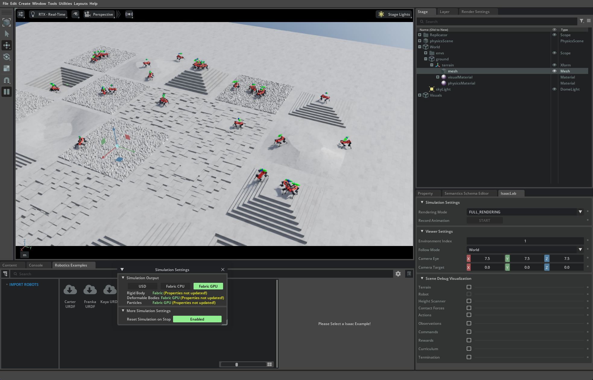

<!--
To view as slides, install marp-cli and run:
  npx @marp-team/marp-cli docs/week8-demos.md --preview
On GitHub this file also renders as a normal document.
-->

# Week 8 Visual Demos — mjlab, Isaac Lab, Holosoma

Three runnable robotics-RL demos that pair with the [Week 8 deep
dive](week8-sim-environments.md). Picked for visual impact, public
verified code, and "actually finishes in a session-friendly timebox."

- **Demo 1 — Unitree G1 double spin kick** (MuJoCo, mjlab + pretrained
  ONNX). Zero training. Instant payoff. Replay only.
- **Demo 2 — ANYmal-D rough terrain** (Isaac Lab, live PPO training,
  ~10–15 min). The canonical sim-to-real quadruped story.
- **Demo 3 — Humanoid locomotion in 15 minutes** (Holosoma, FastSAC,
  live training, ~15 min). The 2025 paper that showed humanoid
  locomotion from scratch is now a consumer-hardware reality.

---

## Hardware requirements

All three demos target a single **RTX 4090 / 5090** (Blackwell SM 12.0)
with CUDA 12.8+. The repo's existing PyTorch-nightly-cu128 setup
(`make setup`) already provides this; the demo envs add to it rather
than replace it.

| Demo | GPU memory | Wall clock | Network |
|---|---|---|---|
| 1. Spin kick (replay) | ~2 GB | seconds | one-time ONNX download |
| 2. ANYmal-D (train + play) | ~12 GB | 10–15 min train, instant play | none after install |
| 3. Holosoma G1 (train + play) | ~12 GB | ~15 min train | optional W&B logging |

### Platform notes

**Linux / WSL2** is the primary-tested path. All three demos work on
Ubuntu 22.04+ and WSL2 with the caveats below.

**Native Windows** works for all three demos with the workarounds
documented in each section below. Each demo section has a **Windows**
callout with platform-specific commands and fixes.

- **Demo 1 (mjlab)** — works on Linux, WSL2, and native Windows
  (Windows needs an encoding fix and an extra `--with scipy` flag).
- **Demo 2 (Isaac Lab)** — NVIDIA does **not** officially support
  Isaac Sim under WSL2; use native Windows or accept the community
  WSL2 path with its known gotchas (see Troubleshooting). On native
  Windows, use `isaaclab.bat` instead of `isaaclab.sh`.
- **Demo 3 (Holosoma)** — works on Linux, WSL2, and native Windows.
  The setup script is Linux-only; Windows users follow the manual
  steps below. Training is ~4× slower on Windows due to the
  mujoco-warp version pinning required to avoid version conflicts.

---

## Demo 1 — Unitree G1 double spin kick (MuJoCo, mjlab)

**What the audience sees.** A Unitree G1 humanoid in the MuJoCo viewer
performs a clean double spin kick — the same motion that ships in the
README teaser GIF of the [`g1_spinkick_example`][spinkick] repo, with
sim-and-real side-by-side. No training, no waiting; a pretrained ONNX
checkpoint is loaded and replayed.

**Why this demo first.** It is the visual payoff that justifies the
rest of the day. Audiences immediately get the answer to "what does a
trained humanoid policy look like?" before any training happens. It
also doubles as a sanity check that the GPU and viewer plumbing work.


[spinkick]: https://github.com/mujocolab/g1_spinkick_example

### Setup

mjlab is distributed via `uv`. If you don't have `uv`, install it once:

```bash
# Install uv (Rust-based Python package manager, ~10 MB)
curl -LsSf https://astral.sh/uv/install.sh | sh
# Restart shell or:  source ~/.bashrc
```

Sanity check that mjlab runs at all on your machine — this requires no
local clone:

```bash
uvx --from mjlab --refresh demo
```

**Windows:** mjlab prints emoji characters that crash on the default
Windows console codepage (cp1252), and scipy is not pulled in
transitively on a clean Windows install. Set the encoding and add the
missing dependency:

```powershell
$env:PYTHONIOENCODING = "utf-8"
uvx --from mjlab --with scipy --refresh demo
```

That command downloads mjlab into a temporary uv cache, opens the
MuJoCo viewer, and runs the built-in demo policy. If you see a robot
in the viewer, the stack works.

Then clone the spin kick repo:

```bash
git clone https://github.com/mujocolab/g1_spinkick_example.git
cd g1_spinkick_example
uv sync
```

`uv sync` installs the project's pinned dependencies into a local
`.venv/`. ~1–2 GB of downloads on first run.

### Run the demo

The repo expects the pretrained ONNX policy to be either pulled from
W&B or downloaded directly. Per the README, the run path follows
`{organization}/{project-name}/{run-id}` — the maintainers' published
spin-kick run is in the project's [W&B
report](https://api.wandb.ai/links/gcbc_researchers/nfi58457). To
replay locally with their checkpoint:

```bash
uv run play \
    Mjlab-Spinkick-Unitree-G1 \
    --wandb-run-path gcbc_researchers/mjlab-spinkick/<run-id> \
    --num-envs 1
```

(`<run-id>` is the 8-character identifier from the report's run
overview. Substitute your own if you trained one.)

> **Note:** The W&B artifacts for this run are scoped to the
> `gcbc_researchers` team. If you are not a member, the download will
> fail with a permissions error. Use the RoboJuDo offline path below
> instead.

For a fully-offline replay using a downloaded ONNX file, place it at
`assets/models/g1/beyondmimic/spinkick_safe.onnx` and use the
`RoboJuDo` integration documented in the spin kick README's
"Alternative Implementation" section.

### What to point the audience at

- **The first ~2 seconds** of the kick — preparation, then the spin
  itself. The smoothness of the trajectory is the payoff.
- **The MuJoCo viewer's contact visualization** — toggle with `C` to
  see foot-ground contact forces firing in real time. This is what the
  Week 8 deep-dive §5 (convex contacts) looks like in motion.
- **Compare to the sim-to-real GIF** in the spin kick README — same
  policy on the real Unitree G1. The transfer is the whole point.

### Optional: train it yourself (~hours, not minutes)

For audiences who want to see the training side, the same repo has a
training script. Expect **multiple hours on a 4090/5090**, not minutes
— motion imitation at 20k iterations × 4096 envs is heavier than the
"15 minute" recipe in Demo 3.

```bash
MUJOCO_GL=egl CUDA_VISIBLE_DEVICES=0 uv run train \
    Mjlab-Spinkick-Unitree-G1 \
    --registry-name your-org/motions/mimickit_spinkick_safe \
    --env.scene.num-envs 4096 \
    --agent.max-iterations 20000
```

This is offered as homework, not as a live-demo step.

---

## Demo 2 — ANYmal-D rough terrain (Isaac Lab)



**What the audience sees.** Up to 4096 ANYmal-D quadrupeds spawned on
randomly generated rough terrain (stairs, slopes, gravel), all
training in parallel. Reward and gait quality plot live. After ~10–15
minutes, a competent walking gait emerges; switching to `play` mode
shows a single trained robot navigating new terrain at runtime.

**Why this demo.** It is the canonical sim-to-real success story
(Week 8 §15, §19). The lineage from Hwangbo 2019 → Lee 2020 → RMA 2021
to the modern Isaac Lab recipe is one continuous arc, and this is the
shortest path to watching it happen on consumer hardware.

### Setup

Isaac Lab v2.3.2 requires **Python 3.11** and ships its own PyTorch
2.7.0+cu128 build. It does **not** share the `rl101` Python-3.10
conda env. Create a new one:

```bash
# 1. Python 3.11 conda env
conda create -y -n rl101-isaac python=3.11
conda activate rl101-isaac

# 2. Isaac Sim 5.1.0 (≈3 GB wheels, balloons to ~15 GB cache on first run)
pip install "isaacsim[all,extscache]==5.1.0" \
    --extra-index-url https://pypi.nvidia.com

# 3. PyTorch with CUDA 12.8 (Blackwell-ready, sm_120)
pip install -U torch==2.7.0 torchvision==0.22.0 \
    --index-url https://download.pytorch.org/whl/cu128

# 4. Clone + install Isaac Lab
git clone https://github.com/isaac-sim/IsaacLab.git
cd IsaacLab
./isaaclab.sh --install rsl_rl
```

**Windows:** Use `isaaclab.bat` instead of `isaaclab.sh`. On Windows
you will likely hit a `flatdict` build-isolation bug
(`ModuleNotFoundError: No module named 'pkg_resources'`). Pre-install
it, then install the source extensions manually:

```powershell
conda activate rl101-isaac

# Work around flatdict build-isolation bug
pip install flatdict==4.0.1 --no-build-isolation

# Install each Isaac Lab source extension
$extensions = Get-ChildItem "source" -Directory
foreach ($ext in $extensions) {
    pip install --editable $ext.FullName
}
pip install -e "source\isaaclab_rl[rsl_rl]"
```

If you installed Isaac Sim from the standalone binary (not via pip),
you must set environment variables so Python can find it:

```powershell
$env:PYTHONPATH = "C:\isaac-sim\site"
$env:ISAAC_PATH = "C:\isaac-sim"
$env:CARB_APP_PATH = "C:\isaac-sim\kit"
$env:EXP_PATH = "C:\isaac-sim\apps"
$env:RESOURCE_NAME = "IsaacSim"
```

If the Isaac Lab install needs a symlink to Isaac Sim and
`New-Item -ItemType SymbolicLink` fails without admin, use a directory
junction instead (no admin required):

```cmd
cmd /c mklink /J _isaac_sim C:\isaac-sim
```

A helper batch script that sets all of this up is at
`scripts/train_anymal_win.bat`.

Reserve **~25 GB** of disk for the install + extension cache.

### Run the training demo

From inside `IsaacLab/`:

```bash
# Headless training (GPU sim, 4096 envs default)
./isaaclab.sh -p scripts/reinforcement_learning/rsl_rl/train.py \
    --task Isaac-Velocity-Rough-Anymal-D-v0 \
    --headless
```

**Windows:** Replace `./isaaclab.sh -p` with `isaaclab.bat -p`, or
run Python directly (after setting the env vars above):

```powershell
python scripts\reinforcement_learning\rsl_rl\train.py `
    --task Isaac-Velocity-Rough-Anymal-D-v0 --headless
```

Wall-clock guideline on a single RTX 5090:

- **~5 min**: robots start producing forward velocity (still falling).
- **~10–15 min**: competent walking gait on flat terrain.
- **~30–45 min**: full rough-terrain convergence.

For a tight session demo, run for ~12 minutes and switch to play mode.

### Run the play / visualization

```bash
# Auto-loads the latest run, shows the trained policy in the viewer
./isaaclab.sh -p scripts/reinforcement_learning/rsl_rl/play.py \
    --task Isaac-Velocity-Rough-Anymal-D-Play-v0 \
    --num_envs 32
```

**Windows:** Same substitution — `isaaclab.bat -p` or `python` directly.

`--num_envs 32` is what the audience watches: 32 ANYmal-D robots
spawning together, all running the same trained policy across
different randomized terrain patches. The visual is iconic Isaac
Lab — many copies of the same robot stepping in sync.

### What to point the audience at

- **The terrain generation** — the rough-terrain curriculum
  procedurally spawns stairs, ramps, gravel, and gaps. This is
  *domain randomization* (Week 8 §14) made visual.
- **The reward plot** in stdout / TensorBoard — climbs from near-zero
  to ~10 over the training window. That climb is the policy *learning*.
- **The per-env failure rate** — early on, most robots fall; late, most
  stay up. This is the moment the audience "gets" what RL is.
- **Switch to play mode** mid-demo to show the trained robot navigating
  *new* terrain it never saw during training.

### Spot fallback

If ANYmal-D is unavailable or you prefer the Boston Dynamics silhouette,
Spot has a **flat-terrain** variant only (no rough variant in current
Isaac Lab main):

```bash
./isaaclab.sh -p scripts/reinforcement_learning/rsl_rl/train.py \
    --task Isaac-Velocity-Flat-Spot-v0 --headless
```

For Spot on rough terrain, the community fork at
[`fan-ziqi/robot_lab`](https://github.com/fan-ziqi/robot_lab) adds it,
but stay on official Isaac Lab for the demo unless you've tested the
fork ahead of time.

---

## Demo 3 — Humanoid locomotion in 15 minutes (Holosoma)

**What the audience sees.** A Unitree G1 humanoid (29 DoF) starting
from random and learning to walk from scratch. By minute 5–7 the robot
takes its first stable steps; by minute 12–15 it walks in a straight
line. Per the paper (arXiv:2512.01996), the same recipe trains a
Booster T1 humanoid in the same budget.

**Why this demo.** It is the "humanoids are now training-time
accessible" moment. The Week 8 deep dive (§20) calls this out as the
2025 turning point — Holosoma is the public Apache-2.0 codebase that
ships the recipe.

**Real-world deployment videos** (click to play):
[G1 Locomotion](https://youtu.be/YYMgj5BDIMI) ·
[T1 Locomotion](https://youtu.be/Q6rNHJZ2a6Y) ·
[G1 Dancing](https://youtu.be/ouPk69_eFfE)

### Setup

Holosoma supports four backends; the **MJWarp** (MuJoCo Warp) path is
the right one for the RTX 5090 because IsaacGym is deprecated and won't
target Blackwell cleanly. Holosoma's `setup_mujoco_via_uv.sh` script
handles dependencies via uv:

```bash
git clone https://github.com/amazon-far/holosoma.git
cd holosoma
bash scripts/setup_mujoco_via_uv.sh
```

The script creates a local environment and installs MuJoCo Warp,
PyTorch, and Holosoma's own dependencies. ~5–10 minutes on a fast
connection.

**Windows:** The setup script is Linux-only. Set up manually with uv
and Python 3.12 (Python 3.13 is incompatible due to missing `open3d`
wheels):

```powershell
cd holosoma
uv venv --python 3.12 .venv\hsmujoco
.venv\hsmujoco\Scripts\activate

# Pin mujoco-warp 0.0.2 to avoid warp-lang version conflict
# (holosoma pins warp-lang==1.10.0; newer mujoco-warp needs >=1.13.0)
uv pip install mujoco mujoco-python-viewer
uv pip install "mujoco-warp==0.0.2"
uv pip install "numpy>=1.23.5,<2"

# CUDA PyTorch — pip default is CPU-only
uv pip install torch==2.10.0 --index-url https://download.pytorch.org/whl/cu128

uv pip install -e src/holosoma
```

Triton is not available on Windows, so `torch.compile` will fail.
Disable it and apply a bfloat16 validation workaround:

```powershell
$env:TORCHDYNAMO_DISABLE = "1"
```

A wrapper script that handles both fixes is at
`scripts/holosoma_train_win.py`.

> **Performance note:** With `mujoco-warp==0.0.2` (the version
> required to avoid the warp-lang conflict), training is **~4× slower**
> than the paper's documented 15 minutes. Expect ~60 minutes for a
> walking gait on Windows. The policy still converges — it just takes
> longer.

### Run the training demo

```bash
# Train Unitree G1 with FastSAC on the MJWarp backend (no W&B login needed)
python src/holosoma/holosoma/train_agent.py \
    exp:g1-29dof-fast-sac \
    simulator:mjwarp \
    --training.seed 1
```

The training command prints a periodic reward summary every few
seconds and logs to a local `runs/` directory by default. Add
`logger:wandb` if you want online plots — but skip it for a session
demo where you don't want to depend on the network.

**Wall-clock on a single RTX 4090** (per paper, expect parity or
slightly better on 5090): ~15 min to a robust walking policy on rough
terrain with push perturbations.

### Run the play / visualization

Holosoma's evaluation script loads the latest local checkpoint and
opens the MuJoCo viewer:

```bash
python src/holosoma/holosoma/play_agent.py \
    exp:g1-29dof-fast-sac \
    simulator:mjwarp \
    --checkpoint runs/latest/checkpoint.pt
```

For audiences, run the play script in a second terminal *while* the
training script is still running — the checkpoint auto-saves
periodically and you can watch the policy improve over the 15-minute
window.

### What to point the audience at

- **Minute 0–3**: robots fall over almost immediately. This is "the
  policy is random."
- **Minute 5–7**: robots stay up longer, take 1–2 lurching steps.
  This is "the policy learned that not-falling has reward."
- **Minute 10–12**: stable forward walking emerges. This is "the
  policy learned the gait."
- **Minute 13–15**: gait quality refines, push recovery starts to
  work. This is "the policy is sim-to-real ready."

The FastSAC recipe itself (Week 8 §18, paper §3) — layer-normed
critic, average-of-Q targets, distributional critic, large batches,
multiple gradient steps per sim step — is the *why*. Off-policy
algorithms reuse data; PPO discards it. That re-use is what makes 15
minutes possible.

---

## Suggested session flow

A coherent 90-minute session that uses all three demos:

| Minute | What happens | Audience takeaway |
|---|---|---|
| 0–5 | Recap Week 8 deep dive: sim-to-real, DR, PPO-dominance | "This is the algorithmic background." |
| 5–15 | Demo 1 — spin kick replay | "This is what a trained humanoid policy looks like." |
| 15–25 | Walk through how the spin kick was trained (motion imitation, ONNX export, deployment) | "Pretrained = someone already paid the training cost." |
| 25–35 | Start Demo 2 — ANYmal-D training (headless) | "Watch a policy go from random to walking." |
| 35–45 | While ANYmal-D trains: cover §14 DR + §15 RMA from the deep dive | The math behind the visual. |
| 45–55 | Demo 2 — ANYmal-D play mode, new terrain | "The trained policy generalizes." |
| 55–70 | Start Demo 3 — Holosoma 15-min G1 training (live) | "Now a humanoid does the same thing." |
| 70–85 | While Holosoma trains: cover §18 (FastSAC vs PPO), §20 (humanoids 2025–2026) | Why off-policy + MJWarp = consumer-hardware humanoids. |
| 85–90 | Demo 3 — play the trained G1; Q&A | The full RL → robotics arc in one session. |

If the time budget is tighter, drop Demo 2 (ANYmal-D) and run just
Demo 1 + Demo 3. The "pretrained vs. live-trained-in-15-minutes"
contrast is the strongest minimal pair.

---

## Troubleshooting

### "MuJoCo viewer is black / nothing renders" (WSL2)

WSLg's GL path is inconsistent for MuJoCo's viewer. Two workarounds:

1. Set `MUJOCO_GL=egl` before any mjlab / Holosoma command to use
   EGL offscreen rendering. Combine with `--video` flags or capture
   PNGs to inspect output.
2. Run the **play / replay** commands on the Windows host instead,
   leaving training on WSL2. Copy the checkpoint between filesystems.

### "Isaac Sim crashes on launch" / `omni.kit` errors

Almost always a CUDA driver mismatch. Check:

- Windows host NVIDIA driver is ≥572.xx (provides CUDA 12.8 stub for
  WSL2).
- **Do not** install a Linux NVIDIA driver inside WSL2.
- Use `--headless` for training (no rendering, far more stable).
- For the play step, run on native Windows if the WSL2 GL path fails.

### "Holosoma training is very slow"

If MJWarp is slower than expected, your card may not be hitting the
optimal kernel path. Sanity check:

```bash
python -c "import mujoco_warp; print(mujoco_warp.__version__)"
nvidia-smi   # confirm GPU is actually being used
```

If the paper's IsaacGym path is preferred, note that IsaacGym is
deprecated and Blackwell support is **not** guaranteed. The MJWarp
path is the recommended Blackwell-era backend.

### "I can't get the spin kick W&B checkpoint to load"

The `--wandb-run-path` flag requires a valid W&B login and the project
must be accessible. Alternatives:

1. Use the RoboJuDo `BeyondmimicPolicy` integration documented in the
   spin kick README — works fully offline once the ONNX file is in
   place.
2. Train your own (~hours) — the spin kick repo has the recipe.

### "ANYmal-D training reward plateaus too low"

Common causes:

- `--num_envs` reduced below 1024 (the default 4096 is calibrated).
- An older Isaac Lab version with different reward weights — pin to
  v2.3.2.
- Walking on a terrain seed that's too hard. The rough-terrain
  curriculum *should* ramp difficulty automatically; if it stays
  hard, try the flat-terrain variant first.

### "flatdict / pkg_resources build failure" (Windows)

`flatdict==4.0.1` imports `pkg_resources` in its `setup.py`. Pip's
build isolation creates a temp virtualenv where modern setuptools no
longer bundles `pkg_resources`, causing
`ModuleNotFoundError: No module named 'pkg_resources'`. Fix:

```powershell
pip install flatdict==4.0.1 --no-build-isolation
```

Then re-run the Isaac Lab install.

### "Emoji crash / UnicodeEncodeError on Windows"

mjlab prints emoji characters that the default Windows console
codepage (cp1252) cannot encode. Set the encoding before running:

```powershell
$env:PYTHONIOENCODING = "utf-8"
```

### "Triton / torch.compile fails on Windows"

Triton is Linux-only. On Windows, disable `torch.compile` by setting:

```powershell
$env:TORCHDYNAMO_DISABLE = "1"
```

Holosoma's `scripts/holosoma_train_win.py` wrapper does this
automatically.

### "Symlink requires admin on Windows"

Isaac Lab may need a symlink to the Isaac Sim install directory.
`New-Item -ItemType SymbolicLink` requires admin privileges on
Windows. Use a directory junction instead (no admin required):

```cmd
cmd /c mklink /J _isaac_sim C:\isaac-sim
```

---

## Resources

**Repos used in this guide.**

- mjlab — [github.com/mujocolab/mjlab](https://github.com/mujocolab/mjlab)
  (2.4k⭐, Apache-2.0, paper arXiv:2601.22074).
- mjlab G1 spin kick example —
  [github.com/mujocolab/g1_spinkick_example](https://github.com/mujocolab/g1_spinkick_example).
- Isaac Lab — [github.com/isaac-sim/IsaacLab](https://github.com/isaac-sim/IsaacLab)
  (paper arXiv:2511.04831, v2.3.2 stable).
- Holosoma —
  [github.com/amazon-far/holosoma](https://github.com/amazon-far/holosoma)
  (Apache-2.0, paper arXiv:2512.01996, project page
  [younggyo.me/fastsac-humanoid](https://younggyo.me/fastsac-humanoid)).

**Windows helper scripts** (in this repo's `scripts/` directory):

- `scripts/holosoma_train_win.py` — wraps Holosoma training with
  Triton disable + bfloat16 validation fix for Windows.
- `scripts/train_anymal_win.bat` — sets Isaac Sim env vars and runs
  ANYmal-D training on native Windows.

**Background reading from this course.**

- [Week 8 deep dive](week8-sim-environments.md) — the theoretical
  companion. Specifically §14 (DR), §15 (RMA/teacher-student), §18
  (PPO vs SAC), §19 (quadruped), §20 (humanoid 2025–2026), §22–25
  (hands-on starting points).
- [Week 7 deep dive](week7-world-models-and-rwml-under-the-hood.md) —
  the world-models side of the same coin.

**Curated lists worth bookmarking.**

- `Tadinu/awesome_mujoco` — comprehensive MuJoCo resource list
  (last updated May 2026):
  [github.com/Tadinu/awesome_mujoco](https://github.com/Tadinu/awesome_mujoco).
- `jc-bao/awesome-mujoco` — shorter curated list of polished MuJoCo
  projects:
  [github.com/jc-bao/awesome-mujoco](https://github.com/jc-bao/awesome-mujoco).
- `shaoxiang/awesome-unitree-robots` — Unitree-specific (G1, Go2, H1+)
  across simulators:
  [github.com/shaoxiang/awesome-unitree-robots](https://github.com/shaoxiang/awesome-unitree-robots).

**Honorable mentions** (not used in this guide but worth knowing):

- `google-deepmind/mujoco_mpc` (1.6k⭐) — DeepMind's MPC framework
  with a working **Shadow Hand Rubik's Cube** demo task. C++/CMake,
  Ubuntu 20.04 + macOS-12 tested. Iconic dexterous-manipulation
  visual; not used here only because the build is more involved than
  the Python-uv path of mjlab.
- `google-research/robopianist` — Shadow Hand piano playing
  (archived, CoRL 2023).
- MuJoCo Playground locomotion notebook — Colab-runnable Unitree G1
  joystick training; lighter than Holosoma but slower convergence.

---

*This file is operational. The math and lineage live in
[`week8-sim-environments.md`](week8-sim-environments.md); this one is
the run guide.*
