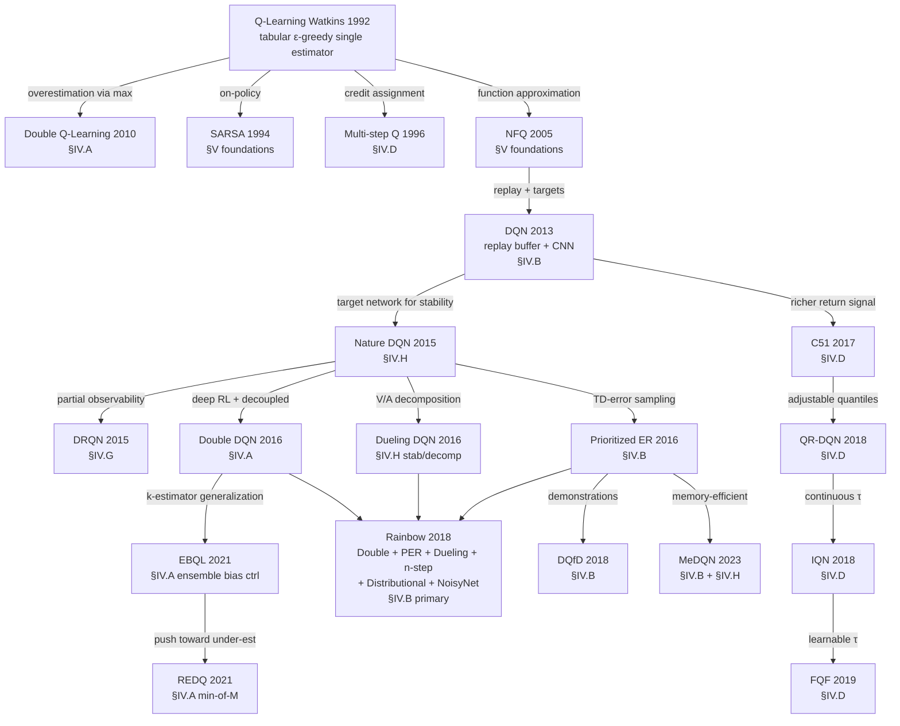
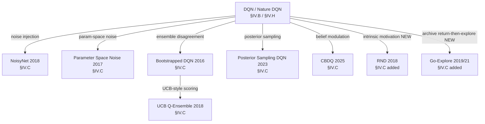
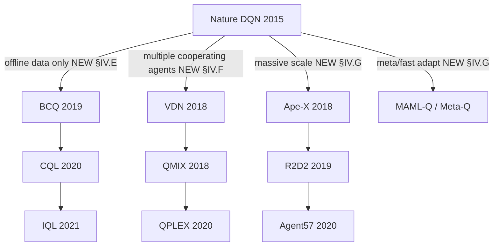

# Genealogy Figure — Design Draft

**Synced to v0.24 (2026-05-30).**
**Status: SHIPPED — both figures are in `draft-tai` §IV overview, rendered to the two-column PDF.**

What actually shipped (vs. the original TikZ/landscape plan below):

- **Two mermaid flowcharts**, both in the §IV "Q-Learning Methods by
  Weakness" overview of `draft-tai`, rendered into the **two-column
  IEEEtran PDF** (not TikZ, not a landscape half-page):
  1. **Method genealogy flowchart** — Q-Learning → Double Q / DQN → …
     → Rainbow, including the **distributional lineage** C51 → QR-DQN →
     IQN → FQF. This is the main lineage tree (the "Mermaid genealogy"
     + "Distributional / credit-assignment branch" content below,
     combined into the paper figure).
  2. **"Branches outside the method-type taxonomy" figure** — the
     offline-RL (§IV.E), multi-agent (§IV.F), and distributed/meta
     (§IV.G) subtrees off Nature DQN. (This is the
     "Modern-RL branches" graph below; it shipped as a *standalone
     second figure*, framed as the axes that sit outside the six
     method-type categories.)
- **CUT from the TAI core: the per-axis quadrant / positioning charts**
  (the 8×4 "axis matrix" / "physician's taxonomy" sketch at the bottom
  of this file). The monograph carried per-axis positioning charts; the
  TAI core does **not** render them as figures. Their analytical content
  was absorbed into the §IV **comparison tables** (one per axis,
  uniform template) and the cross-axis interaction table, with the full
  method-type index pushed to **supplement S2**. The empty-cell
  "where attention went" argument now lives in prose + the comparison
  tables, not a quadrant chart.
- Path note: the draft moved from `draft/` to the two-edition layout —
  `draft-monograph/` (FROZEN, tag `monograph-v0.15`, the quarry) and
  `draft-tai/` (the 19-page submission). The figures live in the §IV
  overview of `draft-tai`; the monograph retains the fuller set.

The remainder of this file is the original **design rationale and
edge-annotation source** — retained because the edge labels (parent
weakness each child addresses) and the lineage decisions are still the
source of truth for the shipped mermaid figures.

---

The visual companion to the structural pivot. This file is the *layout
and edge annotation* design source, suitable for circulating to the
team and converting downstream. (Original plan was a TikZ landscape
half-page figure; the shipped figures are mermaid in the two-column
PDF — see the sync note above.)

Each node is a method (year). Each edge is labeled with the **weakness
of the parent that the child method addresses**. Edges crossing into
new axis-sections introduced by the structural pivot are marked with
`[NEW]`.

The figure is wider than it is tall — when typeset it should sit
landscape, ~half-page, with method nodes color-coded by axis-section
(§IV.A–§IV.H).

**Status:** this file has two visual representations of the same
genealogy. The ASCII version (below, §"Master genealogy") is the
edge-annotation design reference. The mermaid version (immediately
below) renders natively on GitHub and is what reviewers will see in
the markdown preview. Final paper figure will be TikZ.

**Note (SHIPPED):** the mermaid versions are inserted into the §IV
overview of `draft-tai` and render into the two-column PDF:
- **Figure: method genealogy** — master lineage + distributional branch
  (C51→QR-DQN→IQN→FQF) → §IV overview of `draft-tai`.
- **Figure: branches outside the method-type taxonomy** — offline-RL
  (§IV.E) / multi-agent (§IV.F) / distributed-meta (§IV.G) subtrees →
  §IV overview of `draft-tai`.
- The exploration-branch subgraph below did **not** ship as a separate
  figure; its lineage is folded into the main genealogy / §IV.C prose.

This file remains the design-source-of-truth for edge annotations; the
`draft-tai` §IV overview contains the actual paper-position mermaid
figures (the eventual TikZ redraw was dropped — mermaid renders fine in
the two-column PDF).

---

## Mermaid genealogy (renders on GitHub)







The three mermaid subgraphs (main genealogy, exploration branch,
modern-RL branches) are split for GitHub readability — a single
graph would be too wide. The TikZ paper figure can combine them.

---

## Master genealogy

```
                                                                              ┌────────────────────────────────────────┐
                                                                              │ vanilla Q-Learning (Watkins 1992)      │
                                                                              │ tabular, ε-greedy, single estimator    │
                                                                              └─────┬──────────────────────────┬───────┘
                                                                                    │                          │
                                              ┌──────────────────┬──────────────────┼──────────────────┐       │
                                              │ overestimation   │ on-policy        │ credit assignment│       │ function approximation
                                              │ via max          │ behavior         │ delayed reward   │       │ (deadly triad)
                                              ▼                  ▼                  ▼                  │       ▼
                          ┌───────────────────────┐  ┌──────────────────┐  ┌─────────────────────┐    │   ┌───────────────────────────────┐
                          │ Double Q-Learning     │  │ SARSA            │  │ Multi-step Q (Q(λ)) │    │   │ Neural Fitted Q Iteration (NFQ)│
                          │ (Hasselt 2010)        │  │ (Rummery 1994)   │  │ (Peng & Williams 96)│    │   │ (Riedmiller 2005)             │
                          │ §IV.A                 │  │ §V               │  │ §IV.D               │    │   │ §V                            │
                          └───────────┬───────────┘  └──────────────────┘  └──────────┬──────────┘    │   └─────────────────┬─────────────┘
                                      │                                               │               │                     │ replay + targets
                                      │                                               │               │                     ▼
                                      │                                               │               │       ┌───────────────────────────┐
                                      │                                               │               │       │ DQN (Mnih 2013)           │
                                      │                                               │               │       │ replay buffer, conv net   │
                                      │                                               │               │       │ §IV.B (replay = SE)       │
                                      │                                               │               │       └──┬────────────────────────┘
                                      │                                               │               │          │
                                      │                                               │               │          │ target network for stability
                                      │                                               │               │          ▼
                                      │                                               │               │       ┌───────────────────────────┐
                                      │                                               │               │       │ Nature DQN (Mnih 2015)    │
                                      │                                               │               │       │ §IV.H (target net = stab) │
                                      │                                               │               │       └──┬───┬───┬────────────────┘
                                      │                                               │               │          │   │   │
                       ┌──────────────┴───────────────────────────────────────────────┘               │          │   │   └────────────────────────────────────┐
                       │ deep RL + decoupled estimators                                               │          │   │ partial observability                  │ uniform replay = wasteful
                       ▼                                                                              │          │   ▼                                        ▼
        ┌──────────────────────────────┐                                                              │          │  ┌────────────────────────┐  ┌──────────────────────────────┐
        │ Double DQN (Hasselt 2016)    │                                                              │          │  │ DRQN (Hausknecht 2015) │  │ Prioritized ER (Schaul 2016) │
        │ §IV.A                        │                                                              │          │  │ LSTM head              │  │ TD-error sampling             │
        └──────────────────┬───────────┘                                                              │          │  │ §IV.G                  │  │ §IV.B                         │
                           │ k-estimator generalization                                               │          │  └────────────────────────┘  └──────────────┬───────────────┘
                           │ (bias↔variance trade-off)                                                │          │                                              │
                           ▼                                                                          │          ▼                                              │
              ┌────────────────────────────┐                                                          │  ┌────────────────────────┐                              │
              │ EBQL (Peer 2021)           │                                                          │  │ Dueling DQN (2016)     │                              │
              │ §IV.A (ensemble bias ctrl) │                                                          │  │ V(s) + A(s,a)          │                              │
              └───┬────────────────────────┘                                                          │  │ §IV.H (stab/decomp)    │                              │
                  │ push toward under-est                                                             │  └─────────┬──────────────┘                              │
                  ▼                                                                                   │            │                                             │
        ┌──────────────────────────────┐                                                              │            │ integrate enhancements                      │
        │ REDQ (Chen 2021)             │                                                              │            │                                             │
        │ min-of-M, online actor-critic│                                                              │            │                                             │
        │ §IV.A                        │                                                              │            ▼                                             │
        └──────────────────────────────┘                                                              │  ┌─────────────────────────────────────┐                 │
                                                                                                      │  │ Rainbow (Hessel 2018)               │ ◀──────── PER ──┘
                                                                                                      │  │ Double + PER + Dueling + n-step     │
                                                                                                      │  │ + Distributional + NoisyNet         │
                                                                                                      │  │ §IV.B (PER drives ablation gain)    │
                                                                                                      │  └─────────────────────────────────────┘
                                                                                                      │
                                                                                                      │
                                                                                                      │  ┌──────────────────────┐
                                                                                                      ├─▶│ DQfD (Hester 2018)   │
                                                                                                      │  │ §IV.B (demos)        │
                                                                                                      │  └──────────────────────┘
                                                                                                      │
                                                                                                      │  ┌──────────────────────────────┐
                                                                                                      └─▶│ MeDQN (Kapturowski-style 2023)│
                                                                                                         │ §IV.B (memory-efficient)     │
                                                                                                         └──────────────────────────────┘
```

---

## Exploration branch (ε-greedy is dithered, not directed)

This is its own subtree off vanilla Q / DQN — the **brittle exploration**
axis.

```
                                vanilla Q + DQN
                                       │
       ┌──────────────────┬────────────┴────────────┬──────────────────────────┬────────────────────┐
       │ noise injection  │ ensemble disagreement   │ posterior sampling       │ intrinsic motivation│
       ▼                  ▼                         ▼                          ▼                    │
┌─────────────────┐  ┌──────────────────────┐  ┌──────────────────────────┐  ┌───────────────────┐ │
│ NoisyNet (2018) │  │ Bootstrapped DQN     │  │ Bayesian Q-Learning      │  │ RND (Burda 2018)  │ │
│ §IV.C           │  │ (Osband 2016)        │  │ (Dearden 1998)           │  │ §IV.C  [NEW]      │ │
└─────────────────┘  │ §IV.C                │  │ §V (mentioned in §IV.C)  │  └───────────────────┘ │
                     └──────────┬───────────┘  └────────────┬─────────────┘                        │
                                │ UCB-style scoring         │ deep extension                       │
                                ▼                           ▼                                      │
                     ┌──────────────────────┐  ┌──────────────────────────┐                        │
                     │ UCB Q-Ensemble       │  │ Posterior Sampling DQN   │                        │
                     │ (Chen 2018)          │  │ (2023)                   │                        │
                     │ §IV.C                │  │ §IV.C                    │                        │
                     └──────────────────────┘  └──────────────────────────┘                        │
                                                                                                   │
       ┌──────────────────────┐  ┌────────────────────────┐  ┌──────────────────────────┐         │
       │ Param Space Noise    │  │ CBDQ (2025)            │  │ Go-Explore (2019/21)    │ ◀──── archival exploration
       │ (Plappert 2018)      │  │ belief-modulated π     │  │ §IV.C  [NEW]            │           │
       │ §IV.C                │  │ §IV.C                  │  └──────────────────────────┘           │
       └──────────────────────┘  └────────────────────────┘                                        │
                                                                                                   │
                                                                                                   │
```

---

## Distributional / credit-assignment branch

The **reward sparsity & credit assignment** axis. Distributional RL
lives here, *not* under "Statistical/uncertainty" — the load-bearing
empirical claim is that the distribution carries richer credit-assignment
signal than a scalar expectation.

```
                            DQN (2013/15)
                                  │
                                  │ richer return signal
                                  ▼
              ┌────────────────────────────────────┐
              │ C51 (Bellemare 2017)               │
              │ 51 fixed atoms, KL projection      │
              │ §IV.D                              │
              └─────────────────┬──────────────────┘
                                │ fix probs, learn quantiles
                                ▼
              ┌────────────────────────────────────┐
              │ QR-DQN (Dabney 2017)               │
              │ N adjustable quantiles             │
              │ §IV.D                              │
              └─────────────────┬──────────────────┘
                                │ continuous quantile fractions
                                ▼
              ┌────────────────────────────────────┐
              │ IQN (Dabney 2018)                  │
              │ τ ~ U(0,1) at runtime              │
              │ §IV.D                              │
              └─────────────────┬──────────────────┘
                                │ learnable τ proposal
                                ▼
              ┌────────────────────────────────────┐
              │ FQF (Yang 2019)                    │
              │ fraction proposal + value nets     │
              │ §IV.D                              │
              └────────────────────────────────────┘

   Multi-step Q (Peng 1996) ──── n-step bootstrapping ────▶ Rainbow §IV.B
                                                            (multi-step is one of the 6 ingredients)
```

---

## Modern-RL branches (SHIPPED as the "branches outside the method-type taxonomy" figure)

These subtrees became the **second §IV figure** in `draft-tai`:
"branches outside the method-type taxonomy" — offline RL (§IV.E),
multi-agent (§IV.F), and distributed/meta (§IV.G), as new branches off
Nature DQN. (Originally proposed below as the gaps the genealogy made
visible; the sections were added and the figure shipped.)

```
                            Nature DQN (2015)
                                   │
        ┌──────────────────────────┼──────────────────────────┬──────────────────────────┐
        │ offline data only        │ multiple agents          │ massive scale            │ meta / fast adapt
        │                          │ (cooperative)            │ (distributed)            │
        ▼ [NEW §IV.E]              ▼ [NEW §IV.F]              ▼ [NEW §IV.G]              ▼ [NEW §IV.G]
   ┌──────────────────┐     ┌──────────────────┐         ┌──────────────────┐      ┌──────────────────────┐
   │ BCQ (2019)       │     │ VDN (2018)       │         │ Ape-X (2018)     │      │ MAML-Q / Meta-Q     │
   │ explicit OOD     │     │ additive Q       │         │ distributed PER  │      │ (2017–2020)         │
   │ §IV.E            │     │ §IV.F            │         │ §IV.G            │      │ §IV.G               │
   └────────┬─────────┘     └────────┬─────────┘         └────────┬─────────┘      └──────────────────────┘
            │                        │                            │
            ▼                        ▼                            ▼
   ┌──────────────────┐     ┌──────────────────┐         ┌──────────────────┐
   │ CQL (2020)       │     │ QMIX (2018)      │         │ R2D2 (2019)      │
   │ conservative Q   │     │ monotonic mixer  │         │ recurrent distr. │
   │ §IV.E            │     │ §IV.F            │         │ §IV.G            │
   └────────┬─────────┘     └────────┬─────────┘         └────────┬─────────┘
            │                        │                            │
            ▼                        ▼                            ▼
   ┌──────────────────┐     ┌──────────────────┐         ┌──────────────────┐
   │ IQL (2021)       │     │ QPLEX (2020)     │         │ Agent57 (2020)   │
   │ expectile reg.   │     │ duplex dueling   │         │ bandit meta-π    │
   │ §IV.E            │     │ §IV.F            │         │ §IV.G            │
   └──────────────────┘     └──────────────────┘         └──────────────────┘
```

---

## Notes on the final rendering

A real journal figure should:

- Color-code nodes by axis (eight colors for IV.A–IV.H plus a neutral
  for foundations); this lets a reader scan the figure once and see
  the eight clusters visually.
- Show edges with the weakness *as text on the edge*, not in a legend.
  The annotations are the synthesis the reviewers want — they belong
  inline, not in a key.
- Indicate the [NEW] subtrees in a different visual register (dashed
  outline, lighter fill) so a reviewer can immediately see *what the
  paper adds beyond the previous taxonomy*.
- Span a half-page landscape figure; a quarter-page is too cramped for
  the edge annotations to be legible.

## Per-axis quadrant / axis-matrix chart — CUT FROM TAI CORE

**Status: NOT a figure in `draft-tai`.** This 8×4 quadrant/positioning
matrix was proposed as a companion figure (and per-axis positioning
charts existed in the monograph). It was **cut from the TAI core**: the
analytical content — which families target which axis, and the
"empty-cell / where attention went" argument — moved into the §IV
**per-axis comparison tables**, the cross-axis interaction table, and
the full method-type index in **supplement S2**. Kept below as the
design rationale that informed those tables.

A second, simpler figure — the *axis matrix* — would complement the
genealogy:

```
                                Solution families that target this axis
                  ┌───────────────────┬──────────────┬────────────────┬─────────────┐
                  │ decoupling        │ ensembles    │ architectural  │ behavior    │
─────────────────┼───────────────────┼──────────────┼────────────────┼─────────────┤
 IV.A Overest.    │ DoubleQ/DoubleDQN │ EBQL/REDQ    │ Dueling (rel.) │ —           │
 IV.B SampleEff.  │ —                 │ —            │ —              │ PER/DQfD/MeDQN/HER │
 IV.C Explor.     │ —                 │ Boot/UCB-Q   │ NoisyNet/PSpace│ CBDQ/PSDQN/Go-Explore/RND │
 IV.D Sparsity    │ —                 │ —            │ Distributional │ n-step/λ-returns │
 IV.E DistShift   │ BCQ               │ EDAC         │ —              │ CQL/IQL/AWAC │
 IV.F Coord.      │ —                 │ —            │ VDN/QMIX/QPLEX │ —           │
 IV.G Scale       │ —                 │ —            │ DRQN/R2D2      │ Ape-X/Agent57/Meta-Q │
 IV.H Stability   │ —                 │ —            │ TargetNet/Polyak/Dueling/PQN │ MeDQN cons. loss │
─────────────────┴───────────────────┴──────────────┴────────────────┴─────────────┘
```

This 8×4 matrix is the "physician's taxonomy" rendered as a table.
The empty cells matter: they show where the field's collective
attention has gone (heavily on exploration; lightly on coordination)
and where it has not. Pairing this matrix with the genealogy gives
the reader two complementary views of the same field.

---

*This file is a layout draft; the final figure will be redrawn in
TikZ. The point is to fix the edge annotations and the [NEW] subtree
placement, both of which are content decisions, not rendering
decisions.*
