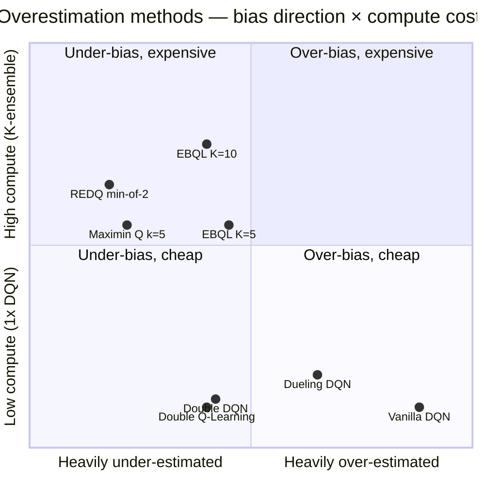

# IV.A. Overestimation Bias {#sec-iv-a}

### A. The Weakness

The standard Q-learning update,

$$
Q(s,a) \leftarrow Q(s,a) + \alpha\bigl(r + \gamma \max_{a'} Q(s',a') - Q(s,a)\bigr),
$$

uses the operator $\max_{a'} Q(s',a')$ to estimate the value of the
next state. When $Q(s',\cdot)$ contains noise — whether from sampling,
function approximation, or partial coverage — this operator is
*systematically biased upward*. The maximum of noisy estimators has
expectation strictly greater than the maximum of their true means
(Smith & Winkler, 2006); applied recursively through the Bellman
backup, this bias propagates and amplifies.

The consequence is not merely cosmetic. Overestimation steers the
greedy policy toward actions whose values are *least accurately
estimated*, not toward actions that are genuinely best. In tabular
settings the effect is bounded by $\mathcal{O}(\sqrt{\log|A|/N})$; in
deep Q-learning with neural approximation it can compound
indefinitely.

This is the canonical example of how a property reasonable in
expectation (*"act greedily"*) becomes harmful in finite-sample
practice. Methods that target this axis trade structural complexity
for a more honest value estimate.

### B. Solution Families

Three families of approach have emerged, distinguished by *what
information they exploit to debias the maximum*.

**B.1. Two-estimator decoupling (Double Q-learning, Double DQN).**
The earliest fix, introduced by [@hasselt_2010_doubleq], maintains two
independent Q-tables $Q_A$ and $Q_B$. At each update, one is randomly
chosen to be updated, with its target computed using the *other* table:

$$
Q_A(s,a) \leftarrow Q_A(s,a) + \alpha\bigl(r + \gamma Q_B(s', a^*) - Q_A(s,a)\bigr),
\quad a^* = \arg\max_{a'} Q_A(s',a').
$$

The decoupling works because the action selected by $Q_A$ does not
share noise with the value used to evaluate it. The bias does not
vanish — it can become slightly *negative* (under-estimation) — but it
is no longer driven by the maximization itself.

Double DQN [@hasselt_2016_doubledqn] applies the same idea inside the
deep-RL recipe, using the *online* network for action selection and
the *target* network for evaluation:

$$
y = r + \gamma\, Q(s', \arg\max_{a'} Q(s', a'; \theta);\, \theta^-).
$$

This adds no additional networks beyond the target network DQN already
maintains, which is a substantial part of its adoption: the cost is
near-zero.

A recent re-examination of this design — Deep Double Q-Learning (DDQL)
[@nagarajan_2026_ddql] — argues that the Double DQN trick
of using online and target networks as a decoupled pair is *not*
equivalent to the original tabular Double Q-learning [@hasselt_2010_doubleq], which
trains two genuinely independent estimators. Substituting a target
network for the second estimator introduces a stale-bootstrap bias
that Double Q-learning does not have. DDQL trains two independent
$Q$-networks jointly, alternating which one updates at each step in
the spirit of the tabular algorithm. The result is reduced
overestimation and improved performance on 47 of 57 Atari games
relative to Double DQN under matched compute. The result revisits a
foundational citation of this section and identifies a long-overlooked
gap between two methods often treated as equivalent in the literature.

**B.2. Ensemble-mediated bias control (EBQL, REDQ).** Ensemble
methods generalize the two-estimator idea to $K$ Q-estimators
and tune the bias-variance trade-off explicitly.

Ensemble Bootstrapped Q-Learning (EBQL) [@peer_2021_ebql] maintains
$K$ Q-networks; at each step it samples a single member $k_t$ for
update and uses the *average of the remaining $K-1$ members* to
evaluate the next-state action chosen by member $k_t$:

$$
Q_{k_t}(s,a) \leftarrow (1-\alpha) Q_{k_t}(s,a) + \alpha\bigl(r + \gamma\, Q_{\setminus k_t}(s', \hat a^*)\bigr).
$$

Increasing $K$ smoothly moves between Q-learning ($K=1$,
over-estimation) and Double DQN ($K=2$, slight under-estimation).
Empirically, $K \in [5,10]$ balances the two.

REDQ [@chen_2021_redq] pushes this further: it takes the *minimum* of
$M \le K$ randomly selected ensemble members at each update step.
Taking the min instead of the average creates explicit
under-estimation pressure, which the authors argue is preferable when
the optimizer is biased toward high-Q regions.

The ensemble approach has a second virtue: the per-member disagreement
is itself a usable uncertainty signal for exploration (see §IV.C),
making the same architecture do double duty across axes.

**B.3. Architectural decomposition (Dueling DQN).** A separate line of
work decomposes the Q-function into a state-value baseline $V(s)$ and
an advantage $A(s,a)$:

$$
Q(s,a) = V(s) + \Bigl(A(s,a) - \tfrac{1}{|\mathcal{A}|}\sum_{a'} A(s,a')\Bigr).
$$

[@wang_2016_dueling] motivate dueling primarily as an architecture for
states where action choice is unimportant: $V(s)$ can be learned from
*all* transitions through $s$, while $A(s,\cdot)$ only updates on
transitions involving each action.

The connection to overestimation is indirect but real: by re-routing
most of the learning signal through $V(s)$, the dueling architecture
reduces the *relative* noise in the action-conditional component, and
therefore the bias introduced by the max. In Rainbow [Hessel et al.
2018], dueling contributes less to performance than PER or
distributional learning, but it does not *hurt*, which is consistent
with this re-interpretation: it is a stability/normalization
contribution, not a value-estimation one. (See also §IV.H.)

**B.4. Hybrid discrete-continuous action spaces.** The
overestimation methods above operate on finite discrete action
spaces. When the action space is *hybrid* — a discrete top-level
choice followed by continuous parameters for the chosen action, as
in many robotic-control and game-control settings — overestimation
compounds across the two levels. The bias of choosing the
"best-looking" discrete action interacts with the bias of choosing
the "best-looking" continuous parameter, and standard Double DQN
treats only the discrete bias.

Parametrized Deep Q-Networks (PDQN) [@xiong_2018_pdqn] address
this by jointly learning a Q-function over $(s, k, a_k)$ — state,
discrete action $k$, and continuous parameter $a_k$ — and a
deterministic policy that produces $a_k$ for each $k$. The
overestimation problem is partially decoupled: the discrete $\max_k$
is debiased via Double-DQN-style decoupling on the discrete level,
while the continuous parameter is selected by a learned actor
rather than by a max operation. Branching variants [Bester et al.
2019, *Multi-Pass Q-Networks*] separate the Q-function into
per-discrete-action sub-branches, each producing a continuous
parameter for its own action. The per-branch decomposition reduces
gradient interference between discrete actions and substantially
reduces compound overestimation in high-dimensional parameter
spaces.

A related line of work addresses overestimation under transfer
learning, where a Q-network trained on a source task is fine-tuned
on a related target. Subsequent ablations have observed that the
feature representations learned by the source Q-network often
become highly correlated, producing a substrate on which
overestimation compounds when the target's reward distribution
differs. Regularizers that penalize positive feature-feature
correlations during transfer reduce this compound overestimation
without modifying the value-estimation mechanism itself.

### C. Trade-offs

Every fix on this axis trades against one or more of the following.
We list the trade-offs explicitly rather than presenting each method
as strictly superior to its predecessors:

- **Bias vs. variance.** Double DQN trades a *small* under-estimation
  for the removal of a *large* over-estimation. EBQL with $K\!=\!5{-}10$
  is calibratable; REDQ's $\min$ deliberately pushes in the
  under-estimation direction. None of these is uniformly best; the
  right choice depends on whether the downstream policy is more
  sensitive to over- or under-estimation, which in turn depends on
  the action-space geometry.

- **Compute and memory.** Double DQN is free (uses the target network
  DQN already has). EBQL adds $K\times$ network forward passes per
  update and $K\times$ parameter storage. REDQ adds the same plus the
  $\min$ operation.

- **Sample efficiency on benign tasks.** On environments where
  overestimation is not the bottleneck (dense-reward Atari games like
  Breakout or Boxing), the more aggressive debiasing methods provide
  little benefit and the added compute cost dominates. EBQL's authors
  acknowledge that on most of the 11 Atari games they evaluated, the
  ensemble's benefit is moderate; the gain is concentrated on
  environments where standard DQN was previously sub-optimal.

- **Interaction with off-policy data.** All of the methods discussed
  here assume an online interaction loop. In offline RL
  (§IV.E), overestimation manifests differently — as out-of-distribution
  action selection — and requires different fixes (CQL, IQL). The
  online-fix toolkit transfers imperfectly to the offline setting.

### D. Empirical Evidence

We summarize the available per-game Atari scores for the methods in
this section, drawn from Tables II and III. Two qualitative patterns
emerge:

On *dense-reward, reaction-time* games (Breakout, Space Invaders,
Boxing, Enduro), the gap between Q-learning and its debiased variants
is modest. Double DQN improves on Nature DQN by 0–20% on most of
these games; Dueling and Rainbow open larger gaps but their
contributions are entangled with PER, distributional, and multi-step
learning. EBQL's advantage on these games is modest and within
Rainbow's range.

On *strategic-planning* and *sparse-reward* games (Q*bert,
Montezuma's Revenge, Pitfall!), the picture is sharper but messier.
Q*bert is where QR-DQN's overestimation control (achieved via
distributional learning rather than ensembles) shows its largest
single-game lead: it reaches 572,510 in the original paper — over
$25\times$ the next-best non-distributional method. Montezuma and
Pitfall, by contrast, are *not* solved by overestimation control
alone: Rainbow's 384 on Montezuma is its single ablation-anomalous
result, and most overestimation-control methods sit at or near 0. This
is consistent with the framing of §IV.C: exploration is the
bottleneck on those games, not value estimation, and the methods of
this section cannot substitute for directed exploration.

The dashes in Tables II and III are themselves evidence: methods that
do not report Montezuma's Revenge (EBQL, Ensemble Bootstrapping)
cannot be argued to solve the exploration problem on the basis of
ensemble disagreement signals. We return to this in §IV.C.

### E. Open Questions

Three questions on this axis remain underexplored:

1. **The bias-variance Pareto frontier is unmapped.** We have
   characterizations of single points — Double DQN (lightly
   under-biased), EBQL with $K=5$ (calibratable), REDQ-min-of-2
   (heavily under-biased) — but no systematic study of the frontier
   as a function of $K$, $M$, and update rate. A modest empirical
   contribution would be a per-environment scan over $(K, M)$ with the
   resulting bias measured directly.

2. **The dueling re-interpretation is a hypothesis.** We argue above
   that dueling's contribution is partially overestimation control via
   re-routed learning signal. The Rainbow ablation is consistent with
   this but does not isolate it. A targeted ablation — dueling
   architecture + standard Q-learning (no other Rainbow components),
   measured against vanilla DQN with matched parameter count — would
   test the claim directly.

3. **Transfer to offline RL is incomplete.** The methods of this
   section were developed for the online interaction loop. Their
   offline-RL analogs (CQL, IQL — see §IV.E) take a different
   approach to the same underlying bias, penalizing
   out-of-distribution actions rather than averaging over noise. The
   theoretical relationship between these two families is currently
   ad hoc; a unifying framework that recovers both as limits of a
   single inequality would clarify the field considerably.

### F. Comparison summary

The methods of this section, summarized in one table:

| Method (year) | Legacy category | Mechanism | Primary cost | Best at | Empirical anchor |
|---|---|---|---|---|---|
| Double Q-Learning (2010) | Q-Function Comp. | Two estimators, swapped action/eval | None vs. vanilla Q | Tabular discrete MDPs | GridWorld: lower bias, higher reward |
| Double DQN (2016) | Q-Function Comp. | Online net selects, target net evaluates | Free (uses existing target net) | Most Atari games | Q*bert: 14,875 (vs. 10,596 DQN) |
| Dueling DQN (2016)* | Q-Function Comp. | V(s) + centered A(s,a) decomposition | Modest architectural | Many-action states | Atari median: incremental |
| EBQL (2021) | Ensemble-Based | $K$-ensemble, target = avg of $K-1$ others | $K\times$ compute, $K\times$ memory | Bias-variance calibration | 11 Atari > Double DQN |
| Maximin Q (2020) | Q-Function Comp. | $\min$ over $k$ Q-estimators | $k\times$ compute | Pure under-estimation pressure | Tabular MDPs |
| REDQ (2021) | Ensemble-Based | $\min$ of $M$ random ensemble members | $K\times$ compute, deliberately under-biased | Continuous-control SAC | MuJoCo locomotion |

*Dueling DQN's primary section is §IV.H (stability); listed here as
incidental contributor to bias control.

**2D positioning (bias × cost):**

The lower-right (cheap, over-biased) is the unmitigated baseline.
The upper-left (expensive, under-biased) is the explicit
under-estimation pressure of REDQ and Maximin. Double DQN sits in
the lower-middle: cheap and lightly under-biased — the canonical
"free improvement" point. EBQL fills the middle band: calibratable
bias at proportional compute cost.
