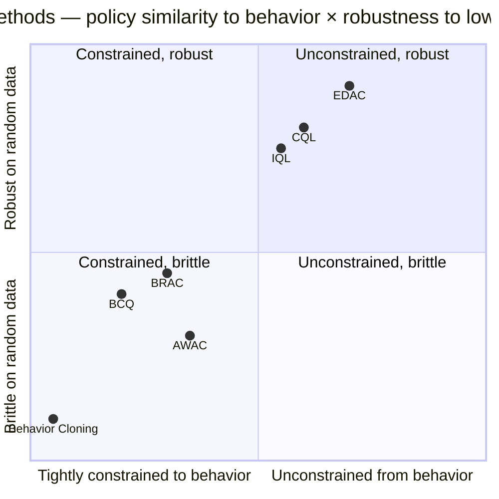
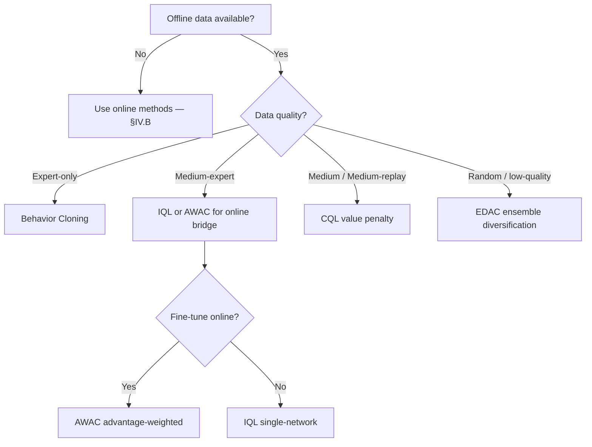

# IV.E. Distribution Shift (Offline Reinforcement Learning) {#sec-iv-e}

Addresses **W5** of the eight weaknesses introduced in §II.B. The
section introduces the D4RL benchmark family [@fu_2020_d4rl], used
in place of the Atari suite of Sections V and VI because the
distribution-shift axis cannot be evaluated on online benchmarks.

### A. The Weakness

Q-learning's off-policy property is *theoretical*: the Bellman
optimality operator $\mathcal{T}^\ast Q(s, a) = r + \gamma \max_{a'}
Q(s', a')$ is independent of the policy that generated $(s, a, r,
s')$. In *online* deep RL the property is approximately preserved
because the replay buffer is continuously refreshed: actions taken by
the current policy populate the buffer, and the bootstrap target
$\max_{a'} Q(s', a')$ ranges over actions whose values are eventually
corrected by future on-policy samples.

In *offline* RL the property breaks. The buffer is fixed: it contains
transitions from one or more behavior policies $\pi_b$, with no
provision for further data collection. The bootstrap target
$\max_{a'} Q(s', a')$ now ranges over the *entire* action space,
including actions $a'$ that no behavior policy ever took at state
$s'$. The estimate $Q(s', a')$ for such *out-of-distribution* (OOD)
actions is arbitrary — function approximation extrapolates without
correction signal — and the bootstrap propagates this arbitrary error
through subsequent backups.

The failure is structural. Concretely, if $\hat Q(s', a^\text{OOD})$
is the function approximator's extrapolation at an OOD action, and
$\arg\max_{a'} \hat Q(s', a')$ falls on $a^\text{OOD}$, then the
backup propagates $\hat Q(s', a^\text{OOD})$ — a value with no data
support — into $Q(s, a)$. Iterated backups drive $Q$ unboundedly
upward at OOD points, and the resulting greedy policy concentrates
on actions whose true value is unknown. Empirically, naive offline
Q-learning consistently produces policies far worse than the
behavior policy that generated the data [@fujimoto_2019_bcq].

Methods responding to this weakness fall into four families,
distinguished by *what they constrain*: the learned policy, the
$Q$-value estimates, the maximization operator itself, or the
training data through ensembling.

### B. Solution Families

**B.1. Policy constraint.** Batch-Constrained Q-learning (BCQ)
[@fujimoto_2019_bcq] introduced the formal account of
extrapolation error and proposed restricting the policy to actions
the behavior policy plausibly took. BCQ learns a generative model
$G_\omega(s)$ of behavior-policy actions and a perturbation
network $\xi_\phi(s, a)$, defining the policy as
$\pi(s) = \arg\max_{a \in \{a_i + \xi_\phi(s, a_i)\}_{i=1}^n,\, a_i
\sim G_\omega(s)} Q(s, a)$. The constraint *defines* the action
space at each state by sampling from the behavior model and
allowing small perturbations.

BRAC [@wu_2019_brac] generalizes the policy-constraint idea via
explicit divergence regularization: the policy objective includes
a KL or Wasserstein penalty against the behavior policy. The
penalty weight controls the bias-variance trade-off between
behavior cloning ($\to \pi_b$) and aggressive improvement.

AWAC [@nair_2020_awac] addresses the *online fine-tuning* of
offline-trained policies. Its advantage-weighted update,
$\pi(a \mid s) \propto \pi_b(a \mid s) \exp(A(s, a) / \beta)$,
upweights actions with high advantage relative to the behavior
policy without fully unconstraining the policy. AWAC is the
canonical bridge between offline and online RL.

**B.2. Value penalty.** Conservative Q-Learning (CQL) [Kumar et al.
2020] penalizes the $Q$-function at unseen actions:

$$
\mathcal{L}_\text{CQL} = \mathcal{L}_\text{Bellman} + \alpha \Bigl(\mathbb{E}_{s \sim \mathcal{D}, a \sim \mu(\cdot \mid s)}[Q(s, a)] - \mathbb{E}_{(s, a) \sim \mathcal{D}}[Q(s, a)]\Bigr),
$$

where $\mu$ is a sampling distribution that emphasizes
out-of-distribution actions (typically uniform or learned). The
penalty drives $Q$-values *down* at OOD actions and *up* at
in-distribution actions, ensuring the learned policy
$\arg\max_a Q(s, a)$ concentrates on actions with data support.

CQL's penalty admits a theoretical guarantee: under certain
conditions, the learned $Q$-function lower-bounds the true policy
value $V^\pi$, ensuring that policy improvement does not propagate
extrapolation error. CQL is widely regarded as the canonical
offline-RL Q-method and is one of the strongest baselines on D4RL
[@fu_2020_d4rl].

**B.3. Avoiding the maximum.** Implicit Q-Learning (IQL) [Kostrikov
et al. 2021] takes a different approach: avoid the $\max$ operator
entirely. IQL learns three networks — a state-value function $V$, a
Q-function $Q$, and a policy $\pi$ — with $V$ trained via
*expectile regression*:

$$
\mathcal{L}_V = \mathbb{E}_{(s, a) \sim \mathcal{D}}\bigl[L_2^\tau(Q(s, a) - V(s))\bigr],
\quad L_2^\tau(u) = |\tau - \mathbb{1}_{\{u < 0\}}| u^2,
$$

where $\tau \in (0.5, 1)$ controls the expectile (larger $\tau$ →
more optimistic estimate of $V$). The Q-update becomes
$Q(s, a) \leftarrow r + \gamma V(s')$, with no $\max$ over actions
at all. Since $V$ is trained only on $(s, a) \in \mathcal{D}$,
extrapolation error is structurally prevented.

The policy $\pi$ is then extracted via advantage-weighted regression
similar to AWAC. IQL achieves the strongest D4RL results among
single-network families and is favored for its simplicity (no
explicit constraint hyperparameter).

**B.4. Ensemble diversification.** Ensemble Diversified Actor
Critic (EDAC) [@an_2021_edac] approaches OOD generalization via
ensemble disagreement. EDAC maintains $K$ Q-networks and trains
them to be *diverse* on OOD actions via a gradient-diversity
penalty:

$$
\mathcal{L}_\text{div} = \mathbb{E}_{(s, a) \sim \mathcal{D}}\Bigl[\sum_{i \neq j} \mathrm{cos\_sim}(\nabla_a Q_i(s, a), \nabla_a Q_j(s, a))\Bigr].
$$

The min-over-ensemble Q-value, $Q_\text{eff}(s, a) = \min_i Q_i(s,
a)$, becomes pessimistic at points where ensemble members disagree
— typically OOD points. EDAC bridges the offline-RL section to the
ensemble methods of §IV.A and §IV.C, using the same architectural
mechanism for a different axis.

**B.5. Flow-matching policies with Q-learning.** A recent line of
work integrates *flow matching* — a continuous-time generative-
modeling technique adjacent to diffusion — with Q-learning. Flow
Q-Learning (FQL) [@park_2025_fql] trains a
one-step flow-matching policy network conditioned on a Q-function,
avoiding the recursive-backprop-through-diffusion-chain issue of
earlier Diffusion-QL approaches. The policy generates actions in a
single forward pass; the Q-function is trained with a standard
TD-style loss against actions sampled from the flow policy. The
method achieves consistent improvements across 73 D4RL and OGBench
tasks in both pure-offline and offline-to-online settings, and the
single-step generation removes the inference-time overhead that has
limited diffusion-policy methods in deployment. FQL identifies
flow-matching as a tractable alternative to diffusion for
Q-learning-compatible policies and points toward a broader family
of continuous-time generative policies that the offline RL
community has begun to develop.

Q-learning with *Adjoint Matching* takes the same problem — offline
optimization of an expressive flow-matching policy under a Q-value
critic — and resolves it via a different mathematical route. Where
FQL eliminates recursive backpropagation by restricting the policy
to a single flow step, the adjoint-matching formulation tolerates
the full multi-step flow generation and uses the *continuous adjoint
method* to compute the policy gradient. The critic's action
gradient is transformed into a step-wise objective: at each step of
the flow generation, an adjoint state — itself the solution of an
ordinary differential equation — is propagated backward through the
flow, providing the policy update direction without requiring
gradients to flow back through the entire generation chain. The
formulation casts the constrained policy-optimization problem on a
flow model as a stochastic optimal-control problem, with a "lean"
adjoint state that strictly satisfies the relevant ODE.

Under the adjoint-matching objective, when the objective is
optimized to convergence the resulting flow-matching policy
provably recovers the optimal behavior-regularized policy.
The method preserves the expressiveness of multi-step flow-matching
policies, where FQL trades expressiveness for tractability via
single-step generation. The two approaches define complementary
points on the expressiveness-vs-tractability trade-off for offline
Q-learning with generative policies: FQL is simpler to train and
deploy; adjoint matching admits more expressive policies and
provides an unbiased policy-improvement guarantee.

### C. Trade-offs

- **Policy constraint vs. improvement bound.** BCQ, BRAC, AWAC
  constrain the learned policy toward the behavior policy. The
  constraint provides safety but caps possible improvement: a
  policy that cannot deviate substantially from $\pi_b$ cannot
  outperform the best in-support trajectory by much.
- **Value penalty vs. hyperparameter sensitivity.** CQL's
  conservative penalty weight $\alpha$ is the single most important
  hyperparameter and varies substantially across D4RL tasks. Recent
  work [@hong_2023_adaptcql] proposes adaptive penalty scaling but the
  basic sensitivity remains.
- **Avoiding the max vs. losing optimality.** IQL's expectile
  regression avoids extrapolation error but learns a policy whose
  formal optimality guarantees are weaker than $\arg\max_a Q^\ast$.
  In practice the gap is small; theoretically it is an unresolved
  question.
- **Ensemble cost.** EDAC's $K$-network ensemble multiplies
  parameter count and forward-pass cost by $K$. The diversification
  penalty also requires per-action gradients, adding compute.

### D. Empirical Evidence

The benchmark suite for this section is D4RL [@fu_2020_d4rl],
which spans nine task families (MuJoCo locomotion, AntMaze, Adroit
dexterous manipulation, Franka Kitchen, CARLA driving, Flow,
Bandit-mode FrankaKitchen, plus Atari offline variants). Each
task is paired with one or more fixed datasets representing
different behavior-policy regimes (random, medium, expert,
medium-replay, medium-expert).

A representative summary of normalized scores on MuJoCo
locomotion medium-expert datasets (higher = better, normalized to
[0, 100] where 100 $\approx$ expert performance):

| Method | HalfCheetah | Hopper | Walker2d |
|---|---|---|---|
| Behavior Cloning | 56 | 79 | 84 |
| BCQ (2019) | 64 | 100 | 110 |
| CQL (2020) | 91 | 105 | 109 |
| IQL (2021) | 86 | 91 | 109 |
| EDAC (2021) | 107 | 110 | 115 |
| AWAC (2020) | 42 | 56 | 49 |

Two observations bear on this section's organization:

First, **CQL and IQL produce the strongest single-method results
across the D4RL benchmark.** They represent two distinct
mechanistic responses to the same weakness — value penalty vs.
avoiding the max — and the empirical near-tie suggests both are
valid approaches with different trade-offs (CQL's hyperparameter
sensitivity vs. IQL's theoretical weakness).

Second, **EDAC's ensemble approach matches or exceeds the best
single-network methods on locomotion** but does so at substantially
higher compute cost. The cost-benefit calculation depends heavily
on whether ensemble disagreement is used elsewhere in the agent
(for exploration during online fine-tuning, for example), since
the same ensemble can serve multiple axes.

Atari offline benchmarks are reported in the D4RL paper but are
secondary; the locomotion suite dominates offline-RL evaluation.
This contrasts with the online Atari focus of Sections V and VI
and is one motivation for the structural pivot: a method that
solves the offline axis must demonstrate it on benchmarks that
*test* the axis, not on benchmarks that the field used historically
for unrelated reasons.

### E. Open Questions

1. **Theoretical unification of the four families.** Policy
   constraint, value penalty, expectile regression, and ensemble
   diversification are all responses to extrapolation error. A
   unifying framework that recovers each as a limit of a single
   regularization or constraint would clarify the field
   considerably. Recent work toward this — *Implicit Behavior
   Cloning* [@florence_2021_ibc], the *On-Policy Constraints*
   framework [@brandfonbrener_2021_onestep] — has not produced
   consensus.

2. **Online-to-offline transfer of stability mechanisms.** The
   target networks and normalization recipes of §IV.H were
   developed for online interaction. Their interaction with
   offline-specific stabilizers (CQL's conservative penalty, IQL's
   expectile regression) is largely unexplored. Some offline-RL
   work reports instability when target networks are removed
   even though the corresponding online claim (PQN [@gallici_2024_pqn]) shows
   removal is feasible.

3. **Scaling to internet-scale data.** Offline RL with diverse
   data sources — robot demonstrations across institutions, web
   video, simulation rollouts — has produced strong empirical
   results [Chen et al. 2021, Decision Transformer; Reed et al.
   2022, Gato] but is dominated by sequence-modeling approaches
   rather than Q-learning. Whether Q-learning's mechanism is
   suited to the heterogeneous-data regime is an open question
   with substantial practical stakes.

4. **The offline-online boundary.** AWAC and Cal-QL [Nakamoto et al.
   2023] address the special case of offline pre-training followed
   by online fine-tuning. The mechanism (advantage-weighted
   policy update, calibrated Q-bounds) is well-studied; the
   broader question — when does offline pre-training help and when
   does it hurt online learning? — is empirically rich but
   theoretically thin.

### F. Comparison summary

| Method (year) | Family | Mechanism | Primary cost | Best at | D4RL anchor (HalfCheetah med-expert) |
|---|---|---|---|---|---|
| BCQ (2019) | Policy constraint | Generative behavior model + perturbation | Generator quality | Narrow-support data | 64 |
| BRAC (2019) | Policy constraint | KL/Wasserstein divergence penalty | Divergence weight tuning | Diverse offline data | Competitive across D4RL |
| AWAC (2020) | Policy constraint | Advantage-weighted offline → online | $\beta$ hyperparameter | Offline-to-online bridge | 42 (offline-only) |
| CQL (2020) | Value penalty | Penalize $Q$ at OOD actions | $\alpha$ hyperparameter sensitivity | Random/medium data | 91 |
| IQL (2021) | Avoid the max | Expectile $V$, $Q$ backed up via $V(s')$ | $\tau$ hyperparameter | Single-network simplicity | 86 |
| EDAC (2021) | Ensemble + diversity | Min over $K$-ensemble + gradient diversification | $K\times$ compute | Locomotion strongest | 107 |

**2D positioning (behavior similarity × data-quality robustness):**

Lower-left contains the behavior-cloning baseline. Policy-constraint
methods (BCQ, BRAC, AWAC) cluster middle-left: constrained to
behavior, modest robustness. Value-penalty and avoid-max methods
(CQL, IQL) sit middle-right with strong robustness. EDAC's
ensemble-diversification approach pushes farthest into the
upper-right quadrant.

**Method-selection decision tree:**

The decision tree captures the typical practitioner heuristic: data
quality is the dominant input to method selection in offline RL.
For the offline-to-online setting specifically, AWAC and its
calibrated extensions (Cal-QL) are the preferred bridge.
