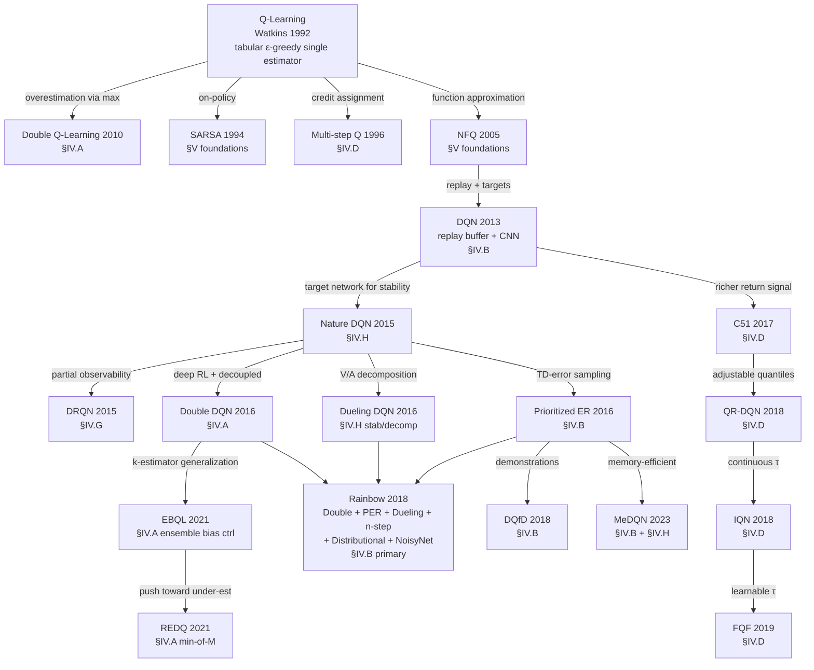

# IV. Q-Learning Methods by Weakness {#sec-iv}

Over the past three decades, Q-learning and its deep variants have
evolved through a long sequence of mechanism-level innovations.
Section II.B identified eight foundational weaknesses of vanilla
Q-learning that motivate the field's trajectory; this section
surveys the methods that respond to each. The organization is
problem-first: each subsection corresponds to one weakness,
groups responses by mechanism, and compares them on the trade-offs
they introduce.

**The method-type taxonomy.** Prior Q-learning surveys
[@urtans_2018_pygame; @jang_2019_qsurvey; @boppiniti_2021_evolution; @hafiz_2023_dqnsurvey]
organize methods by *type* — what kind of mechanism a method is. We
call this the *method-type taxonomy* and use that term throughout.
The table below lists its six categories and, crucially, shows where
each category's methods fall among the eight problem axes. The categories
cut *across* the axes: statistical methods split between exploration
(§IV.C) and credit assignment (§IV.D), and ensemble methods between
overestimation control (§IV.A) and exploration (§IV.C). A problem-first
organization regroups exactly these cross-cutting cases by the weakness
each method addresses rather than by what the method is. (The full
per-method mapping is provided as supplementary material.)

| Method-type category | Groups methods that… | Examples | Problem axes |
|---|---|---|---|
| Statistical | model the return distribution or inject parameter noise | C51, QR-DQN, NoisyNet | §IV.C, §IV.D |
| Q-Function Computation | alter how the bootstrap target is computed | Double DQN, Dueling, Rainbow | §IV.A, §IV.B, §IV.H |
| Memory / Replay | change what experience is stored and replayed | DQN, PER, DQfD, HER | §IV.B |
| Ensemble-Based | maintain several Q-estimators | Bootstrapped DQN, EBQL, REDQ | §IV.A, §IV.C |
| Model-Based | use a model or a posterior over values | Bayesian Q, Posterior-Sampling DQN | §IV.C, §V |
| Pure Q-Learning | tabular or minimal value iteration | Q-learning, SARSA, NFQ | §V, §IV.H |

: The method-type taxonomy used by prior Q-learning surveys — its six
categories and where each category's methods fall among this paper's
eight problem axes. Families that postdate this taxonomy (offline RL
§IV.E, multi-agent §IV.F, distributed/meta §IV.G) have no method-type
category at all.

This subsection orients the reader through three further artifacts: a
method genealogy showing the inheritance relationships between
Q-learning's variants, a companion figure showing the modern-RL
branches that have emerged outside the conventional taxonomy, and
an axis × mechanism-family matrix summarizing what mechanism types
are deployed against each weakness. Each §IV axis-subsection that
follows uses a uniform template: the *weakness*, the *mechanism
families* that respond (grouped by what they exploit), the
*trade-offs* among them, the open *questions* that remain, and a
compact comparison table.

### A. Method genealogy

Figure 1 shows the genealogy of Q-learning methods covered in this
paper. Nodes are methods; edges are inheritance relationships
labeled by *the weakness of the parent that the child method
addresses*. The annotations on the edges are themselves a
contribution: they trace the field's evolution as a sequence of
targeted responses rather than a chronological accumulation of
techniques.



Two structural observations emerge from the genealogy. First,
**Rainbow [@hessel_2018_rainbow] is the integration point** for five separate
axis responses (Double DQN, PER, Dueling, multi-step,
distributional, NoisyNet) — it is not a single method but a
deliberate composition across axes. Second, **the distributional
family** (C51 → QR-DQN → IQN → FQF) constitutes an unusually long
single-axis lineage compared to most other branches, reflecting the
field's progressive refinement of distributional Q-learning under
the credit-assignment weakness (W4).

### B. Branches outside the conventional taxonomy

Figure 2 below shows three Q-learning branches that emerged outside
the conventional six-category mechanism taxonomy — families that
respond to weaknesses (distribution shift, multi-agent coordination,
distributed scale and meta-adaptation) that the method-type taxonomy has
no category to hold. These are the methods that motivate §IV.E,
§IV.F, and §IV.G.

```mermaid
%% caption: Q-learning branches outside the conventional six-category mechanism taxonomy — offline RL (§IV.E), multi-agent value decomposition (§IV.F), and distributed / meta-learning (§IV.G).
flowchart TD
    NDQN[@mnih_2015_nature]
    NDQN -->|offline data only NEW §IV.E| BCQ[@fujimoto_2019_bcq]
    BCQ --> CQL[@kumar_2020_cql]
    CQL --> IQL[@kostrikov_2022_iql]
    BCQ -.->|ensemble variant| EDAC[@an_2021_edac]
    NDQN -->|multiple cooperating agents NEW §IV.F| VDN[@sunehag_2017_vdn]
    VDN --> QMIX[@rashid_2018_qmix]
    QMIX --> QPLEX[@wang_2021_qplex]
    QMIX -.->|constraint-free| QTRAN[@son_2019_qtran]
    NDQN -->|massive scale NEW §IV.G| ApeX[@horgan_2018_apex]
    ApeX --> R2D2[R2D2 2019]
    R2D2 --> Agent57[@badia_2020_agent57]
    NDQN -->|meta/fast adapt NEW §IV.G| MAML[MAML-Q / Meta-Q 2017+]
```

The visual absence of these branches from prior Q-learning surveys
[@urtans_2018_pygame; @jang_2019_qsurvey; @boppiniti_2021_evolution; @hafiz_2023_dqnsurvey] is one of the most direct empirical arguments for the
structural pivot of §IV. The method-type taxonomy classifies methods by
mechanism type; these branches require new mechanism categories
(constrained policies, value decomposition, distributed actors,
meta-learning) that did not exist when the original taxonomy was
conventionalized.

### C. Axis × mechanism-family matrix

The matrix below summarizes which mechanism families address which
axis. Filled cells indicate a primary contribution; open cells
($\circ$) indicate an incidental or secondary contribution; blanks
indicate the axis is not addressed by that mechanism family.

| Axis                       | Decoupling      | Ensembles       | Architectural decomposition | Behavior / loss modulation | Distributed / parallel |
|---|---|---|---|---|---|
| **W1 Overestimation** (§IV.A) | DoubleQ, DDQN   | EBQL, REDQ      | Dueling (rel.) $\circ$           | —                          | —                      |
| **W2 Sample inefficiency** (§IV.B) | —              | —               | —                           | PER, DQfD, MeDQN, HER      | Ape-X (replay) $\circ$       |
| **W3 Brittle exploration** (§IV.C) | —              | Bootstrapped, UCB-Q | NoisyNet, ParSpaceNoise | CBDQ, PSDQN, RND, Go-Explore | Agent57 (portfolio)  |
| **W4 Reward sparsity** (§IV.D) | —              | —               | Distributional family       | n-step, $\lambda$-returns          | —                      |
| **W5 Distribution shift** (§IV.E) | BCQ            | EDAC            | —                           | CQL, IQL, BRAC, AWAC       | —                      |
| **W6 Multi-agent coord.** (§IV.F) | —              | —               | VDN, QMIX, QPLEX, QTRAN     | —                          | —                      |
| **W7 Scaling / adaptation** (§IV.G) | —              | —               | DRQN, R2D2                  | —                          | Ape-X, Agent57, Meta-Q |
| **W8 Function-approx stability** (§IV.H) | —      | —               | Target net, Dueling, PQN    | MeDQN consol., Munchausen  | —                      |

Several patterns are visible at a glance:

- The **architectural decomposition** column is the most populous
  — most axes have at least one architectural response. This
  reflects the field's strong preference for *structural* solutions
  (modifying what the network represents) over *training-procedure*
  solutions (modifying what the loss optimizes).
- The **distributed** column is sparse but increasingly populated
  by frontier agents (Ape-X, Agent57). The pattern suggests
  scaling-as-mechanism is undercovered in the literature relative
  to its empirical importance — a point the open-questions
  subsection of §IV.G develops.
- The **decoupling** column has only two entries (DoubleQ-derived).
  Decoupling is mechanistically narrow; ensembling subsumes most
  of its effect once compute budgets permit $K > 2$ Q-functions.
- The **bottom-left quadrant** of the matrix (W6, W7 × decoupling
  or ensembles) is empty. Whether this reflects a true gap in the
  literature or merely a labeling artifact is an open question
  flagged in §VIII.

### D. Axis interactions and failure modes

The eight weaknesses are not independent: a method that resolves one
frequently aggravates another. The table below names, for each axis,
its mathematical origin, the axis it most strongly interacts with, and
the deployment symptom that signals it — a practitioner-facing
complement to the mechanism view above.

| Axis | Mathematical origin | Principal interaction | Deployment failure mode |
|---|---|---|---|
| W1 Overestimation | $\max$ over noisy estimates biased upward | debiasing can suppress optimism (W3) | value divergence in stochastic / large action spaces |
| W2 Sample inefficiency | uniform replay ignores information density | heavy reuse of stale data erodes stability (W8) | slow convergence under memory limits |
| W3 Brittle exploration | temporally inconsistent $\varepsilon$-greedy dithering | poor coverage delays credit propagation (W4) | stuck on sparse-reward plateaus (e.g.\ Montezuma) |
| W4 Credit assignment | one-step backups propagate reward slowly | $n$-step cuts bias but adds off-policy variance (W8) | fails under delayed / terminal-only rewards |
| W5 Distribution shift | bootstrapping on OOD actions, narrow support | OOD extrapolation mimics overestimation (W1) | offline policy collapse without interaction |
| W6 Multi-agent | non-stationarity breaks the single-agent MDP | exponential joint action space strains stability (W8) | coordination collapse under decentralized execution |
| W7 Scaling / adaptation | sequential-interaction bottleneck; no meta-transfer | stale actor–learner gradients destabilize targets (W8) | extreme sample / wall-clock cost; weak online adaptation |
| W8 Instability | deadly triad: off-policy $+$ bootstrap $+$ approximation | target nets stabilize but slow learning (W2) | catastrophic value divergence, oscillation |

: Each weakness, its origin, the axis it most strongly interacts with,
and the symptom that signals it in deployment. Most interaction paths
lead back to W8 (function-approximation stability), which the matrix
above already shows as the field's central failure mode.

### E. Section roadmap

The remainder of §IV proceeds axis by axis:

- **§IV.A** Overestimation bias — Double Q-learning to ensemble
  bias control (EBQL, REDQ).
- **§IV.B** Sample inefficiency — prioritized replay, demonstrations,
  memory-efficient consolidation, hindsight relabeling.
- **§IV.C** Brittle exploration — noise injection, ensemble
  disagreement, belief modulation, intrinsic motivation, archival
  exploration.
- **§IV.D** Reward sparsity and credit assignment — multi-step
  returns and the distributional family.
- **§IV.E** Distribution shift (offline RL) — policy constraint,
  value penalty, expectile regression, ensemble diversification.
- **§IV.F** Multi-agent coordination — additive, monotonic,
  duplex-dueling, and constraint-free value decomposition.
- **§IV.G** Scaling and slow adaptation — distributed actor-learner
  architectures, bandit-controlled exploration meta-policies,
  meta-learning, recurrence.
- **§IV.H** Function-approximation instability — target networks,
  architectural decomposition, normalization recipes, consolidation
  losses.
- **§IV.I** Theoretical foundations — a brief synthesis of
  convergence, finite-time, pessimism, stability, and IGM results
  underlying the eight axes (full statements in supplementary).
- **§IV.J** Q-learning for foundation-model alignment — an emerging
  direction (Q-Transformer, ShiQ, VLM Q-Learning, Q$^\sharp$),
  representing a new deployment regime rather than a new mechanism.
