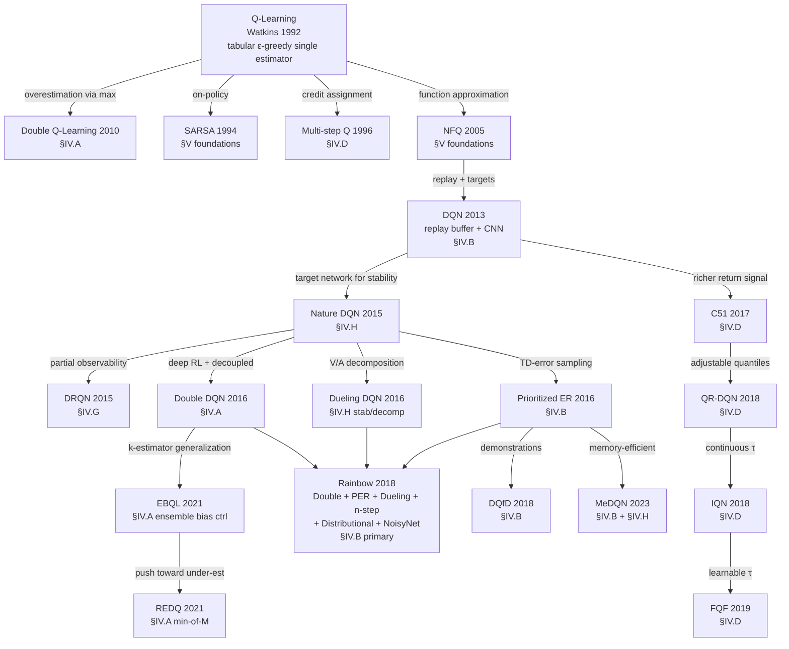
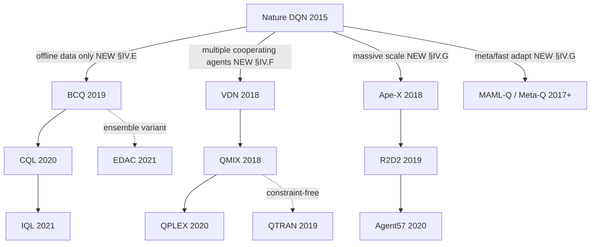

# IV. Related Works

Over the past three decades, Q-learning and its deep variants have
evolved through a long sequence of mechanism-level innovations.
Section II.B identified eight foundational weaknesses of vanilla
Q-learning that motivate the field's trajectory; this section
surveys the methods that respond to each. The organization is
problem-first: each subsection corresponds to one weakness,
groups responses by mechanism, and compares them on the trade-offs
they introduce.

This subsection orients the reader through three artifacts: a
method genealogy showing the inheritance relationships between
Q-learning's variants, a companion figure showing the modern-RL
branches that have emerged outside the conventional taxonomy, and
an axis × mechanism-family matrix summarizing what mechanism types
are deployed against each weakness. The §IV subsections that
follow each provide a five-part structure: formal statement of
the weakness (subsection A), grouped solution families
(subsection B), trade-offs (subsection C), empirical evidence
(subsection D), open questions (subsection E), and a comparison
summary with positioning grid (subsection F).

### A. Method genealogy

Figure 1 shows the genealogy of Q-learning methods covered in this
paper. Nodes are methods; edges are inheritance relationships
labeled by *the weakness of the parent that the child method
addresses*. The annotations on the edges are themselves a
contribution: they trace the field's evolution as a sequence of
targeted responses rather than a chronological accumulation of
techniques.

Two structural observations emerge from the genealogy. First,
**Rainbow [28] is the integration point** for five separate
axis responses (Double DQN, PER, Dueling, multi-step,
distributional, NoisyNet) — it is not a single method but a
deliberate composition across axes. Second, **the distributional
family** (C51 → QR-DQN → IQN → FQF) constitutes an unusually long
single-axis lineage compared to most other branches, reflecting the
field's progressive refinement of distributional Q-learning under
the credit-assignment weakness (W4).

### B. Branches outside the conventional taxonomy

Figure 2 below shows three Q-learning branches that emerged outside
the conventional six-category mechanism taxonomy — families that
respond to weaknesses (distribution shift, multi-agent coordination,
distributed scale and meta-adaptation) that the legacy taxonomy has
no category to hold. These are the methods that motivate §IV.E,
§IV.F, and §IV.G.

The visual absence of these branches from prior Q-learning surveys
[12]–[15] is one of the most direct empirical arguments for the
structural pivot of §IV. The legacy taxonomy classifies methods by
mechanism type; these branches require new mechanism categories
(constrained policies, value decomposition, distributed actors,
meta-learning) that did not exist when the original taxonomy was
conventionalized.

### C. Axis × mechanism-family matrix

The matrix below summarizes which mechanism families address which
axis. Filled cells indicate a primary contribution; open cells
(◯) indicate an incidental or secondary contribution; blanks
indicate the axis is not addressed by that mechanism family.

| Axis                       | Decoupling      | Ensembles       | Architectural decomposition | Behavior / loss modulation | Distributed / parallel |
|---|---|---|---|---|---|
| **W1 Overestimation** (§IV.A) | DoubleQ, DDQN   | EBQL, REDQ      | Dueling (rel.) ◯           | —                          | —                      |
| **W2 Sample inefficiency** (§IV.B) | —              | —               | —                           | PER, DQfD, MeDQN, HER      | Ape-X (replay) ◯       |
| **W3 Brittle exploration** (§IV.C) | —              | Bootstrapped, UCB-Q | NoisyNet, ParSpaceNoise | CBDQ, PSDQN, RND, Go-Explore | Agent57 (portfolio)  |
| **W4 Reward sparsity** (§IV.D) | —              | —               | Distributional family       | n-step, λ-returns          | —                      |
| **W5 Distribution shift** (§IV.E) | BCQ            | EDAC            | —                           | CQL, IQL, BRAC, AWAC       | —                      |
| **W6 Multi-agent coord.** (§IV.F) | —              | —               | VDN, QMIX, QPLEX, QTRAN     | —                          | —                      |
| **W7 Scaling / adaptation** (§IV.G) | —              | —               | DRQN, R2D2                  | —                          | Ape-X, Agent57, Meta-Q |
| **W8 Function-approx stability** (§IV.H) | —      | —               | Target net, Dueling, PQN    | MeDQN consol., Munchausen  | —                      |

Several patterns are visible at a glance:

- The **architectural decomposition** column is the most populous
  — most axes have at least one architectural response. This
  reflects the field's strong preference for *structural* solutions
  (modifying what the network represents) over *training-procedure*
  solutions (modifying what the loss optimizes).
- The **distributed** column is sparse but increasingly populated
  by frontier agents (Ape-X, Agent57). The pattern suggests
  scaling-as-mechanism is undercovered in the literature relative
  to its empirical importance — a point the open-questions
  subsection of §IV.G develops.
- The **decoupling** column has only two entries (DoubleQ-derived).
  Decoupling is mechanistically narrow; ensembling subsumes most
  of its effect once compute budgets permit $K > 2$ Q-functions.
- The **bottom-left quadrant** of the matrix (W6, W7 × decoupling
  or ensembles) is empty. Whether this reflects a true gap in the
  literature or merely a labeling artifact is an open question
  flagged in §VIII.

### D. Section roadmap

The remainder of §IV proceeds axis by axis:

- **§IV.A** Overestimation bias — Double Q-learning to ensemble
  bias control (EBQL, REDQ).
- **§IV.B** Sample inefficiency — prioritized replay, demonstrations,
  memory-efficient consolidation, hindsight relabeling.
- **§IV.C** Brittle exploration — noise injection, ensemble
  disagreement, belief modulation, intrinsic motivation, archival
  exploration.
- **§IV.D** Reward sparsity and credit assignment — multi-step
  returns and the distributional family.
- **§IV.E** Distribution shift (offline RL) — policy constraint,
  value penalty, expectile regression, ensemble diversification.
- **§IV.F** Multi-agent coordination — additive, monotonic,
  duplex-dueling, and constraint-free value decomposition.
- **§IV.G** Scaling and slow adaptation — distributed actor-learner
  architectures, bandit-controlled exploration meta-policies,
  meta-learning, recurrence.
- **§IV.H** Function-approximation instability — target networks,
  architectural decomposition, normalization recipes, consolidation
  losses.

Each subsection ends with **F. Comparison summary**: a uniform
six-column table (method / mechanism category / mechanism / cost /
best-at / empirical anchor) and, where the trade-off is naturally
two-dimensional, a 2D positioning grid. §IV.E additionally provides
a method-selection decision tree for practitioner use.
