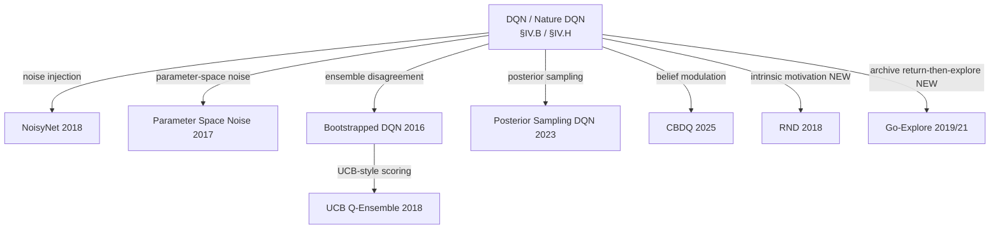
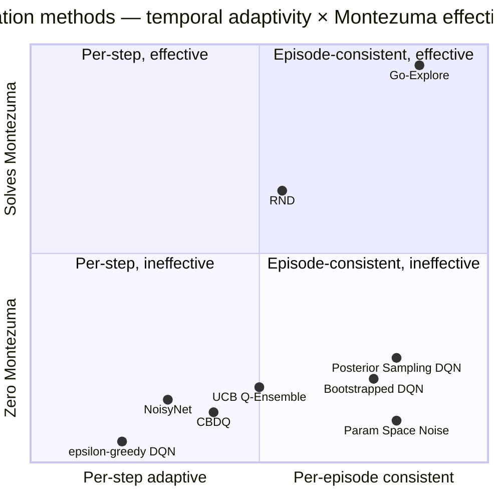

# IV.C. Brittle Exploration

Addresses **W3** of the eight weaknesses introduced in §II.B. Methods
here replace ε-greedy's undirected randomness with structured
exploration that scales to environments where reward is sparse,
delayed, or behind narrow state-space passages.

### A. The Weakness

ε-greedy action selection takes the greedy action $\arg\max_a Q(s,a)$
with probability $1-\varepsilon$ and a uniform-random action with
probability $\varepsilon$. The mechanism is *dithered*: at each step
independently, with no memory of past exploration and no model of
which actions remain uncertain. The resulting exploration trajectory
is a random walk modulated by the current greedy policy.

This is sufficient for environments where reward is dense enough that
near-greedy policies stumble into informative states. It fails
dramatically when reward is sparse, delayed beyond ε-greedy's
effective horizon, or located behind state-space passages whose
random-walk hitting time is exponential in trajectory length. The
canonical example is Montezuma's Revenge [2]: standard DQN agents
score essentially zero, while domain-naive humans achieve thousands
of points within minutes.

The deeper diagnosis is that ε-greedy is *myopic with respect to
epistemic uncertainty*. A state-action pair $(s,a)$ that has been
visited many times is sampled at the same rate as one that has been
visited zero times. Methods in this section maintain or approximate a
posterior over $Q(s,a)$ — explicitly or implicitly — and use it to
direct exploration toward states whose value remains uncertain.

### B. Solution Families

Four mechanisms recur, distinguished by *how the posterior or
exploration bonus is induced*: through parameter perturbations,
ensemble disagreement, learned belief models, or intrinsic-reward
signals. The figure below shows the genealogy of methods covered in
this section.

The methods marked NEW (RND and Go-Explore) are intrinsic-motivation
and archival approaches that extend the families above.

**B.1. Noise injection.** Two methods inject zero-mean noise during
action selection but at different layers of the network.

Parameter Space Noise for Exploration [16] perturbs the parameter
vector at the start of each episode: $\tilde\theta = \theta +
\mathcal{N}(0, \sigma^2 I)$. The perturbation is held fixed within
the episode, producing temporally consistent exploration:
the same state yields the same exploratory action within an
episode but different actions across episodes. To maintain perturbation
scale across layers, layer normalization [17] is applied. The
noise scale $\sigma$ is adjusted adaptively via
$\sigma_{k+1} = \alpha \sigma_k$ if $d(\pi, \tilde\pi) \leq \delta$
and $\alpha^{-1} \sigma_k$ otherwise, where $d(\pi, \tilde\pi)$
measures policy distance.

Noisy Networks (NoisyNet) [19] move noise into the network weights
themselves. Each linear layer $y = wx + b$ is replaced by
$y = (\mu_w + \sigma_w \odot \varepsilon_w) x + (\mu_b + \sigma_b
\odot \varepsilon_b)$, where $\mu, \sigma$ are learned parameters
and $\varepsilon$ is sampled at each forward pass. The noise scale
$\sigma$ is *learned*, allowing the network to reduce exploration
in well-understood regions of the state space and maintain it where
uncertainty remains. NoisyNet improved median human-normalized Atari
score by 48% over DQN and is one of the six components of Rainbow
[28].

**B.2. Ensemble disagreement.** Multiple Q-heads, trained on
overlapping but distinct subsets of the experience buffer, disagree
on $Q(s,a)$ in proportion to epistemic uncertainty. The disagreement
provides a usable exploration signal.

Bootstrapped DQN [45] maintains $K$ Q-heads sharing a feature
extractor, with each head trained on a bootstrap-masked subset of
the buffer. At the start of each episode, one head is sampled and
used throughout, ensuring temporally consistent exploration similar
to parameter-noise. Bootstrapped DQN reaches human-level performance
on Atari approximately 30% faster than DQN.

UCB Q-Ensembles [47] use the ensemble disagreement explicitly via
an upper-confidence-bound selection rule: $a_t = \arg\max_a (\mu(s,a)
+ \lambda \sigma(s,a))$, where $\mu, \sigma$ are the empirical mean
and standard deviation of $Q$ across the ensemble. The variant
"Ensemble Voting" uses majority vote at action selection;
"UCB Exploration" uses the explicit bound. UCB Exploration achieves
the highest maximal mean reward on 30 of 49 Atari games at the time
of publication.

The same ensemble architecture used here for exploration is used in
§IV.A for bias control (EBQL). The structural redundancy is
deliberate: a single ensemble provides both uncertainty estimates and
bias reduction at no additional architectural cost.

**B.3. Belief-modulated policies.** Cognitive Belief-Driven
Q-Learning (CBDQ) [37] maintains an explicit belief distribution
$b_t(a \mid s)$ over actions, updated as
$b_t(a \mid s_{t+1}) = (1-\beta_t) \hat b_t(a \mid s_{t+1}) +
\beta_t \, p_k(a \mid s_{t+1})$,
where $p_k(a \mid s)$ is the action-probability estimate within a
state cluster $k$ obtained via clustering. The Q-update weights
future values by the belief:

$$
Q_{t+1}(s,a) = Q_t(s,a) + \alpha\Bigl[r + \gamma \sum_a b_t(a \mid s') Q_t(s', a) - Q_t(s,a)\Bigr].
$$

CBDQ improves convergence on classic control benchmarks (Cartpole,
Acrobot, LunarLander) and on the MetaDrive [38] traffic simulation.
Its mechanism — modulating future-value backups by a learned belief
distribution — sits between value-based exploration (§IV.A) and
policy-distribution exploration.

Posterior Sampling DQN [51] applies the older idea of posterior
sampling [49] to the deep setting, sampling a hypothesis $Q$-function
from an approximate posterior at the start of each episode and
acting greedily with respect to it. This is the natural deep-network
analog of Thompson sampling for bandits.

**B.4. Intrinsic motivation.** Where the methods above modulate the
exploitation signal, intrinsic-motivation methods modify the *reward*
itself, adding a bonus $r^\text{int}(s, a)$ for visiting under-explored
states.

Random Network Distillation (RND) [Burda et al. 2018] computes the
bonus as the prediction error of a small network trained to mimic a
fixed random target network on observed states: $r^\text{int}_t =
\|f_\theta(s_t) - \hat f(s_t)\|^2$. The bonus decays as the
prediction network learns the state distribution, biasing exploration
toward novel states. RND was the first method to achieve consistent
non-trivial performance on Montezuma's Revenge.

Go-Explore [Ecoffet et al. 2019/2021] takes a fundamentally
different approach: it maintains an archive of visited states with
their action sequences, returns to a sampled archived state without
exploration, and only then begins exploration. The archive
disentangles "remembering how to reach a state" from "exploring from
that state," sidestepping the deep-exploration problem entirely.
Go-Explore was the first method to solve Montezuma's Revenge
fully (achieving the maximum possible score) and Pitfall! at
super-human level.

RND and Go-Explore represent the modern state-of-the-art on the
Atari games that motivate this entire section.

### C. Trade-offs

- **Temporal consistency vs. adaptivity.** Parameter-noise and
  Bootstrapped DQN sample the perturbation once per episode,
  producing temporally consistent exploration. NoisyNet samples per
  forward pass, allowing finer-grained adaptation but losing the
  multi-step exploration property that solves problems like
  Pong-with-flickering-frames [34]. The right choice depends on the
  temporal structure of the exploration problem.
- **Ensemble cost.** Ensemble methods (Bootstrapped DQN,
  UCB Q-Ensembles, RND) multiply forward-pass cost by $K$. On
  modern GPU pipelines, this is largely hidden by batching, but
  parameter memory scales linearly.
- **Bonus design vs. domain coupling.** Intrinsic-motivation bonuses
  add a hyperparameter (the bonus scale) and risk reward-shaping
  pathologies: an agent can become addicted to the novelty bonus
  and ignore extrinsic reward. RND's exponentially decaying bonus
  mitigates but does not eliminate this.
- **Archive-based vs. learned exploration.** Go-Explore's archive
  approach is empirically dominant on hard-exploration Atari games
  but introduces a non-Markovian component (the archive itself).
  Whether the approach generalizes to continuous state spaces, where
  archiving requires a similarity metric, is a separate research
  question.

### D. Empirical Evidence

The diagnostic games for this axis are Montezuma's Revenge, Pitfall!,
and Private Eye — sparse-reward environments where exploration is the
binding constraint. From Tables II–III:

| Method | Montezuma | Pitfall! | Private Eye |
|---|---|---|---|
| DQN (Nature, 2015) | 0 | — | 1,788 |
| Parameter Space Noise (2017) | 0 | -100 | 100 |
| NoisyNet (2018) | 3 | 0 | 3,712 |
| Bootstrapped DQN (2016) | 100 | — | 1,812 |
| UCB Q-Ensemble (2018) | 4 | -1.5 | 1,252 |
| Rainbow (2018) | 384 | 0 | 4,234 |
| C51 (2017) (distributional) | 0 | 0 | 15,095 |
| QR-DQN (2018) | 0 | 0 | 350 |
| IQN (2018) | 0 | 0 | 200 |
| FQF (2019) | 0 | 0 | 140 |
| DQfD (2018) (with demos) | 4,638 | 57.3 | 42,457 |

Three observations bear directly on this section's thesis:

First, **the methods that target this axis directly are also the
methods that produce nonzero Montezuma scores** — Bootstrapped DQN,
NoisyNet, Rainbow (whose NoisyNet component is load-bearing here),
and most decisively DQfD. The methods that do not (distributional
methods on this axis, see §IV.D) score zero.

Second, **most methods in Tables II–III report zero or do not report
on Montezuma**. The dashes are themselves evidence: a method that
cannot demonstrate non-trivial Montezuma performance cannot claim to
solve the exploration weakness, however strong it is on dense-reward
games.

Third, **the strongest non-demonstration Montezuma result in
Tables II–III is Rainbow's 384** — well below DQfD's 4,638. This
gap quantifies the "exploration vs. demonstration" trade-off
(§IV.B): demonstrations are currently the most effective way to
side-step deep exploration on the hardest Atari games.

RND reports ~10,000+ on Montezuma without demonstrations, and
Go-Explore achieves full solutions exceeding 1 million points on
Montezuma. These results sit outside the comparison Tables II–III
because they use evaluation protocols incompatible with the
extraction methodology, but they bound the achievable performance
on the diagnostic exploration games.

### E. Open Questions

1. **Adaptive exploration regimes.** All methods in this section
   adopt a fixed exploration strategy throughout training. Game-by-
   game performance variance (parameter noise excels on some Atari
   games and fails on others) suggests adaptive selection — choosing
   exploration mechanism by detected environment properties — could
   improve average performance without sacrificing peak performance.
   The mechanism for such selection (meta-learned? bandit-controlled?
   uncertainty-thresholded?) is unsettled. Agent57 [Badia et al. 2020]
   makes progress here via bandit-controlled exploration policy
   selection; it is the natural cross-reference to §IV.G.

2. **Bonus-extrinsic reward balance.** Intrinsic-motivation bonuses
   require a balance against the extrinsic reward. RND's
   exponentially decaying bonus is one mechanism; explicit
   uncertainty thresholding is another; learning the bonus scale
   is a third. No consensus method exists.

3. **Archive-based exploration in continuous spaces.** Go-Explore's
   discrete archive is one of its strengths on Atari (where pixel
   hashing identifies revisits cheaply) but a limitation in
   continuous control. Whether archive-based methods can be extended
   via learned latent representations is an active research
   direction at the time of writing.

### F. Comparison summary

| Method (year) | Legacy category | Mechanism | Primary cost | Best at | Empirical anchor |
|---|---|---|---|---|---|
| Parameter Space Noise (2017) | Statistical | Per-episode $\theta$ perturbation | Layer norm requirement | Episode-consistent exploration | Atari mixed |
| NoisyNet (2018) | Statistical | Per-pass weight noise with learned $\sigma$ | Per-pass 2× forward | Adaptive exploration | +48% Atari median |
| Bootstrapped DQN (2016) | Ensemble-Based | $K$-head ensemble, sample head per episode | $K\times$ memory | Episode-coherent exploration | Human-level 30% faster |
| UCB Q-Ensemble (2018) | Ensemble-Based | $Q_\mu + \lambda \sigma$ from $K$-ensemble | $K\times$ compute | Uncertainty-aware action | 30/49 Atari max |
| CBDQ (2025) | Q-Function Comp. | Belief distribution over actions | Clustering overhead | Classic control + driving | LunarLander, MetaDrive |
| Posterior Sampling DQN (2023) | Model-Based | Sample $Q$ from posterior per episode | Approximate posterior | Cyclic environments | 5-state chain |
| RND (2018)* | Statistical | Random network distillation intrinsic bonus | Bonus scale hyperparameter | Sparse-reward Atari | Montezuma ≈10,000 |
| Go-Explore (2019/2021) | Memory/Replay (archive) | Archive + return-then-explore | Discrete state hashing | Hardest Atari exploration | Montezuma > 1,000,000 |

**2D positioning (adaptivity × Montezuma effectiveness):**

The upper-half of the chart contains the methods that actually
solve the diagnostic exploration problem. Go-Explore's
archive-based approach lands top-right; RND's intrinsic motivation
lands middle-upper. Most ensemble and noise-injection methods
cluster in the lower bands — useful improvements over $\epsilon$-greedy
but not transformative on the hardest exploration games.
