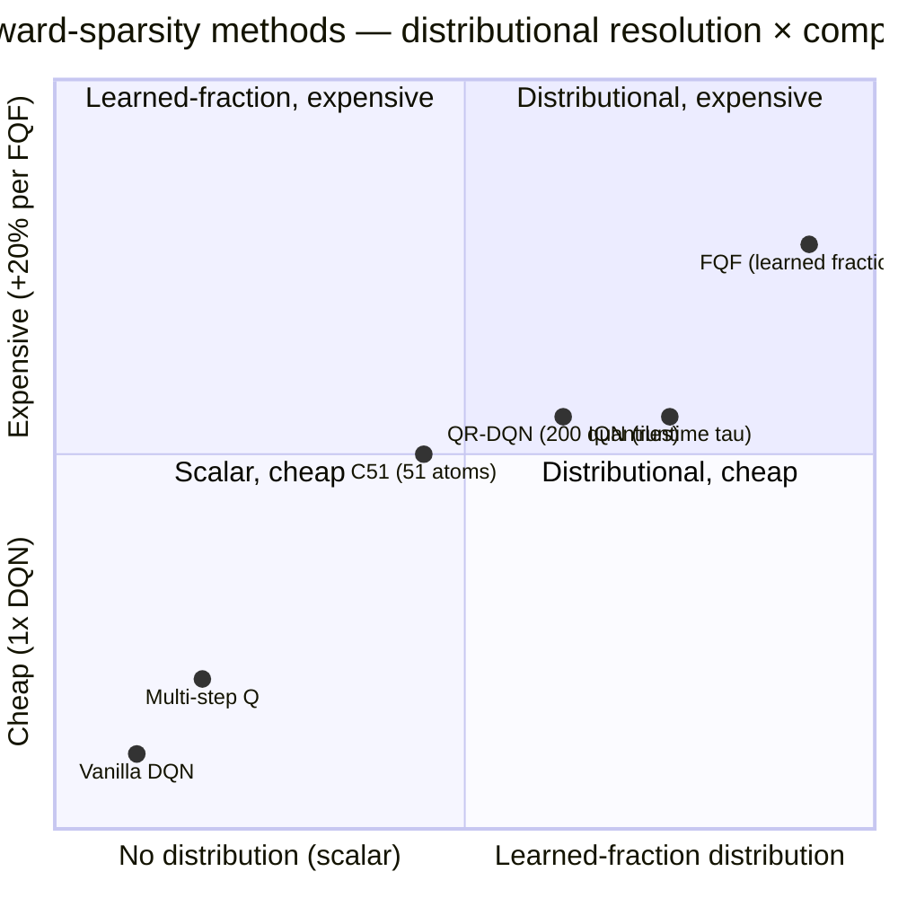

# IV.D. Reward Sparsity and Credit Assignment {#sec-iv-d}

Addresses **W4** of the eight weaknesses introduced in §II.B. Methods
here modify *what the return signal represents* — its temporal
extent, its distributional form, or both — to extract richer credit-
assignment information from each trajectory.

Distributional RL is treated as a *credit-assignment* method rather
than an *uncertainty* method. The case for this reading is developed
in the per-method paragraphs and the open-questions subsection.

### A. The Weakness

**A note on framing.** This section's placement of distributional
Q-learning (C51, QR-DQN, IQN, FQF) under the credit-assignment axis
is an *interpretive choice* rather than a canonical classification.
The original distributional-RL papers [Bellemare et al. 2017;
Dabney et al. 2018] motivate the family primarily as
uncertainty-modeling or learning-signal-richness contributions; the
prior surveys [12]–[15] place these methods under "Statistical
Methods" or similar uncertainty-focused groupings. We re-frame them
as credit-assignment mechanisms because the empirical strength of
the family — and especially the standalone Rainbow-comparable
performance of IQN — is dominated by the richer return-distribution
signal's effect on long-horizon backup propagation, not by acting on
uncertainty. The defense for this re-classification is developed in
subsections B and D; readers preferring the conventional grouping
can navigate via Appendix A.

The one-step Q-learning update propagates reward signal by exactly one
Bellman backup per environment step. When reward is received only at
the end of a long trajectory, the signal must traverse the full
trajectory length via repeated updates before it influences early
states. This is the *credit-assignment problem*: assigning fractional
responsibility for a terminal reward to each upstream state-action
pair.

Two distinct framings of the weakness motivate distinct method
families:

1. **Temporal extent of the backup.** The one-step backup is
   conservative. Multi-step ($n$-step) backups,
   $y_t^{(n)} = r_t + \gamma r_{t+1} + \dots + \gamma^{n-1} r_{t+n-1}
   + \gamma^n \max_{a'} Q(s_{t+n}, a')$,
   propagate reward faster but introduce bias when the behavior policy
   differs from the target policy. $\text{TD}(\lambda)$ returns
   $r^\lambda_t = (1-\lambda)\sum_{n=1}^\infty \lambda^{n-1} y_t^{(n)}$
   interpolate between one-step and Monte Carlo, controlling the
   bias-variance trade-off with $\lambda$.
2. **Information content of the backup.** The scalar
   $\mathbb{E}[\text{return}]$ discards higher moments of the return
   distribution. Distributional RL [21] replaces the scalar with the
   full return distribution $Z(s,a)$ and learns it directly. Per
   [Bellemare, Dabney & Munos 2017], the distributional target is
   more informative as a learning signal even when the agent
   ultimately acts on its expectation.

Methods in this section attack the credit-assignment weakness from
both directions. The distributional family has been the more
empirically productive line of work, but the multi-step family
underlies several composite agents (notably Rainbow [28], where
multi-step is the second-largest performance contributor after PER).

### B. Solution Families

**B.1. Multi-step returns.** Multi-Step Q-Learning [30] generalizes
the one-step update via eligibility traces. For each state-action
pair, the trace $\mathrm{Tr}(s,a)$ tracks recency and frequency of
visits; updates apply to all eligible pairs simultaneously, weighted
by trace value:

$$
Q_{t+1}(x, a) = Q_t(x, a) + \alpha \mathrm{Tr}(x, a) e_t,
$$

where $e_t$ is the TD error of the current transition. The TD($\lambda$)
formulation interpolates between strict one-step bootstrapping
($\lambda = 0$) and Monte Carlo returns ($\lambda = 1$), with
intermediate $\lambda$ trading bias against variance. In the
function-approximation setting, $\lambda$ also controls a stability
trade-off: large $\lambda$ amplifies the variance of bootstrap targets
and can destabilize learning.

Rainbow [28] uses three-step returns as one of its six components.
The ablation reported in [Hessel et al. 2018] places multi-step
learning second only to PER in performance contribution, removing
it produces the second-largest performance drop among all components.

**B.2. Distributional return — fixed support.** A Distributional
Perspective on Reinforcement Learning (C51) [21] models the return
distribution $Z(s,a)$ as a categorical distribution over 51 fixed
atoms in a bounded support $[V_\text{min}, V_\text{max}]$. The
training objective minimizes the KL divergence between the predicted
distribution $Z_\theta(s,a)$ and the projected Bellman target
$\hat{\mathcal{T}}_C Z_{\bar\theta}(s,a)$:

$$
\mathcal{L}(\theta) = \mathbb{E}_{(s,a,r,s') \sim \mathcal{D}}\bigl[\mathrm{KL}(\hat{\mathcal{T}}_C Z_{\bar\theta}(s,a) \,\|\, Z_\theta(s,a))\bigr],
$$

where the projection operator $\Phi$ maps the post-Bellman
distribution back onto the fixed support. Acting greedily with
respect to $\mathbb{E}[Z(s,a)]$ recovers a standard policy, but the
*learning signal* is the full distribution.

C51 outperformed DQN, Double DQN, Dueling DQN, and PER on the Atari
suite at the time of publication. The choice of 51 atoms was
empirically determined; performance degraded for both substantially
fewer (limited resolution) and substantially more (training
inefficiency).

**B.3. Distributional return — adjustable quantiles.** Quantile
Regression DQN (QR-DQN) [25] inverts C51's design: instead of fixed
support and learned probabilities, QR-DQN uses fixed probabilities
and learned quantile locations. For $N$ uniform quantile fractions
$\tau_i = i/N$, the network outputs quantile values
$\theta_i(s, a)$, and the value estimate is
$Q(s,a) = \sum_i (1/N) \theta_i(s,a)$. Training minimizes the
asymmetric quantile Huber loss:

$$
\rho_{\kappa, \tau}(u) = |\tau - \mathbb{1}_{\{u < 0\}}| L_\kappa(u),
$$

where $L_\kappa$ is the Huber loss. QR-DQN removes C51's projection
step and the bounded-support requirement; quantile locations adapt
to the actual return distribution. QR-DQN outperforms C51 on Atari
median scores.

**B.4. Distributional return — implicit and fully-parameterized.**
Implicit Quantile Networks (IQN) [27] generalize QR-DQN by sampling
quantile fractions $\tau \sim \mathcal{U}(0,1)$ at runtime and
learning a network that maps $(s, \tau)$ to a quantile value:
$Q(s, a; \tau) = f(m(\psi(s), \phi(\tau)))$, where $\psi(s)$ is the
state embedding, $\phi(\tau)$ a cosine-embedded quantile fraction,
and $m$ a Hadamard product. IQN learns a continuous approximation
of the return distribution, achieving Rainbow-comparable
performance with none of Rainbow's six components except the
distributional component.

Fully Parameterized Quantile Function (FQF) [29] extends IQN by
*also* learning the quantile fractions: a fraction proposal network
generates $\tau_1, \dots, \tau_N$ adaptively per state-action pair,
trained to minimize 1-Wasserstein distance between predicted and
true distributions. FQF achieves the highest mean and median
human-normalized scores in Tables II–III, surpassing human
performance on 44 of 55 games. The cost is approximately 20%
slower training than IQN.

### C. Trade-offs

- **Bias-variance via $n$ and $\lambda$.** Larger $n$-step or larger
  $\lambda$ propagates reward signal faster but increases variance
  and bias under off-policy targets. In Rainbow, three-step is the
  empirical sweet spot; for distributed agents (Ape-X, R2D2) longer
  horizons become viable due to vastly increased sample throughput.
- **Distributional resolution vs. compute.** C51's 51 atoms,
  QR-DQN's $N=200$ quantiles, IQN's runtime-sampled fractions, and
  FQF's learned fractions span a spectrum of distributional
  resolution. FQF achieves the strongest empirical results at the
  highest compute cost.
- **Bounded vs. unbounded support.** C51 requires *a priori*
  specification of $[V_\text{min}, V_\text{max}]$; misestimation
  causes distributional clipping. QR-DQN, IQN, FQF avoid this but
  pay in training complexity (projection-free but quantile-loss
  based).
- **Acting on the distribution.** All distributional methods in
  this section *act* on the expectation $\mathbb{E}[Z(s,a)]$ —
  recovering a standard policy. The richer signal helps *learning*,
  not *acting*. Methods that act on higher distributional moments
  (risk-sensitive RL, CVaR-based action selection) are out of scope
  here but represent a natural extension.

### D. Empirical Evidence

The distributional family produces the most consistent improvements
in Tables II–III among methods in this paper. From the dense-reward
and strategic-planning categories:

| Method | Q*bert | Breakout | Space Invaders | Ms. Pac-Man |
|---|---|---|---|---|
| Nature DQN | 10,596 | 401 | 1,976 | 2,311 |
| Double DQN | 14,875 | 375 | 3,155 | 3,210 |
| Dueling DQN | 19,220 | 345 | 6,427 | 6,284 |
| C51 | 23,784 | 748 | 5,747 | 3,415 |
| QR-DQN | 572,510 | 742 | 20,972 | 5,821 |
| IQN | 25,750 | 734 | 28,888 | 6,349 |
| FQF | 27,524 | 854 | — | 7,632 |
| Rainbow | 33,818 | 418 | 18,789 | 5,380 |

QR-DQN's 572,510 on Q*bert is the single largest result in the
Atari extraction by any method and is the canonical evidence for
the distributional family's strength on long-horizon
credit-assignment problems. (The result reflects an evaluation
artifact in addition to genuine performance — Q*bert has an
exploitable wraparound mechanic — but the pattern holds across the
strategic-planning category.)

On the *Brittle Exploration* axis (§IV.C, Montezuma / Pitfall /
Private Eye), the distributional family scores at or near zero on
the hardest games. This is the expected behavior of methods that
target W4 (credit assignment) rather than W3 (exploration): richer
signal cannot substitute for directed search. The empirical
separation between the two axes is one of the clearer arguments
for the problem-first organization.

Multi-step learning's contribution is harder to isolate empirically
because it appears as a component of Rainbow rather than as a
standalone method in Tables II–III. The Rainbow ablation [28]
reports that removing $n$-step learning produces the second-largest
performance drop among the six components, second only to PER.

### E. Open Questions

1. **Convergence theory for the distributional family.** C51's
   projection-step convergence is established under restrictive
   conditions; QR-DQN, IQN, and FQF have substantially weaker
   theoretical guarantees. Whether the distributional family
   converges to the true return distribution under standard
   function-approximation assumptions remains incompletely
   resolved.
2. **Compositional gains.** The Rainbow ablation shows distributional
   learning is *one of two* components whose removal degrades
   performance after 40M frames (the other being PER). Whether the
   compositional gain reflects orthogonal contributions or partially
   redundant mechanisms is not settled. IQN's standalone
   Rainbow-comparable performance suggests the distributional
   signal may be doing more work than the ablation assigns.
3. **Risk-sensitive action selection.** All distributional methods
   discussed here act on $\mathbb{E}[Z(s,a)]$. The richer signal
   admits policies that act on tail behavior, useful in
   safety-critical settings. Whether existing distributional
   architectures support stable training under risk-sensitive
   action selection — and how the resulting policies compare to
   risk-neutral baselines — is largely unexplored.

### F. Comparison summary

| Method (year) | Legacy category | Mechanism | Primary cost | Best at | Empirical anchor |
|---|---|---|---|---|---|
| Multi-Step Q-Learning (1996) | Pure Q-Learning | $n$-step bootstrapped returns + eligibility traces | Variance penalty under off-policy | Long-horizon credit assignment | Rainbow ablation: 2nd-largest contributor |
| C51 (2017) | Statistical | 51 fixed atoms over $[V_\text{min}, V_\text{max}]$ | Bounded support pre-specified | Atari mean + median | Q*bert: 23,784 |
| QR-DQN (2018) | Statistical | $N$ fixed-probability quantile values | Projection-free but quantile loss | Dense + strategic Atari | Q*bert: 572,510 |
| IQN (2018) | Statistical | Runtime-sampled $\tau \sim U(0,1)$ | Cosine embedding for $\phi(\tau)$ | Standalone Rainbow-comparable | Matches Rainbow without other 5 components |
| FQF (2019) | Statistical | Fully parameterized quantile fractions + values | +20% compute vs. IQN | Highest median Atari | 44/55 Atari > human |

**2D positioning (distributional resolution × compute):**

The progression C51 → QR-DQN → IQN → FQF traces a diagonal of
increasing distributional flexibility against increasing compute.
The diagonal is monotonic in performance for the empirical regime
tested (Atari median), but the per-game pattern is non-monotonic —
QR-DQN's Q*bert peak (572,510) is not matched by FQF despite FQF's
higher median. Multi-step Q occupies the lower-left as the
non-distributional credit-assignment baseline.
