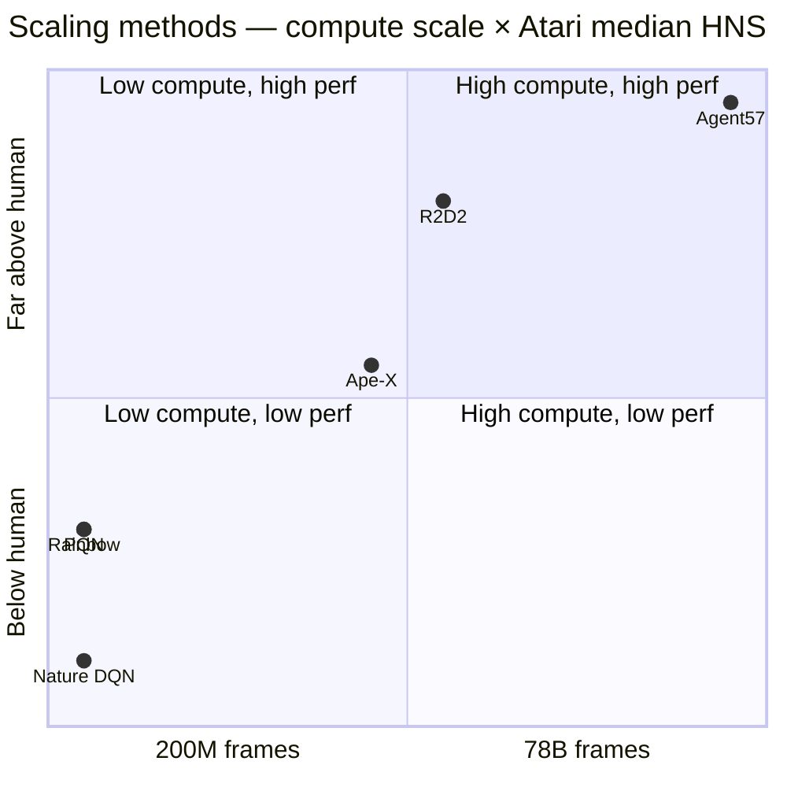

# IV.G. Scaling and Slow Adaptation {#sec-iv-g}

Addresses **W7** of the eight weaknesses introduced in §II.B. The
section covers two related directions: distributed and parallel
architectures that increase sample throughput by orders of magnitude,
and meta-learning approaches that produce policies adapting quickly
to new tasks. The two directions are unified by the shared diagnosis
that *per-task, single-learner Q-learning is fundamentally
sample-bottlenecked*. Coverage emphasizes canonical methods; the
rapidly-evolving distributed-RL landscape (IMPALA, SEED RL, Sample
Factory, Podracer) is touched only at cross-references.

### A. The Weakness

Vanilla Q-learning trains a single agent on a single task using
sequential environment interactions. Two distinct failure modes
follow.

**Scaling.** A single sequential learner is bottlenecked on the rate
at which the environment produces transitions. Even with experience
replay, the agent cannot consume transitions faster than they are
generated. Atari training runs at ~30 FPS in the standard
environment; collecting the 200M frames used in Rainbow [28]
evaluation requires approximately 80 days of wall-clock time on a
single machine. The bottleneck is not compute — modern GPUs train
Q-networks orders of magnitude faster than the environment generates
data — but sample throughput.

**Slow adaptation.** Q-learning trained on task $\mathcal{T}_1$
produces a Q-function specialized to $\mathcal{T}_1$. Adaptation to
related task $\mathcal{T}_2$ requires either retraining from scratch
or initialization from $Q^{\mathcal{T}_1}$ — the latter sometimes
helpful, sometimes actively harmful when the tasks share state but
disagree on reward. Neither approach satisfies the requirement of
online adaptation within a small number of episodes — the regime
where a deployed agent encounters a related-but-novel task.

Methods responding to these weaknesses fall into three families:
*distributed architectures* that parallelize environment interaction
across many actors with a centralized learner; *meta-learning
approaches* that train across a distribution of tasks to produce
fast-adaptation initializations or update rules; and *recurrent
architectures* that handle partial observability and trajectory
context within a single agent.

### B. Solution Families

**B.1. Distributed actor-learner architectures.** Ape-X [Horgan et
al. 2018] decouples experience collection from learning. Many
*actors* (typically 64–256 CPU processes) interact with parallel
environment instances using a (potentially stale) copy of the
$Q$-network, sending transitions to a centralized prioritized replay
buffer. A single *learner* (a GPU process) samples from the buffer,
performs Q-learning updates, and periodically broadcasts updated
parameters back to the actors.

The architecture supports prioritized experience replay (§IV.B) at
distributed scale, with priorities computed by the actors at
generation time. Ape-X achieves $\sim 50\times$ faster wall-clock
training than DQN while substantially improving final performance,
reaching state-of-the-art on the majority of Atari games at the
time of publication.

R2D2 (Recurrent Replay Distributed DQN) [Kapturowski et al. 2019]
extends Ape-X with LSTM-based recurrent agents and a *burn-in*
mechanism for replay: when sampling a trajectory segment from
replay, the first $\ell$ steps are used only to initialize the
recurrent state, and gradient updates apply only to the subsequent
steps. The mechanism resolves the *state staleness* problem in
recurrent replay — stored recurrent states are stale by the time
they are sampled, but a short burn-in re-syncs them.

R2D2 demonstrates substantial gains on Atari games with memory
demands (Solaris, Skiing) where non-recurrent agents plateau. It
also doubles as the scaling case for §IV.C: the larger sample
throughput enables exploration strategies (R2D2 uses a fixed-$\epsilon$
mixture across actors with $\epsilon$ values logarithmically spaced
in $[0.4, 4 \times 10^{-3}]$) that would be infeasible in
single-agent training.

**B.2. Bandit-controlled exploration meta-policies.** Agent57 [Badia
et al. 2020] is the first method to achieve human-normalized
performance above 100% on *all* 57 Atari games, including the
canonical hard-exploration suite (Montezuma's Revenge, Pitfall!,
Skiing, Solaris). Agent57 builds on R2D2 and adds:
- A family of policies parameterized by exploration intensity
  $\beta$ and discount $\gamma$, ranging from short-horizon
  exploitative to long-horizon exploratory;
- A multi-armed bandit at the actor level that selects which
  policy parameters to roll out, with rewards based on undiscounted
  episode return — exploiting more when exploitation is paying off
  and exploring more when it is not;
- The Never Give Up (NGU) [Badia et al. 2020] intrinsic
  motivation module providing exploration bonuses based on
  episodic memory.

Agent57's mechanism is fundamentally cross-axis: it addresses
exploration (§IV.C) via bandit-controlled policy selection,
sample efficiency (§IV.B) via distributed actor pools, and slow
adaptation (this section) via a portfolio of policies rather than a
single learned policy. The pattern — *cross-axis composition* — is
the dominant pattern in frontier distributed agents and points
toward a hybrid taxonomy that the problem-first organization
explicitly supports.

**B.3. Meta-learning on the Q-function.** Methods in this family
train across a *distribution* of tasks $p(\mathcal{T})$ rather than a
single task, with the goal of producing agents that adapt to a new
sampled task in a small number of episodes. Three mechanisms recur,
distinguished by *what is meta-learned*: an initialization, a context
embedding, or a forward-pass update rule.

*Optimization-based meta-learning.* MAML [Finn et al. 2017] applied
to Q-learning [Mendonca et al. 2019] trains an initialization
$\theta_0$ from which a few gradient steps on any sampled task
produce a good task-specific Q-function:

$$
\theta_0^\ast = \arg\min_{\theta_0} \mathbb{E}_{\mathcal{T} \sim p(\mathcal{T})}\bigl[\mathcal{L}_{\mathcal{T}}(\theta_0 - \alpha \nabla_{\theta_0} \mathcal{L}_{\mathcal{T}}(\theta_0))\bigr],
$$

requiring second-order gradients through the inner-loop adaptation.
Reptile-Q [Nichol et al. 2018] proposes a first-order approximation
that retains most of the empirical performance at substantially
lower compute. ProMP [Rothfuss et al. 2019] introduces a proximal
constraint on the inner-loop update — a low-variance estimator that
substantially stabilizes meta-policy gradient computation and was
adopted by several subsequent meta-RL works.

*Context-based meta-learning.* PEARL [Rakelly et al. 2019] takes a
different approach: rather than learning an initialization that
adapts via gradient steps, PEARL learns a *context inference network*
$q_\phi(z \mid c)$ that infers a low-dimensional task embedding $z$
from a context buffer $c$ of recent transitions. The Q-function is
then conditioned on the inferred context, $Q(s, a, z; \theta)$. At
deployment, the agent samples $z$ from $q_\phi$ and acts greedily
with respect to $Q(\cdot, \cdot, z)$ — no gradient adaptation
required. The approach decouples meta-training (expensive,
distribution-wide) from meta-deployment (cheap, single forward pass).

Meta-Q-Learning (MQL) [Fakoor et al. 2020] extends PEARL's context
approach to off-policy multi-task settings. MQL maintains a single
shared Q-network plus a multi-task replay buffer, using
*propensity-score weighting* to correct for the differing visitation
distributions across training tasks. The approach achieves
state-of-the-art on the Meta-World benchmark with substantially less
inner-loop compute than MAML-Q variants.

*Forward-pass / in-context meta-learning.* A more recent line of
work treats meta-RL as a sequence-modeling problem: a transformer
network is trained on trajectories from many tasks, and at
deployment the agent's transformer "reads" the recent trajectory and
predicts the next action without any parameter updates. The Q-value
estimation becomes a forward-pass computation rather than an
optimization. AdA / In-Context Learning approaches [Team Adaptable
Agents 2023; Laskin et al. 2023, *In-Context Reinforcement Learning
with Algorithm Distillation*] demonstrate that, given a sufficient
context window and a sufficiently diverse task distribution, a
transformer-based Q-function can match or exceed MAML's few-shot
adaptation performance without any explicit meta-update.

The in-context line has consolidated since 2023 into a recognizable
subfamily. Scalable In-Context Q-Learning (SICQL) [Liu et al. 2026,
ICLR 2026] decouples policy and value into separate transformer
heads, with a pretrained world model producing compact prompts that
preserve the dynamic-programming structure of Q-bootstrapping inside
the in-context computation. In-Context Compositional Q-Learning
(ICQL) [Xu et al. 2026, ICLR 2026] takes a different angle: it casts
Q-learning as contextual inference, with a linear-attention
transformer inferring local Q-functions from retrieved transitions,
and admits theoretical bounds on the inferred Q's accuracy under
mild assumptions on the trajectory distribution. Both achieve
substantial gains over AdA on the compositional-task subsets of
Meta-World; together they establish in-context Q-learning as a
distinct meta-RL family with its own emerging design space (prompt
construction, value-head architecture, attention pattern) rather
than as an opportunistic application of transformers.

**Implicit vs. explicit meta-learning.** A central tension across
these approaches is whether meta-learning should be *explicit* — a
distinct outer-loop objective with hyperparameters governing
inner-loop adaptation (MAML, ProMP) — or *implicit* — a single
agent trained across the entire task distribution at once, with no
meta-objective at all (Agent57, AdA). Empirically, the implicit path
has been more productive at scale: Agent57's bandit-controlled
policy portfolio matches or exceeds explicit meta-learners on
within-distribution Atari tasks, and AdA achieves few-shot
adaptation on 3D-world tasks without an explicit MAML-style outer
loop. The explicit approaches retain advantages on *narrow* task
distributions where the inductive bias of a fast-adaptation objective
helps, and on settings where context windows are insufficient to
encode the task implicitly. The right framework remains an open
question that the cross-axis composition of Agent57 (§IV.C, §IV.B,
this section) makes especially visible.

**B.4. Recurrent architectures for partial observability.** Deep
Recurrent Q-Network (DRQN) [Hausknecht & Stone 2015] introduces an
LSTM layer into the DQN architecture, replacing the first
fully-connected layer. The recurrent network maintains a hidden
state $h_t$ summarizing the trajectory so far; the Q-function
becomes $Q(h_t, a)$ rather than $Q(o_t, a)$, addressing partial
observability.

DRQN is included in this section rather than alongside DQN
because its primary contribution is *contextual adaptation* — the
ability to condition on trajectory history — which sits closer to
slow-adaptation and partial-observability concerns than to the core
Q-learning mechanism. The connection to R2D2 is direct: R2D2's
recurrent architecture is DRQN's mechanism deployed at distributed
scale with burn-in correction for replay.

**B.5. Synchronous parallelism (cross-reference to §IV.H).** PQN
[55] adopts a different parallelism model: synchronous vectorized
environments where a single learner processes $B$ environments per
step, accumulating gradients across the batch. The trade-off
relative to Ape-X is:
- PQN is simpler (no actor-learner communication), runs on a single
  machine, and removes the staleness inherent in actor-learner
  systems;
- Ape-X scales beyond single-machine limits, supports prioritized
  replay, and admits heterogeneous actor configurations
  (e.g., different exploration parameters per actor as in R2D2/
  Agent57).

PQN's argument that synchronous parallelism + normalization
suffices for Atari-scale training is one of the strongest recent
challenges to the actor-learner orthodoxy. The right architecture
likely depends on whether the cost structure is compute-dominated
(favoring synchronous) or environment-dominated (favoring
asynchronous).

**B.6. Predictable scaling laws for value-based deep RL.** The
preceding subsections frame distributed scaling as an *architectural*
response to a sample throughput bottleneck. A complementary line of
recent work argues that this framing is partial: value-based deep
Q-learning scales *predictably* once the right relationships among
data, compute, and hyperparameters are identified. Rybkin et al.
[2025] show empirically that the data and compute required to reach
a given performance level lie on a strict Pareto frontier whose
shape follows power-law relationships governed by the
*updates-to-data ratio* (UTD, the number of gradient updates per
collected transition). For a fixed total resource budget, there
exists a predictable optimal UTD along with predictable optimal
choices of batch size and learning rate; these jointly determine the
point on the frontier at which a value-based agent achieves a target
return at minimum total resource cost.

The results were validated across multiple algorithms — SAC and a
parallel Q-learning variant — and across domains including the
DeepMind Control Suite, OpenAI Gym, and IsaacGym, indicating that
the predictability is a property of the value-based learning regime
rather than of a single algorithm. The framework's practical use is
*extrapolative*: estimating the frontier on a low-budget pilot run
allows researchers to project compute-data trade-offs into
higher-resource regimes without re-tuning at scale, and conversely
to identify regimes where additional compute would not improve
performance because the bottleneck is data quality rather than
sample volume.

This result revises one of the longstanding framings of distributed
Q-learning: the assumption that scaling is achieved primarily by
parallelizing environment interaction (Ape-X / R2D2 / Agent57) is
incomplete. A complementary path is to predict — from a small-scale
calibration — the *optimal* compute-data allocation and tune
hyperparameters accordingly *before* scaling. The two approaches are
compatible rather than competing: a distributed architecture provides
the data-throughput axis; predictable scaling laws govern the
data-versus-compute axis along which any architecture is tuned. The
empirical implications for the §V Atari analysis are subtle: the
methods in Tables II-III were largely not tuned along the
predictable-scaling frontier, so the per-game numbers under-state
the algorithmic performance achievable with the same compute budget
under modern UTD-aware tuning.

### C. Trade-offs

- **Throughput vs. staleness.** Asynchronous actor-learner systems
  scale throughput linearly in actor count but introduce *parameter
  staleness*: actors collect data using parameters $k$ updates
  behind the learner. The staleness is empirically tolerable up to
  modest $k$ but becomes destabilizing at scale. Synchronous
  parallelism eliminates staleness at the cost of throughput
  scaling.
- **Exploration heterogeneity.** Distributed actor pools admit
  *heterogeneous exploration*: different actors can run different
  exploration strategies in parallel. R2D2's $\epsilon$-mixture and
  Agent57's bandit-controlled policy portfolio both exploit this.
  Single-learner systems cannot replicate the mechanism.
- **Meta-training cost.** MAML-style meta-RL on Q-learning requires
  many full inner-loop adaptations per outer-loop step. The compute
  cost can exceed the equivalent single-task training by 10–100×.
  The relevant question for adoption is whether the few-shot
  transfer gain compensates for the meta-training cost. Empirical
  evidence is mixed.
- **Implicit vs. explicit meta-learning.** Agent57 demonstrates
  that a sufficiently capable single agent trained across a task
  distribution can match or exceed explicit meta-learners on the
  same distribution. The trade-off is *what is meta-learned*
  (an initialization, an update rule, a policy portfolio) and
  *how it is used at deployment* (gradient-step adaptation,
  forward-pass adaptation, bandit selection).

### D. Empirical Evidence

The empirical case for this section spans multiple benchmarks
because the methods target different combinations of axes. The
strongest single empirical result is Agent57's solution of *all
57 Atari games* to above human-normalized performance, including
games where every prior method had scored zero or near-zero
(Montezuma's Revenge to 9,352; Pitfall! to 41,313; Skiing to
-4,202.6 — above human's -3,629).

Selected results from the distributed-RL line on Atari median
human-normalized score after the indicated training scale:

| Method | Frames | Median HNS | Notes |
|---|---|---|---|
| Nature DQN | 200M | 79% | Single-learner baseline |
| Rainbow | 200M | 223% | Single-learner combination |
| Ape-X | 22B | 434% | Distributed; 100+ actors |
| R2D2 | 10B | 1920% | Distributed + recurrent |
| Agent57 | 78B | 4766% | Distributed + bandit-controlled exploration |
| PQN | 200M | 220% | Single-machine synchronous |

Two observations:

First, **the move to distributed training accounts for ~10× the
performance improvement of any single algorithmic innovation in
this paper's scope.** The Ape-X → R2D2 → Agent57 progression is
the most consistent single source of performance gain in the
field since DQN. The empirical lesson is that *sample throughput
is, in practice, the binding constraint on Atari performance* —
the algorithmic axes addressed elsewhere in this paper become
secondary at sufficient scale.

Second, **PQN's single-machine result matching Rainbow** suggests
that the *algorithmic* axes are far from saturated, only that the
single-machine compute budget bounds what can be demonstrated.
PQN at 200M frames matches Rainbow at 200M frames; what PQN at
22B frames would achieve is empirically untested.

Meta-RL Q-learning results are reported on smaller benchmarks
(MetaWorld, RL-Bench, Meta-MuJoCo) where direct comparison to
distributed Atari is not possible. The within-benchmark evidence
shows meta-Q methods adapting in 5–50 episodes to held-out tasks
where single-task baselines require thousands. The transfer to
Atari-scale benchmarks has not occurred.

### E. Open Questions

1. **Compute-vs.-sample Pareto.** The Agent57 result raises the
   question of whether *every* algorithmic innovation in this paper
   would close the human-performance gap on Montezuma if given
   78B training frames. If so, the algorithmic taxonomy becomes
   primarily relevant in the compute-constrained regime; if not,
   the gap diagnoses which methods are truly addressing the
   exploration weakness vs. compensating for it via scale. No
   systematic study of this question exists.

2. **Heterogeneous task distributions.** Meta-RL Q-learning has
   succeeded on benchmarks where the task distribution is narrow
   (parametric variations of a single environment). Performance
   on heterogeneous distributions — different state spaces,
   different action spaces, different reward structures — remains
   weak. Whether the meta-learning framework can be extended to
   substantially heterogeneous task families is the question
   gating the practical adoption of meta-Q methods.

3. **Compute requirement for problem-first ablations.** This
   paper's structural argument — that methods target distinct
   weaknesses with distinct mechanisms — would be strongest if
   supported by ablations holding compute fixed and measuring
   axis-specific performance gains. At Atari-scale, such
   ablations are prohibitively expensive. A reduced-scale
   benchmark designed specifically for axis-stratified evaluation
   would be a substantial methodological contribution to the
   field.

4. **The actor-learner-synchronous tradespace.** Ape-X-style
   asynchronous parallelism and PQN-style synchronous vectorization
   represent two points on a tradespace whose interior is largely
   unexplored. Hybrid architectures — synchronous within an
   actor pool, asynchronous between pools — exist (IMPALA, Sample
   Factory) but the formal characterization of when each
   architecture is preferred remains incomplete.

### F. Comparison summary

| Method (year) | Legacy category | Mechanism | Primary cost | Best at | Empirical anchor |
|---|---|---|---|---|---|
| DRQN (2015) | Q-Function Comp. | LSTM head over DQN | Recurrent BPTT | Partial observability | Flickering Pong robust |
| Ape-X (2018) | Distributed | Async actors + centralized learner + PER | Multi-machine infrastructure | 50× wall-clock speedup | 434% median Atari HNS |
| R2D2 (2019) | Distributed + Recurrent | Ape-X + LSTM + replay burn-in | Recurrent replay infrastructure | Memory-demanding tasks | 1920% median Atari HNS |
| Agent57 (2020) | Distributed + Meta-policy | R2D2 + NGU + bandit policy portfolio | Massive compute (78B frames) | All 57 Atari at human level | 4766% median Atari HNS |
| MAML-Q / Meta-Q (2017+) | Meta-RL | Meta-train initialization across task distribution | Inner + outer-loop compute | Few-shot transfer | MetaWorld benchmarks |
| PQN (2024) | Pure Q-Learning (cross-ref to §IV.H) | Synchronous vectorized envs + LayerNorm | Single-machine compute structure | Compute-efficient Atari | 220% median at 200M frames |

**Compute–performance positioning (log frames × performance):**

The PQN/Rainbow co-located point at the same low-compute regime is
the visual case against pure compute scaling: algorithmic
sophistication and minimalism plus normalization reach the same
performance level at the same compute budget. The
Ape-X → R2D2 → Agent57 progression then traces the compute axis as
an orthogonal contributor.
