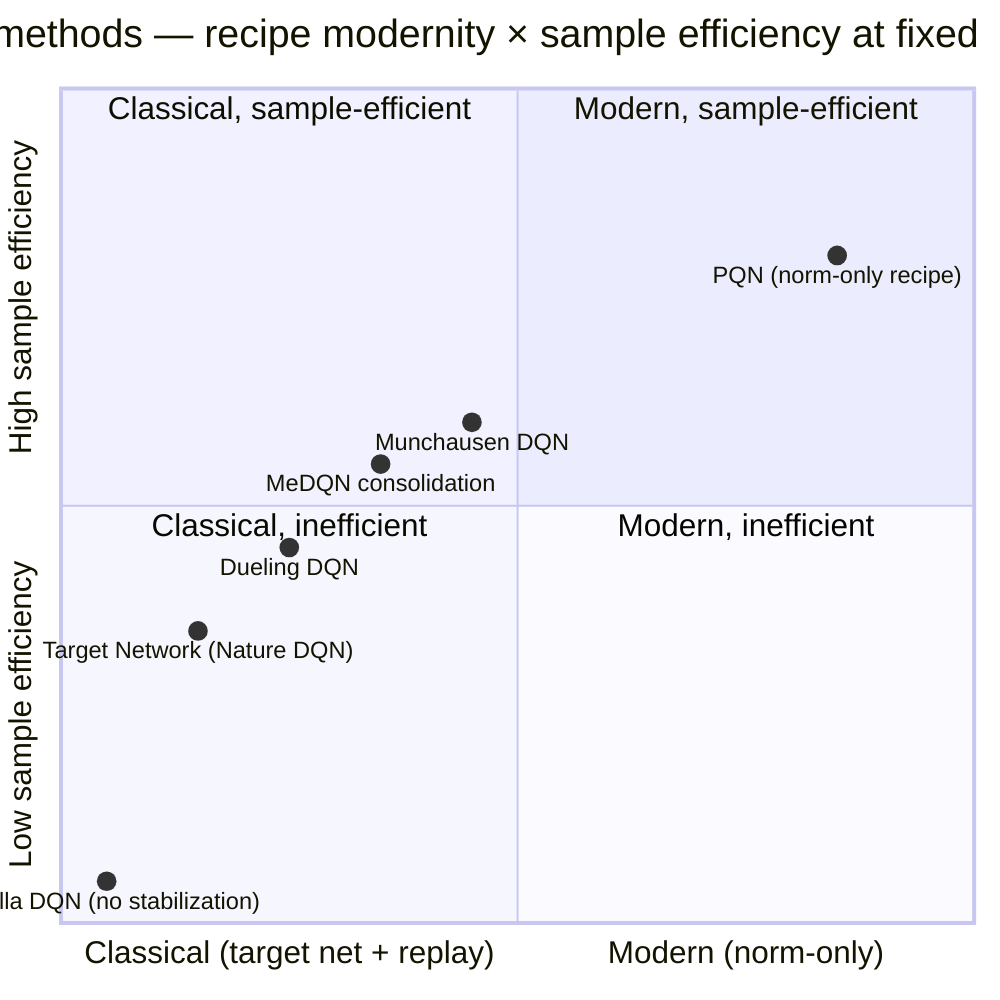

# IV.H. Function-Approximation Instability {#sec-iv-h}

Addresses **W8** of the eight weaknesses introduced in §II.B. Methods
here modify the *training recipe* — target networks, normalization,
architectural decomposition — to damp the instability that arises
when Q-learning is combined with off-policy bootstrapping and
function approximation. The section also covers methods that
*remove* components previously thought essential for stabilization
(notably PQN, which argues the standard recipe is unnecessarily
complex when the right normalization and regularization are applied).

### A. The Weakness

The *deadly triad* [Sutton & Barto 2018] names the combination of
three properties that together produce instability:

1. **Off-policy learning** — updating from data generated by a
   policy other than the current one.
2. **Bootstrapping** — using $Q(s', a')$ in the target rather than
   Monte Carlo returns.
3. **Function approximation** — representing $Q$ via a parametric
   model that generalizes across states.

Any two of these can be combined stably. All three together admit
counterexamples in which the iterates of

$$
\theta \leftarrow \theta + \alpha\bigl(r + \gamma \max_{a'} Q(s', a'; \theta) - Q(s, a; \theta)\bigr) \nabla_\theta Q(s, a; \theta)
$$

diverge, oscillate, or converge to a point far from $Q^\ast$
[Baird 1995; Tsitsiklis & Van Roy 1997]. The instability arises
because gradient steps modify $Q$ on states *other than* $(s, a)$ —
including the bootstrap target $Q(s', a')$ — and the resulting
self-referential update can be expansive.

In practice, deep Q-learning agents trained naively do diverge.
The success of DQN [1] and its descendants depends on a collection
of stabilization techniques that, individually modest, together
make the deadly triad tractable. Methods in this section *are*
those techniques.

### B. Solution Families

Four mechanisms, with substantial cross-cutting:

**B.1. Target networks.** Nature DQN [1] introduced the use of a
*target network* $Q(\cdot; \theta^-)$ whose parameters are held fixed
for a window of updates and periodically copied from the online
network. The bootstrap target becomes
$y = r + \gamma \max_{a'} Q(s', a'; \theta^-)$, decoupling the
update target from the parameters being updated.

The target-network mechanism is the single most important
stabilization in the deep Q-learning recipe. Removing it from DQN
produces immediate divergence on most Atari games. Subsequent work
varied the update schedule — hard copy at fixed intervals (Nature
DQN), Polyak averaging $\theta^- \leftarrow \tau \theta + (1-\tau)
\theta^-$ with small $\tau$ (Soft target networks, ubiquitous in
continuous control) — but the underlying mechanism is unchanged.

**B.2. Architectural decomposition (Dueling).** Dueling Network
Architectures [20] decompose $Q$ into a state-value baseline $V(s)$
and an advantage $A(s, a)$:

$$
Q(s, a; \theta, \alpha, \beta) = V(s; \theta, \beta) + \Bigl(A(s, a; \theta, \alpha) - \tfrac{1}{|\mathcal{A}|}\sum_{a'} A(s, a'; \theta, \alpha)\Bigr).
$$

The original motivation [Wang et al. 2016] was to improve learning
in states where the choice of action is unimportant: $V(s)$ is
learned from *all* transitions through $s$, while $A(s, \cdot)$ updates
only on transitions involving each specific action.

We re-interpret dueling's contribution as primarily a *stability*
mechanism. The decomposition routes most of the gradient signal
through $V(s)$, reducing the relative noise in the
action-conditional component and damping the most destabilizing
gradient interactions. The Rainbow ablation [28] supports this
re-interpretation: dueling produces the smallest performance change
on removal of any of the six Rainbow components, consistent with a
mechanism whose contribution is stability rather than capacity. (See
also §IV.A on dueling's incidental contribution to overestimation
control via the same routing.)

**B.3. Normalization and weight decay.** Layer normalization [17] in
the network body, batch normalization at the input, and L2 weight
decay collectively form the "modern" stabilization recipe that has
emerged since 2020. Parameterized Q-Network (PQN) [55] is the
clearest exposition of this recipe and the strongest argument for
its sufficiency.

PQN removes both target networks and experience replay — the two
classical stabilization mechanisms — and instead relies on:
- Layer normalization throughout the network body;
- BatchNorm at the input layer (for high-dimensional observations);
- Optional L2 regularization at the final layer;
- $n$-step returns for sample efficiency;
- Parallelized vectorized environments for sample throughput.

PQN matches or exceeds PER [24], Double DQN [23], and Rainbow [28]
on the Atari suite while reducing training wall-clock by up to $50
\times$. The argument is implicit but strong: the deadly triad's
instability can be damped by normalization alone, without
architectural workarounds.

A related observation appears in Munchausen DQN [Vieillard et al.
2020], which adds a logarithm-of-policy bonus to the reward:
$\tilde r_t = r_t + \alpha \tau \log \pi(a_t \mid s_t)$, where
$\pi = \mathrm{softmax}(Q/\tau)$. The bonus implicitly regularizes
the policy toward the previous iterate, damping policy oscillation.
Munchausen DQN's gains are surprisingly large given the simplicity
of the modification, and the mechanism — implicit KL regularization
to the previous iterate — fits the same stability story.

**B.4. Consolidation losses.** MeDQN [41] (also discussed in §IV.B
for its memory efficiency) introduces an explicit
knowledge-consolidation loss:

$$
\mathcal{L}_\text{V-consolid} = \mathbb{E}_{(s, a) \sim p}\bigl[(Q(s, a; \theta) - \hat Q(s, a; \theta^-))^2\bigr],
$$

added to the standard DQN loss. The consolidation term explicitly
penalizes movement away from past Q-values, damping the
non-stationarity that drives function-approximation drift. The
mechanism is closely related to elastic weight consolidation
[Kirkpatrick et al. 2017] in the continual-learning literature; the
shared insight is that controlled retention of past parameters
stabilizes online learning under distribution shift.

### C. Trade-offs

- **Target networks vs. responsiveness.** Hard target updates damp
  instability but introduce target staleness — Q-values are updated
  toward an estimate that is up to $C$ steps behind the current
  policy, where $C$ is the target-update interval. Soft updates
  trade staleness against the smoothness of the target. The right
  point on this trade-off depends on environment time scale.
- **Replay vs. normalization.** PQN's argument that replay can be
  *replaced* by normalization is empirically supported on Atari but
  may not generalize. Replay also serves the sample-efficiency
  function of §IV.B; PQN compensates by running many parallel
  environments. In settings where environmental interaction is
  expensive (real robotics), the trade-off may favor replay
  retention.
- **Architectural complexity.** Dueling adds two output streams and
  a centering operation; the parameter count is approximately
  unchanged but architectural complexity grows. Rainbow's
  cumulative complexity (six stacked components) becomes a
  maintainability cost. PQN's "remove components" argument is
  partly a maintainability argument.
- **Consolidation hyperparameter.** MeDQN's consolidation weight
  $\lambda$ requires tuning. Too small and consolidation has no
  effect; too large and learning slows.

### D. Empirical Evidence

Direct empirical comparisons on this axis are difficult because
"stability" is not a single benchmark. Available evidence falls into
three categories:

**Ablation-based evidence.** Rainbow's ablation [28] places
dueling as the smallest-impact component (consistent with its role
as a stability mechanism whose contribution is masked when other
stabilizers are present). The same ablation places target
networks (via their interaction with the Double-DQN update) as
load-bearing only in early training, before sample efficiency
becomes the bottleneck. These observations are consistent with the
mechanistic interpretation in subsection B.

**PQN's direct test.** PQN [55] is the strongest existing empirical
test of the proposition that normalization suffices for stability.
Its Atari performance is comparable to PER + Double DQN + Rainbow
at fraction of the training wall-clock. The result indicates that
target networks and experience replay, while sufficient, are not
necessary — and that "modern" normalization recipes can stabilize
deep Q-learning at scale.

**Cross-axis evidence.** The empirical evidence for this section
also appears indirectly in every other section: methods that *do
not* report Atari results (Tables II–III dashes for several
ensemble methods, cognitive belief-driven Q, posterior sampling
DQN) may be encountering stability issues at scale. The dashes
admit multiple interpretations; this is one.

### E. Open Questions

1. **A formal account of "modern" stability.** PQN argues
   empirically that layer normalization plus $n$-step returns
   stabilize Q-learning at Atari scale, but the theoretical
   justification — beyond observations about Lipschitz continuity
   under normalization — remains incomplete. A formal stability
   result for normalized Q-learning under the deadly triad would
   clarify the field substantially.

2. **The role of dueling decomposition.** This section re-interprets
   dueling as primarily a stability mechanism rather than a
   capacity mechanism, citing the Rainbow ablation evidence. A
   direct test — dueling architecture on top of *vanilla* DQN (no
   other Rainbow components), measured against parameter-matched
   vanilla DQN — would isolate the contribution. Such an experiment
   does not appear in the literature.

3. **Stability under offline regimes.** The stability mechanisms in
   this section were developed for online interaction. Offline RL
   (§IV.E) introduces stability challenges of a different
   character — extrapolation to unsupported actions creates
   destabilization that is not damped by target networks or
   normalization. The interaction between online stability
   recipes and offline-specific stabilizers (CQL's conservative
   penalty, IQL's expectile regression) is largely unexplored.

4. **Munchausen-style implicit regularization.** Munchausen DQN's
   surprisingly strong empirical gains suggest that implicit
   regularization to the previous policy iterate is doing more
   stabilization work than is generally recognized. Whether this
   mechanism subsumes or complements target networks is an open
   question.

### F. Comparison summary

| Method (year) | Legacy category | Mechanism | Primary cost | Best at | Empirical anchor |
|---|---|---|---|---|---|
| Target Network (Nature DQN, 2015) | Q-Function Comp. | Frozen copy of $Q$ for bootstrap target | Target staleness ($C$ steps) | Foundational deep-RL stability | Atari DQN baseline |
| Dueling DQN (2016)* | Q-Function Comp. | $V(s) + (A(s,a) - \bar A)$ decomposition | Architectural complexity | Many-action states | Rainbow ablation: smallest impact |
| MeDQN consolidation (2023) | Memory/Replay | Past-$Q$ distillation loss | $\lambda$ hyperparameter | Catastrophic forgetting | + memory efficiency |
| PQN (2025) | Pure Q-Learning | LayerNorm + $n$-step + parallel envs; no target net | Compute structure shift | Modern stability recipe | 50× wall-clock, matches Rainbow |
| Munchausen DQN (2020) | Q-Function Comp. | $\tilde r_t = r_t + \alpha \tau \log \pi(a_t \mid s_t)$ | $\tau$ hyperparameter | Implicit KL regularization | Atari competitive |

**2D positioning (classical → modern recipe × sample efficiency):**

The classical recipe (target network + replay) sits in the middle:
foundational but compute-inefficient at scale. The modern recipe
(PQN's normalization-based approach) reaches comparable
performance with substantially better sample efficiency at fixed
compute. The interior of the chart contains hybrid methods —
MeDQN and Munchausen DQN add stabilization mechanisms to the
classical recipe rather than replacing it.
